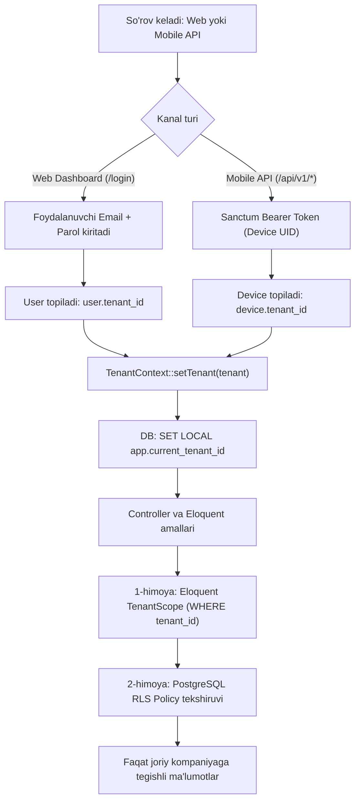

# Multi-Tenant SaaS "ZvonkiPro" (Single Database + Centralized Auth & Tenant Scoping)

Mazkur hujjat foydalanuvchi tanlovi asosida **A-Variant: Markazlashgan Login (Centralized Auth & User Session)** hamda **Single Database with Row-Level / Tenant Scoping** modeliga 100% moslashtirilgan texnik arxitektura va amaliy yo'l xaritasini (Implementation Roadmap) belgilaydi.

---

## Tanlangan Arxitektura Xulosasi:
1. **Web Dashboard:** Foydalanuvchilar subdomen qidirmaydi. Yagona kirish portali orqali (`app.zvonkipro.com/login` yoki `/login`) email va parol orqali tizimga kiradi. Tizim foydalanuvchining `user.tenant_id` qiymati orqali joriy kompaniya (tenant) kontekstini sessiyaga yuklaydi.
2. **Mobil Agent (Android):** Xodimlar subdomen yoki login terib o'tirmaydi. Dashboarddagi QR-kodni skanerlash orqali avtomatik `Device Token` (Sanctum) olinadi va apparat o'z kompaniyasiga qat'iy bog'lanadi.
3. **Izolyatsiya va Xavfsizlik:** PostgreSQL Row-Level Security (RLS) va Laravel Eloquent `TenantScope` (ikki bosqichli chuqur himoya).
4. **CRM & ERP Integratsiyalari:** amoCRM, Bitrix24, MoySklad va BitoERP tizimlari bilan tayyor drayverlar (Driver Pattern).

---

## 1. Multi-Tenant Backend & Database Arxitekturasi (Laravel 12 + PostgreSQL RLS)

### 1.1. Tenantni Aniqlash Mexanizmi (Markazlashgan Yondashuv)



### 1.2. PostgreSQL Row-Level Security (RLS) Konfiguratsiyasi
Barcha tenantga xos jadvallarda RLS yoqiladi:

```sql
-- Calls, Devices, Integratsiyalar jadvallarida RLS yoqish
ALTER TABLE calls ENABLE ROW LEVEL SECURITY;
ALTER TABLE devices ENABLE ROW LEVEL SECURITY;
ALTER TABLE tenant_integrations ENABLE ROW LEVEL SECURITY;
ALTER TABLE crm_webhooks ENABLE ROW LEVEL SECURITY;

-- Qat'iy izolyatsiya qoidalari (Policies)
CREATE POLICY calls_tenant_isolation_policy ON calls
    FOR ALL
    USING (tenant_id = NULLIF(current_setting('app.current_tenant_id', true), '')::bigint)
    WITH CHECK (tenant_id = NULLIF(current_setting('app.current_tenant_id', true), '')::bigint);

CREATE POLICY devices_tenant_isolation_policy ON devices
    FOR ALL
    USING (tenant_id = NULLIF(current_setting('app.current_tenant_id', true), '')::bigint)
    WITH CHECK (tenant_id = NULLIF(current_setting('app.current_tenant_id', true), '')::bigint);

CREATE POLICY integrations_tenant_isolation_policy ON tenant_integrations
    FOR ALL
    USING (tenant_id = NULLIF(current_setting('app.current_tenant_id', true), '')::bigint)
    WITH CHECK (tenant_id = NULLIF(current_setting('app.current_tenant_id', true), '')::bigint);
```

### 1.3. Laravel Middleware va TenantContext

#### `SetTenantContext.php` (Middleware):
```php
namespace App\Http\Middleware;

use Closure;
use Illuminate\Http\Request;
use App\Services\Tenancy\TenantContext;

class SetTenantContext
{
    public function handle(Request $request, Closure $next)
    {
        $tenantContext = app(TenantContext::class);

        // 1. Agar Web foydalanuvchi avtorizatsiyadan o'tgan bo'lsa
        if (auth()->check()) {
            $tenantContext->setTenant(auth()->user()->tenant);
        }
        // 2. Agar Mobil Qurilma Sanctum tokeni bilan kelgan bo'lsa
        elseif ($device = $request->user('device')) {
            $tenantContext->setTenant($device->tenant);
        }

        return $next($request);
    }
}
```

---

### 1.4. To'liq Jadvallar Strukturasi (Markazlashgan Login Uchun Moslashtirilgan)

#### 1. `tenants` (Kompaniyalar)
```sql
CREATE TABLE tenants (
    id BIGSERIAL PRIMARY KEY,
    uuid UUID UNIQUE NOT NULL DEFAULT gen_random_uuid(),
    name VARCHAR(255) NOT NULL, -- "Artel Asosiy Filial", "Akfa Call Center"
    slug VARCHAR(100) UNIQUE NOT NULL, -- Identifikator (ixtiyoriy)
    plan VARCHAR(50) NOT NULL DEFAULT 'standard',
    plan_limits JSONB NOT NULL DEFAULT '{"max_devices": 10, "retention_days": 90, "audio_storage_gb": 20}',
    is_active BOOLEAN NOT NULL DEFAULT TRUE,
    created_at TIMESTAMP WITH TIME ZONE NULL,
    updated_at TIMESTAMP WITH TIME ZONE NULL
);
```

#### 2. `users` (Dashboard Foydalanuvchilari - Markazlashgan Email)
```sql
CREATE TABLE users (
    id BIGSERIAL PRIMARY KEY,
    tenant_id BIGINT NOT NULL REFERENCES tenants(id) ON DELETE CASCADE,
    name VARCHAR(255) NOT NULL,
    email VARCHAR(255) UNIQUE NOT NULL, -- Markazlashgan login uchun global unikal
    password VARCHAR(255) NOT NULL,
    role VARCHAR(50) NOT NULL DEFAULT 'operator', -- 'superadmin', 'tenant_admin', 'manager', 'operator'
    phone_number VARCHAR(50) NULL,
    is_active BOOLEAN NOT NULL DEFAULT TRUE,
    remember_token VARCHAR(100) NULL,
    created_at TIMESTAMP WITH TIME ZONE NULL,
    updated_at TIMESTAMP WITH TIME ZONE NULL
);
CREATE INDEX idx_users_tenant ON users(tenant_id);
```

#### 3. `devices` (Android Mobil Agentlar)
```sql
CREATE TABLE devices (
    id BIGSERIAL PRIMARY KEY,
    uuid UUID UNIQUE NOT NULL DEFAULT gen_random_uuid(),
    tenant_id BIGINT NOT NULL REFERENCES tenants(id) ON DELETE CASCADE,
    user_id BIGINT NULL REFERENCES users(id) ON DELETE SET NULL,
    device_uid VARCHAR(128) NOT NULL, -- Hardware UUID hash
    name VARCHAR(255) NOT NULL, -- "Alisher - Xiaomi 13"
    model VARCHAR(150) NULL,
    sim_slots_info JSONB NULL DEFAULT '[]', -- [{"slot":0,"carrier":"Ucell","phone":"+99890..."},{"slot":1,"carrier":"Beeline","phone":"+99891..."}]
    battery_level SMALLINT NULL,
    is_charging BOOLEAN NOT NULL DEFAULT FALSE,
    pairing_code VARCHAR(16) NULL,
    pairing_code_expires_at TIMESTAMP WITH TIME ZONE NULL,
    last_seen_at TIMESTAMP WITH TIME ZONE NULL,
    is_active BOOLEAN NOT NULL DEFAULT TRUE,
    created_at TIMESTAMP WITH TIME ZONE NULL,
    updated_at TIMESTAMP WITH TIME ZONE NULL,
    CONSTRAINT uq_devices_tenant_device_uid UNIQUE (tenant_id, device_uid)
);
CREATE INDEX idx_devices_tenant_seen ON devices(tenant_id, last_seen_at);
```

#### 4. `calls` (Qo'ng'iroqlar va Audio Yozuvlar)
```sql
CREATE TABLE calls (
    id BIGSERIAL PRIMARY KEY,
    uuid UUID UNIQUE NOT NULL DEFAULT gen_random_uuid(),
    tenant_id BIGINT NOT NULL REFERENCES tenants(id) ON DELETE CASCADE,
    device_id BIGINT NOT NULL REFERENCES devices(id) ON DELETE CASCADE,
    user_id BIGINT NULL REFERENCES users(id) ON DELETE SET NULL,
    direction VARCHAR(20) NOT NULL, -- 'inbound', 'outbound', 'missed'
    phone_number VARCHAR(50) NOT NULL,
    contact_name VARCHAR(255) NULL,
    duration_seconds INTEGER NOT NULL DEFAULT 0,
    sim_slot SMALLINT NOT NULL DEFAULT 0,
    sim_operator VARCHAR(100) NULL,
    recording_disk VARCHAR(50) NOT NULL DEFAULT 'private_storage',
    recording_path VARCHAR(500) NULL, -- 'recordings/{tenant_id}/{year}/{month}/{call_uuid}.m4a'
    recording_size_bytes BIGINT NULL,
    recording_status VARCHAR(30) NOT NULL DEFAULT 'none',
    call_timestamp TIMESTAMP WITH TIME ZONE NOT NULL,
    synced_at TIMESTAMP WITH TIME ZONE NOT NULL DEFAULT CURRENT_TIMESTAMP,
    created_at TIMESTAMP WITH TIME ZONE NULL,
    updated_at TIMESTAMP WITH TIME ZONE NULL
);
CREATE INDEX idx_calls_tenant_timestamp ON calls(tenant_id, call_timestamp DESC);
CREATE INDEX idx_calls_tenant_phone ON calls(tenant_id, phone_number);
CREATE INDEX idx_calls_tenant_device ON calls(tenant_id, device_id);
```

#### 5. `tenant_integrations` (CRM & ERP Integratsiyalari)
```sql
CREATE TABLE tenant_integrations (
    id BIGSERIAL PRIMARY KEY,
    uuid UUID UNIQUE NOT NULL DEFAULT gen_random_uuid(),
    tenant_id BIGINT NOT NULL REFERENCES tenants(id) ON DELETE CASCADE,
    provider VARCHAR(50) NOT NULL, -- 'amocrm', 'bitrix24', 'moysklad', 'bitoerp', 'custom_webhook'
    name VARCHAR(150) NOT NULL,
    credentials JSONB NOT NULL, -- Shifrlangan kalitlar va tokenlar
    settings JSONB NOT NULL DEFAULT '{"auto_create_lead": true, "sync_recordings": true, "sync_missed_calls": true}',
    is_active BOOLEAN NOT NULL DEFAULT TRUE,
    last_synced_at TIMESTAMP WITH TIME ZONE NULL,
    status_message TEXT NULL,
    created_at TIMESTAMP WITH TIME ZONE NULL,
    updated_at TIMESTAMP WITH TIME ZONE NULL,
    CONSTRAINT uq_tenant_integrations_provider UNIQUE (tenant_id, provider)
);
CREATE INDEX idx_tenant_integrations_tenant ON tenant_integrations(tenant_id);

CREATE TABLE integration_user_mappings (
    id BIGSERIAL PRIMARY KEY,
    tenant_id BIGINT NOT NULL REFERENCES tenants(id) ON DELETE CASCADE,
    integration_id BIGINT NOT NULL REFERENCES tenant_integrations(id) ON DELETE CASCADE,
    device_id BIGINT NOT NULL REFERENCES devices(id) ON DELETE CASCADE,
    crm_user_id VARCHAR(100) NOT NULL,
    crm_user_name VARCHAR(255) NULL,
    created_at TIMESTAMP WITH TIME ZONE NULL,
    updated_at TIMESTAMP WITH TIME ZONE NULL,
    CONSTRAINT uq_user_mappings UNIQUE (integration_id, device_id)
);
```

---

## 2. Mobil Agent (Kotlin Native) - Ulanish Mexanizmi

1. **Dashboardda QR-kod chiqarish:**
   Admin Web Dashboardda "Yangi telefon ulash" tugmasini bosadi. Server vaqtinchalik bir martalik token (`pairing_token`) generatsiya qiladi:
   ```json
   {
     "endpoint": "https://app.zvonkipro.com/api/v1",
     "pairing_token": "PAIR_7xK9pQ2m",
     "tenant_name": "Artel Call Center",
     "expires_at": "2026-09-10T12:00:00Z"
   }
   ```
2. **QR-kod skanerlash:** Xodim ilovada kamerani ochib QR-kodni skanerlaydi.
3. **Bog'lanish:** Ilova serverga `POST /api/v1/devices/pair` so'rovini yuboradi (qurilma modeli, Android ID xeshi va SIM-karta ma'lumotlari bilan).
4. **Token olish:** Server qurilmani yaratadi va unga doimiy `Sanctum Device Token` qaytaradi.
5. **Avtomatik ishlash:** Mobil agent bundan keyin barcha qo'ng'iroqlarni shu token bilan yuboradi, foydalanuvchiga hech qanday qayta kirish talab etilmaydi.

---

## 3. Qadam-baqadam Ishga Tushirish Yo'l Xaritasi (Roadmap: Phase 1 — Phase 5)

### **Phase 1: Multi-Tenant Backend Core & Ingest API (Laravel + PostgreSQL RLS)**
- [ ] **1.1.** PostgreSQL bazasi va jadvallar migratsiyasini yaratish (`tenants`, `users`, `devices`, `calls`, `tenant_integrations`, `integration_user_mappings`).
- [ ] **1.2.** Jadvallarga PostgreSQL RLS siyosatlarini (`ENABLE ROW LEVEL SECURITY`) qo'llash.
- [ ] **1.3.** Markazlashgan kirish: `SetTenantContext` middleware'ini yaratish (Foydalanuvchi login bo'lganda `user.tenant_id` orqali RLS sessiyasini o'rnatish).
- [ ] **1.4.** `BelongsToTenant` Trait va `TenantScope` ni Eloquent modellari uchun tatbiq etish.
- [ ] **1.5.** QR-kod orqali qurilmani ulash APIsi: `POST /api/v1/devices/pair` (Sanctum Device Token berish).
- [ ] **1.6.** Telemetriya va audio qabul qilish APIsi: `POST /api/v1/telemetry/calls` (Multipart/JSON).
- [ ] **1.7.** Heartbeat APIsi: `POST /api/v1/telemetry/heartbeat` (Batareya va onlayn status).
- [ ] **1.8.** Pest orqali RLS va Tenant Scoping testlarini o'tkazish.

---

### **Phase 2: Android Native Core & Device Pairing**
- [ ] **2.1.** `android/` papkasida Jetpack Compose, Material3 va Hilt asosida loyiha skeletini yaratish.
- [ ] **2.2.** Android ruxsatnomalar oqimini tayyorlash (`READ_PHONE_STATE`, `RECORD_AUDIO`, `POST_NOTIFICATIONS`).
- [ ] **2.3.** CameraX + ML Kit asosida QR-kod skanerlash va Tenantga ulanish (Pairing) ekranini yaratish.
- [ ] **2.4.** `EncryptedSharedPreferences` orqali Sanctum tokenni saqlash va Retrofit interseptorini sozlash.
- [ ] **2.5.** `TelephonyCallback` orqali qo'ng'iroq holatlarini (`RINGING`, `OFFHOOK`, `IDLE`) tutuvchi fon servisini yozish.

---

### **Phase 3: Audio Yozish va Offline Sync Mexanizmi (Room + WorkManager)**
- [ ] **3.1.** `ForegroundService` (`microphone` turi) asosida audio yozish modulini qurish (`MediaRecorder` - AAC/M4A).
- [ ] **3.2.** `SubscriptionManager` orqali Dual-SIM (SIM 1 / SIM 2) ma'lumotlarini aniqlash.
- [ ] **3.3.** Room Database tuzish (`LocalCallRecord`, DAO, Repository).
- [ ] **3.4.** `WorkManager` asosida `CallSyncWorker` yaratish (Offline navbat va Exponential Backoff).
- [ ] **3.5.** Batareya optimallashtirish cheklovlarini chetlab o'tish bo'yicha vizual Onboarding yo'riqnomasini yaratish.

---

### **Phase 4: Tenant Dashboard & Audio Player (Inertia.js + React)**
- [ ] **4.1.** Inertia.js va React asosida `TenantLayout` va asosiy navigatsiyani qurish.
- [ ] **4.2.** Qo'ng'iroqlar jurnali sahifasi: Kengaytirilgan filtrlar, xodimlar, sanalar va qidiruv.
- [ ] **4.3.** `WaveformPlayer.tsx` komponenti: Audio to'lqinini chizish, ijro nazorati, tezlikni oshirish.
- [ ] **4.4.** Qurilmalar monitoringi sahifasi: Real-vaqtda onlayn/oflayn belgilari, zaryad indikatori va QR-kod generatsiya modali.
- [ ] **4.5.** Xavfsiz audio oqim marshruti (`/api/v1/calls/{uuid}/audio-stream`) va ruxsatlarni tekshirish.

---

### **Phase 5: CRM & ERP Integratsiya Tizimi (amoCRM, Bitrix24, MoySklad, BitoERP) va Webhooklar**
- [ ] **5.1.** Integratsiyalar arxitekturasi: `CrmDriverInterface` va `CrmManager` (Driver Pattern).
- [ ] **5.2.** **amoCRM Drayveri:** OAuth2 oqimi, kontakt qidirish/yaratish, qo'ng'iroq voqeasi va audio yozuvni biriktirish (`/api/v4/calls`).
- [ ] **5.3.** **Bitrix24 Drayveri:** Bitrix24 Telephony API (`telephony.externalcall.register` va `telephony.externalcall.finish`), audio fayl biriktirish.
- [ ] **5.4.** **MoySklad Drayveri:** JSON API 1.2 orqali kontragentni qidirish/yaratish va voqea kiritish.
- [ ] **5.5.** **BitoERP va Universal Webhook Drayveri:** REST Webhook orqali HMAC SHA-256 imzolangan voqealarni uzatish.
- [ ] **5.6.** `SyncCallToIntegrationsJob` orqali asinxron navbat, Redis Rate Limiter (amoCRM 7 req/sec limit) va qayta urinish (Retry Policy).
- [ ] **5.7.** Integratsiyalar Dashboard UI: Ulanish modallari, xodimlarni CRM menejerlari bilan moslashtirish (User Mapping) va audit loglari.
- [ ] **5.8.** CI/CD (GitHub Actions) va yakuniy yuklama ostida sinovlar.
