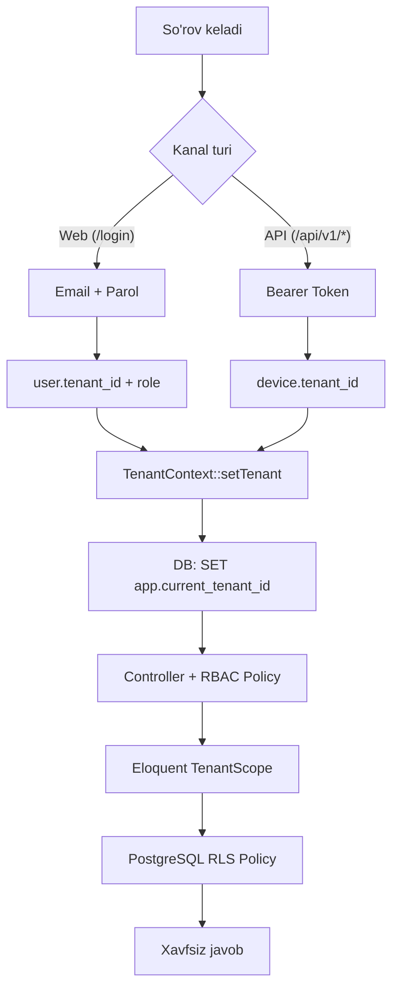
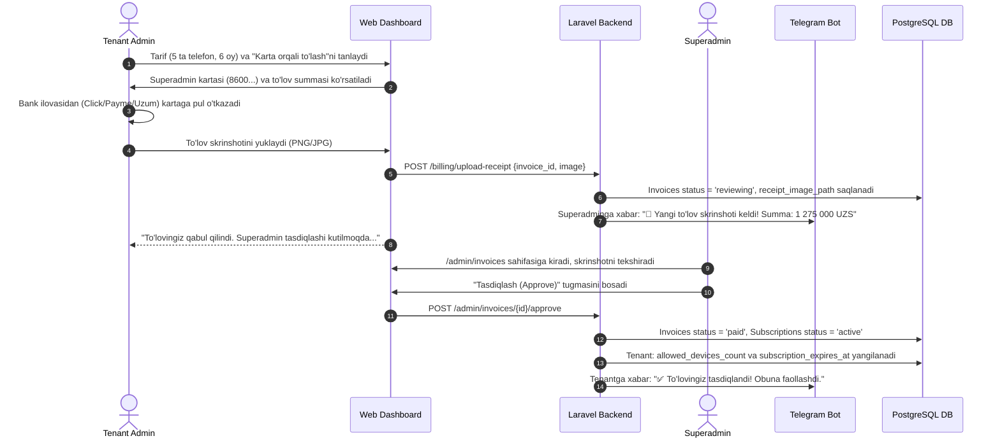
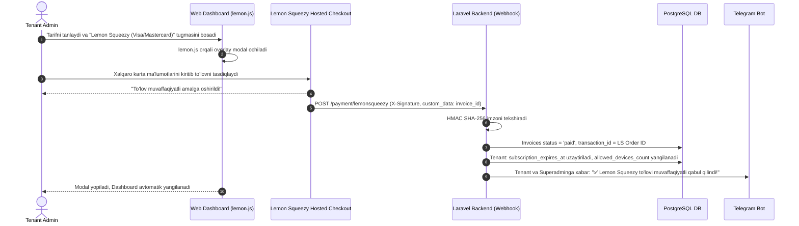

# Multi-Tenant SaaS "agent.1call.uz" — Texnik Arxitektura va Implementatsiya Rejasi

**(Single Database + Centralized Auth + PostgreSQL RLS + Laravel 13 + Reverb WebSockets + Click/Payme/LemonSqueezy Billing + Telegram Bot + CRM/ERP)**

---

## Arxitektura Xulosasi

| Qaror                            | Tanlangan Variant                                                                                                                                   |
| -------------------------------- | --------------------------------------------------------------------------------------------------------------------------------------------------- |
| **Texnologik Stack**             | **Laravel 13** (`laravel/framework: ^13.17`), PHP 8.3+, Inertia.js v3 (`^3.0`), React 19, TailwindCSS, Pest 4 (`^4.7`)                              |
| **Real-Time WebSockets**         | **Laravel Reverb:** Jonli qo'ng'iroq monitoringi (Live call board), instant ringing popupi va live ro'yxat yangilanishi                             |
| **Multi-Tenancy modeli**         | Single Database with Row-Level / Tenant Scoping (`tenant_id`)                                                                                       |
| **Tenantni aniqlash (Web)**      | A-Variant: Markazlashgan Login → `user.tenant_id` → sessiya                                                                                         |
| **Tenantni aniqlash (Mobil)**    | Sanctum Device Token → `device.tenant_id`                                                                                                           |
| **Izolyatsiya**                  | 2 bosqichli: Laravel Eloquent TenantScope + PostgreSQL RLS                                                                                          |
| **Foydalanuvchi Rollari (RBAC)** | 3 ta aniq rol: `superadmin` (Platforma egasi), `admin` (Kompaniya rahbari), `operator` (Xodim)                                                      |
| **DBMS & Masshtab**              | **PostgreSQL 16+ (Range Partitioning):** `calls` jadvali oylar kesimida bo'linadi (`PARTITION BY RANGE (call_timestamp)`)                           |
| **Billing & To'lov Usullari**    | 1) Click (UZS), 2) Payme (UZS), 3) Karta (P2P + Skrinshot), 4) **Lemon Squeezy** (To'g'ridan-to'g'ri USD tariflari/variantlari, `1call.uz` asosida) |
| **Bepul Sinov Davri (Trial)**    | Yangi ro'yxatdan o'tgan kompaniyalar uchun **14 kunlik bepul sinov (Free Trial)** (3 ta qurilmagacha)                                               |
| **Tarif Modeli**                 | Bazada boshqariluvchi (`tariffs`, `tariff_discounts`): Har bir telefon uchun (Dual-SIM = 1 telefon)                                                 |
| **Chegirmalar Modeli**           | Oylar kesimida (3/6/12 oy) VA Qurilmalar soni kesimida (5+, 10+, 20+ telefon) chegirma foizlari                                                     |
| **Billing Dinamikasi**           | Yangi telefonlar uchun **Pro-rata (Co-terming)** + **3 kunlik Grace Period**                                                                        |
| **Android Audio Capture**        | **AccessibilityService** + MediaRecorder fallback (Android 10 - 15)                                                                                 |
| **Audio Format & Siqish**        | **AAC / Opus (16kHz, 24 kbps Mono, `.m4a`)** — 1 daqiqa suhbat atigi ~200 KB (xotira va internet tejaladi)                                          |
| **Android Barqarorlik**          | **BootCompletedReceiver** (`ACTION_BOOT_COMPLETED`) + Accessibility Watchdog/Heartbeat + Instant Ringing Webhook                                    |
| **Dual-SIM Tanlash**             | Operator ilovada **Faqat Korporativ SIM** ni tanlashi mumkin (`selected_sim_slot`), shaxsiy SIM qo'ng'iroqlari yozilmaydi                           |
| **Maxfiylik (Privacy)**          | **Ish vaqti rejimi (Work Schedule)** va shaxsiy raqamlar filtri (Blacklist)                                                                         |
| **Tezkor Bildirishnomalar**      | **Telegram Bot:** Qoldirilgan qo'ng'iroqlar, kunlik hisobotlar va to'lov eslatmalari                                                                |
| **CRM Integratsiyalari**         | **amoCRM va MoySklad** (Driver Pattern, `panel.1call.uz` tajribasi asosida)                                                                         |
| **Audio Saqlash & Xotira**       | **Storage Abstraction:** VPS Private Storage (`storage/app/private/recordings/`) yoki Cloudflare R2 / AWS S3 (`RECORDINGS_STORAGE_DISK=local        | r2  | s3`) |
| **Audio Arxiv Muddati**          | Sukut bo'yicha **30 kun** saqlanadi. Uzoqroq saqlash (60, 90, 180, 365 kun) uchun alohida narx belgilash imkoniyati                                 |
| **Superadmin Paneli**            | Ichki Inertia.js/React boshqaruvi (`/admin/users`, `/admin/tenants`, `/admin/tariffs`, `/admin/payment-methods`, `/admin/invoices`)                 |

---

## 1. Tenant Izolyatsiyasi va RBAC Ruxsatlar Tizimi



### 1.1. TenantContext Singleton

```php
namespace App\Services\Tenancy;

use App\Models\Tenant;
use Illuminate\Support\Facades\DB;

class TenantContext
{
    protected ?Tenant $tenant = null;

    public function setTenant(?Tenant $tenant): void
    {
        $this->tenant = $tenant;

        if ($tenant) {
            // Sessiya darajasida (SET LOCAL emas! — tranzaksiyaga bog'liq emas)
            DB::statement("SET app.current_tenant_id = '{$tenant->id}'");
        } else {
            DB::statement("RESET app.current_tenant_id");
        }
    }

    public function getTenant(): ?Tenant { return $this->tenant; }
    public function id(): ?int { return $this->tenant?->id; }
    public function check(): bool { return $this->tenant !== null; }
}
```

### 1.2. 3 Ta Asosiy Rol (Superadmin, Admin, Operator) Ruxsatlar Matritsasi

| Imkoniyat / Bo'lim                                            | Superadmin (Platforma egasi)     | Admin (Kompaniya rahbari)                      | Operator (Xodim)                     |
| ------------------------------------------------------------- | -------------------------------- | ---------------------------------------------- | ------------------------------------ |
| **Barcha tenantlar va tizim sozlamalari (`/admin/*`)**        | ✅ To'liq nazorat                | ❌ Kirish taqiqlangan                          | ❌ Kirish taqiqlangan                |
| **To'lovlar, Tariflar va Karta sozlamalari**                  | ✅ Tasdiqlaydi / Narx belgilaydi | ✅ Obuna sotib oladi / To'laydi                | ❌ Kirish taqiqlangan                |
| **Kompaniyaning barcha qo'ng'iroqlarini ko'rish va eshitish** | ✅ Barcha kompaniyalarni         | ✅ O'z kompaniyasining barcha qo'ng'iroqlarini | ❌ Faqat o'zining qo'ng'iroqlarini   |
| **Audio yozuvlarni yuklab olish (Download)**                  | ✅ Ha                            | ✅ Ha                                          | ❌ Faqat eshitish (yuklab ololmaydi) |
| **Qurilmalar qo'shish va QR-kod chiqarish**                   | ✅ Ha                            | ✅ Ha                                          | ❌ Yo'q                              |
| **CRM/ERP integratsiyalari sozlash (amoCRM, MoySklad)**       | ✅ Ha                            | ✅ Ha                                          | ❌ Kirish taqiqlangan                |
| **Ish grafigi va maxfiylik sozlamalari**                      | ✅ Ha                            | ✅ Ha                                          | ❌ Kirish taqiqlangan                |

### 1.3. Superadmin Ichki Boshqaruv Sahifasi (`/admin/users` va `/admin/tenants`)

Alohida og'ir paketlar (masalan Filament) o'rnatilmaydi. Mavjud Inertia.js + React stekida faqat `role === 'superadmin'` foydalanuvchilari uchun yengil boshqaruv sahifalari yaratiladi:

1. **`/admin/users`:**
    - Platformadagi barcha tenantlar xodimlarining yagona jadvali.
    - Filtrlash (Tenant bo'yicha, rol bo'yicha, status bo'yicha).
    - Foydalanuvchini bloklash, faollashtirish yoki parolini yangilash.
2. **`/admin/tenants`:**
    - Barcha kompaniyalar (tenantlar) ro'yxati, ularning joriy tarifi, faol telefonlari soni va obuna tugash sanasi.
    - Obunani qo'lda uzaytirish (masalan, to'lov bank orqali kelib tushganda yoki do'stona trial berilganda).
3. **`/admin/tariffs`:**
    - Asosiy tariflar va baza narxini belgilash (1 ta telefon uchun oylik narx).
    - **Audio arxiv saqlash muddati narxlari:** Standart kunlar (30 kun) va 60, 90, 180, 365 kunlik arxiv saqlash uchun qo'shimcha oylik narxlarni belgilash.
    - **Oylar kesimidagi chegirmalar:** 3, 6, 12 oylik chegirma foizlarini qo'shish/tahrirlash.
    - **Qurilmalar soni kesimidagi chegirmalar:** Qanchadir miqdordan ortiq telefonlar uchun hajm chegirmalarini (masalan, 5+, 10+, 20+ telefon) belgilash.
4. **`/admin/payment-methods` (To'lov Tizimlari Sozlamalari):**
    - Click, Payme, Karta hamda **Lemon Squeezy** to'lov usullarini **Active / Passive** (yoqish/o'chirish) boshqaruvi.
    - Karta to'lovi uchun Karta raqami (masalan: `8600 1234 5678 9012`), Karta egasi ismi va bank nomini kiritish/yangilash.
    - **Lemon Squeezy sozlamalari:** Store ID, API Key, Webhook Secret, Store Slug hamda oylik/yillik USD variantlarini belgilash/yangilash.
5. **`/admin/invoices` (To'lovlarni Tasdiqlash Navbati):**
    - Karta orqali qilingan to'lovlar skrinshotlarini kattalashtirib ko'rish.
    - Bitta tugma bilan **"Tasdiqlash" (Approve)** → tenant obunasini avtomatik uzaytirish yoki **"Rad etish" (Reject)**.
    - RLS bu sahifalarda `SuperadminBypassTenant` middleware orqali avtomatik chetlab o'tiladi.

---

## 2. Jadvallar Strukturasi (PostgreSQL DDL + RLS)

### 2.1. `tenants` (Kompaniyalar)

```sql
CREATE TABLE tenants (
    id BIGSERIAL PRIMARY KEY,
    uuid UUID UNIQUE NOT NULL DEFAULT gen_random_uuid(),
    name VARCHAR(255) NOT NULL,
    slug VARCHAR(100) UNIQUE NOT NULL,
    plan VARCHAR(50) NOT NULL DEFAULT 'standard',
    plan_limits JSONB NOT NULL DEFAULT '{"max_devices": 10, "retention_days": 90, "audio_storage_gb": 20}',
    allowed_devices_count INTEGER NOT NULL DEFAULT 2, -- Sotib olingan faol telefon slotlari
    audio_retention_days INTEGER NOT NULL DEFAULT 30, -- Audio saqlash muddati (standart: 30 kun)
    subscription_expires_at TIMESTAMPTZ NULL,        -- Obuna rasmiy tugash sanasi
    grace_period_ends_at TIMESTAMPTZ NULL,           -- 3 kunlik imtiyozli davr tugash sanasi
    trial_ends_at TIMESTAMPTZ NULL,                  -- Bepul sinov davri (masalan, 14 kun)
    work_schedule JSONB NOT NULL DEFAULT '{
        "enabled": false,
        "work_days": [1, 2, 3, 4, 5],
        "start_time": "09:00",
        "end_time": "18:00",
        "timezone": "Asia/Tashkent"
    }',                                              -- Kompaniya umumiy ish grafigi
    privacy_blacklist JSONB NOT NULL DEFAULT '[]',   -- Yozilmaydigan maxfiy/shaxsiy raqamlar maskalari
    telegram_chat_id VARCHAR(100) NULL,             -- Bildirishnomalar uchun Telegram guruh/kanal ID si
    is_active BOOLEAN NOT NULL DEFAULT TRUE,
    created_at TIMESTAMPTZ NULL,
    updated_at TIMESTAMPTZ NULL
);
```

### 2.2. `users` (3 darajali RBAC bilan)

```sql
ALTER TABLE users
    ADD COLUMN tenant_id BIGINT REFERENCES tenants(id) ON DELETE CASCADE,
    ADD COLUMN role VARCHAR(50) NOT NULL DEFAULT 'operator', -- superadmin, admin, operator
    ADD COLUMN phone_number VARCHAR(50) NULL,
    ADD COLUMN is_active BOOLEAN NOT NULL DEFAULT TRUE;

CREATE INDEX idx_users_tenant ON users(tenant_id);

ALTER TABLE users ENABLE ROW LEVEL SECURITY;
CREATE POLICY users_tenant_isolation ON users
    FOR ALL
    USING (tenant_id = NULLIF(current_setting('app.current_tenant_id', true), '')::bigint)
    WITH CHECK (tenant_id = NULLIF(current_setting('app.current_tenant_id', true), '')::bigint);
```

### 2.3. `devices` (Android Mobil Agentlar)

> [!IMPORTANT]
> **Dual-SIM Qoidasi:** Bitta jismoniy smartfonda 2 ta SIM karta bo'lishi billing va litsenziyaga ta'sir qilmaydi! SIM ma'lumotlari `sim_slots_info` ustunida saqlanadi va 1 ta litsenziya deb hisoblanadi.

```sql
CREATE TABLE devices (
    id BIGSERIAL PRIMARY KEY,
    uuid UUID UNIQUE NOT NULL DEFAULT gen_random_uuid(),
    tenant_id BIGINT NOT NULL REFERENCES tenants(id) ON DELETE CASCADE,
    user_id BIGINT NULL REFERENCES users(id) ON DELETE SET NULL,
    device_uid VARCHAR(128) NOT NULL,
    name VARCHAR(255) NOT NULL,
    model VARCHAR(150) NULL,
    manufacturer VARCHAR(100) NULL,
    os_version VARCHAR(50) NULL,
    app_version VARCHAR(50) NULL,
    sim_slots_info JSONB NULL DEFAULT '[]',
    selected_sim_slot SMALLINT NULL DEFAULT NULL, -- NULL = barcha SIMlar, 1 = faqat SIM-1 (Korporativ), 2 = faqat SIM-2
    accessibility_service_enabled BOOLEAN NOT NULL DEFAULT FALSE, -- Watchdog/Ovoz yozish xizmati holati
    battery_level SMALLINT NULL,
    is_charging BOOLEAN NOT NULL DEFAULT FALSE,
    work_schedule_override JSONB NULL,           -- Xodim uchun maxsus individual grafik (agar kerak bo'lsa)
    pairing_code VARCHAR(16) NULL,
    pairing_code_expires_at TIMESTAMPTZ NULL,
    last_seen_at TIMESTAMPTZ NULL,
    is_active BOOLEAN NOT NULL DEFAULT TRUE,
    created_at TIMESTAMPTZ NULL,
    updated_at TIMESTAMPTZ NULL,
    CONSTRAINT uq_devices_tenant_uid UNIQUE (tenant_id, device_uid)
);
CREATE INDEX idx_devices_tenant_seen ON devices(tenant_id, last_seen_at);

ALTER TABLE devices ENABLE ROW LEVEL SECURITY;
CREATE POLICY devices_tenant_isolation ON devices
    FOR ALL
    USING (tenant_id = NULLIF(current_setting('app.current_tenant_id', true), '')::bigint)
    WITH CHECK (tenant_id = NULLIF(current_setting('app.current_tenant_id', true), '')::bigint);
```

### 2.4. `calls` (Qo'ng'iroqlar va Audio Yozuvlar)

````sql
> [!TIP]
> **PostgreSQL Range Partitioning:** Millionlab qo'ng'iroqlarda yuqori tezlikni ta'minlash uchun `calls` jadvali `call_timestamp` bo'yicha oylar kesimida bo'linadi (masalan, `calls_2026_09`, `calls_2026_10`).
```sql
CREATE TABLE calls (
    id BIGSERIAL,
    uuid UUID NOT NULL DEFAULT gen_random_uuid(),
    tenant_id BIGINT NOT NULL REFERENCES tenants(id) ON DELETE CASCADE,
    device_id BIGINT NOT NULL REFERENCES devices(id) ON DELETE CASCADE,
    user_id BIGINT NULL REFERENCES users(id) ON DELETE SET NULL,
    direction VARCHAR(20) NOT NULL,              -- inbound, outbound, missed
    phone_number VARCHAR(50) NOT NULL,
    contact_name VARCHAR(255) NULL,
    duration_seconds INTEGER NOT NULL DEFAULT 0,
    sim_slot SMALLINT NOT NULL DEFAULT 0,        -- 0 (SIM 1) yoki 1 (SIM 2)
    sim_operator VARCHAR(100) NULL,
    recording_disk VARCHAR(50) NOT NULL DEFAULT 'local', -- 'local', 'r2', 's3'
    recording_path VARCHAR(500) NULL,
    recording_format VARCHAR(10) NOT NULL DEFAULT 'm4a', -- 'm4a' (AAC / Opus 24kbps)
    recording_size_bytes BIGINT NULL,
    recording_status VARCHAR(30) NOT NULL DEFAULT 'none', -- none, uploaded, processing, failed, expired
    audio_source_type VARCHAR(50) NULL,          -- accessibility_service, mic, voice_communication
    is_work_hours BOOLEAN NOT NULL DEFAULT TRUE, -- Ish vaqtida bo'lganmi
    call_timestamp TIMESTAMPTZ NOT NULL,
    synced_at TIMESTAMPTZ NOT NULL DEFAULT CURRENT_TIMESTAMP,
    created_at TIMESTAMPTZ NULL,
    updated_at TIMESTAMPTZ NULL,
    PRIMARY KEY (id, call_timestamp)
) PARTITION BY RANGE (call_timestamp);

-- Oylik partitsiyalar namunasi (avtomat yaratiladi):
CREATE TABLE calls_2026_09 PARTITION OF calls
    FOR VALUES FROM ('2026-09-01 00:00:00+05') TO ('2026-10-01 00:00:00+05');
CREATE TABLE calls_2026_10 PARTITION OF calls
    FOR VALUES FROM ('2026-10-01 00:00:00+05') TO ('2026-11-01 00:00:00+05');

CREATE INDEX idx_calls_tenant_ts ON calls(tenant_id, call_timestamp DESC);
CREATE INDEX idx_calls_tenant_phone ON calls(tenant_id, phone_number);
CREATE INDEX idx_calls_tenant_device ON calls(tenant_id, device_id);

ALTER TABLE calls ENABLE ROW LEVEL SECURITY;
CREATE POLICY calls_tenant_isolation ON calls
    FOR ALL
    USING (tenant_id = NULLIF(current_setting('app.current_tenant_id', true), '')::bigint)
    WITH CHECK (tenant_id = NULLIF(current_setting('app.current_tenant_id', true), '')::bigint);
````

````

### 2.5. `tariffs` (Asosiy Bosh Tariflar Jadvali)
> [!NOTE]
> Ushbu jadval global konfiguratsiya hisoblanadi (barcha tenantlar uchun umumiy, RLS talab etilmaydi). Superadmin tomonidan boshqariladi.
```sql
CREATE TABLE tariffs (
    id BIGSERIAL PRIMARY KEY,
    name VARCHAR(100) NOT NULL,                 -- Masalan: "Standart Korporativ"
    code VARCHAR(50) UNIQUE NOT NULL,           -- Masalan: "standard"
    description TEXT NULL,
    base_price_monthly NUMERIC(12, 2) NOT NULL, -- 1 ta telefon uchun 1 oylik baza narxi UZS da (masalan: 50 000 UZS)
    price_usd_monthly NUMERIC(10, 2) NOT NULL DEFAULT 4.99, -- Lemon Squeezy uchun to'g'ridan-to'g'ri USD narxi (kursga bog'lanmagan)
    currency VARCHAR(3) NOT NULL DEFAULT 'UZS',
    min_devices INTEGER NOT NULL DEFAULT 1,     -- Minimal sotib olinadigan slotlar
    default_retention_days INTEGER NOT NULL DEFAULT 30, -- Standart kiritilgan audio arxiv muddati (30 kun)
    trial_days INTEGER NOT NULL DEFAULT 14,     -- Bepul sinov kunlari
    trial_device_slots INTEGER NOT NULL DEFAULT 2, -- Sinovdagi bepul qurilmalar
    is_active BOOLEAN NOT NULL DEFAULT TRUE,
    is_default BOOLEAN NOT NULL DEFAULT FALSE,
    created_at TIMESTAMPTZ NULL,
    updated_at TIMESTAMPTZ NULL
);
````

### 2.6. `tariff_discounts` (Qurilmalar Soni va Oylar Kesimidagi Chegirmalar)

> [!IMPORTANT]
> Superadmin istalgan paytda ushbu jadval orqali oylar yoki qurilmalar miqdori bo'yicha chegirma foizlarini erkin boshqara oladi.

```sql
CREATE TABLE tariff_discounts (
    id BIGSERIAL PRIMARY KEY,
    tariff_id BIGINT NOT NULL REFERENCES tariffs(id) ON DELETE CASCADE,
    type VARCHAR(30) NOT NULL,                  -- 'period' (oylar bo'yicha) yoki 'device_volume' (qurilmalar soni bo'yicha)
    min_value INTEGER NOT NULL,                 -- Minimal chegara (oylar soni: 3, 6, 12 yoki qurilmalar soni: 5, 10, 20)
    max_value INTEGER NULL,                     -- Maksimal chegara (masalan: 9 ta telefon, NULL = cheksiz)
    discount_percent NUMERIC(5, 2) NOT NULL,    -- Chegirma foizi (masalan: 5.00, 10.00, 15.00, 20.00 %)
    description VARCHAR(255) NULL,              -- Masalan: "10 tadan ortiq telefon uchun 10% chegirma"
    is_active BOOLEAN NOT NULL DEFAULT TRUE,
    created_at TIMESTAMPTZ NULL,
    updated_at TIMESTAMPTZ NULL,
    CONSTRAINT uq_tariff_discount UNIQUE (tariff_id, type, min_value)
);
CREATE INDEX idx_tariff_discounts ON tariff_discounts(tariff_id, type, is_active);
```

### 2.7. `tariff_retention_options` (Audio Arxivini Uzoqroq Saqlash Narxlari)

> [!NOTE]
> Standart holatda audio arxiv 30 kun bepul saqlanadi. Mijoz audiolarni 60, 90, 180 yoki 365 kun saqlashni xohlasa, Superadmin ushbu jadval orqali qo'shimcha oylik narx belgilaydi.

```sql
CREATE TABLE tariff_retention_options (
    id BIGSERIAL PRIMARY KEY,
    tariff_id BIGINT NOT NULL REFERENCES tariffs(id) ON DELETE CASCADE,
    retention_days INTEGER NOT NULL,               -- 60, 90, 180, 365 kun
    name VARCHAR(100) NOT NULL,                    -- Masalan: "60 kunlik arxiv (+30 kun)", "1 yillik arxiv"
    additional_price_monthly NUMERIC(12, 2) NOT NULL DEFAULT 0, -- 1 ta telefon uchun oylik qo'shimcha narx
    is_active BOOLEAN NOT NULL DEFAULT TRUE,
    created_at TIMESTAMPTZ NULL,
    updated_at TIMESTAMPTZ NULL,
    CONSTRAINT uq_retention_days UNIQUE (tariff_id, retention_days)
);
```

### 2.8. `subscriptions` (Tarif va Obunalar)

```sql
CREATE TABLE subscriptions (
    id BIGSERIAL PRIMARY KEY,
    uuid UUID UNIQUE NOT NULL DEFAULT gen_random_uuid(),
    tenant_id BIGINT NOT NULL REFERENCES tenants(id) ON DELETE CASCADE,
    tariff_id BIGINT NULL REFERENCES tariffs(id) ON DELETE SET NULL,
    period_months SMALLINT NOT NULL,              -- 3, 6, 12 oy
    device_count INTEGER NOT NULL,               -- Obunadagi telefonlar soni
    unit_price_monthly NUMERIC(12, 2) NOT NULL,  -- 1 ta telefon uchun 1 oylik baza narxi
    retention_days INTEGER NOT NULL DEFAULT 30,  -- Tanlangan audio arxiv muddati (30, 60, 90, 180, 365 kun)
    retention_addon_price_monthly NUMERIC(12, 2) NOT NULL DEFAULT 0, -- Arxiv muddati uchun oylik qo'shimcha narx
    period_discount_percent NUMERIC(5, 2) NOT NULL DEFAULT 0, -- Oylar kesimidagi chegirma foizi
    volume_discount_percent NUMERIC(5, 2) NOT NULL DEFAULT 0, -- Qurilmalar soni bo'yicha chegirma foizi
    total_discount_percent NUMERIC(5, 2) NOT NULL DEFAULT 0,  -- Jami qo'llangan chegirma foizi
    total_amount NUMERIC(14, 2) NOT NULL,        -- Umumiy to'lov summasi
    is_prorated BOOLEAN NOT NULL DEFAULT FALSE,  -- Pro-rata orqali qo'shilgan slotmi
    currency VARCHAR(3) NOT NULL DEFAULT 'UZS',
    starts_at TIMESTAMPTZ NOT NULL,
    expires_at TIMESTAMPTZ NOT NULL,
    status VARCHAR(30) NOT NULL DEFAULT 'pending', -- pending, active, expired, cancelled
    created_at TIMESTAMPTZ NULL,
    updated_at TIMESTAMPTZ NULL
);
CREATE INDEX idx_subscriptions_tenant ON subscriptions(tenant_id, status);

ALTER TABLE subscriptions ENABLE ROW LEVEL SECURITY;
CREATE POLICY subscriptions_tenant_isolation ON subscriptions
    FOR ALL
    USING (tenant_id = NULLIF(current_setting('app.current_tenant_id', true), '')::bigint)
    WITH CHECK (tenant_id = NULLIF(current_setting('app.current_tenant_id', true), '')::bigint);
```

### 2.9. `payment_methods` (To'lov Tizimlari va Karta Sozlamalari)

> [!NOTE]
> Global konfiguratsiya jadvali (RLS talab etilmaydi). Superadmin qaysi to'lov usullari faol bo'lishini va karta rekvizitlarini boshqaradi.

```sql
CREATE TABLE payment_methods (
    id BIGSERIAL PRIMARY KEY,
    code VARCHAR(50) UNIQUE NOT NULL,            -- 'click', 'payme', 'card_transfer', 'lemonsqueezy'
    name VARCHAR(100) NOT NULL,                  -- 'Click', 'Payme', 'Karta orqali to''lov (P2P)', 'Lemon Squeezy'
    is_active BOOLEAN NOT NULL DEFAULT TRUE,     -- Active / Passive holati
    settings JSONB NULL DEFAULT '{}',            -- Karta: {"card_number", "card_holder", "bank_name"} | Lemon Squeezy: {"store_id", "api_key", "webhook_secret", "store_slug"}
    instructions TEXT NULL,                      -- To'lov ko'rsatmalari (mijozga ko'rsatiladigan matn)
    sort_order SMALLINT NOT NULL DEFAULT 0,
    created_at TIMESTAMPTZ NULL,
    updated_at TIMESTAMPTZ NULL
);
```

### 2.10. `invoices` (Hisob-fakturalar, Skrinshotlar va To'lovlar)

```sql
CREATE TABLE invoices (
    id BIGSERIAL PRIMARY KEY,
    uuid UUID UNIQUE NOT NULL DEFAULT gen_random_uuid(),
    tenant_id BIGINT NOT NULL REFERENCES tenants(id) ON DELETE CASCADE,
    subscription_id BIGINT NULL REFERENCES subscriptions(id) ON DELETE SET NULL,
    invoice_number VARCHAR(50) UNIQUE NOT NULL,    -- Masalan: INV-202609-00042
    amount NUMERIC(14, 2) NOT NULL,
    currency VARCHAR(3) NOT NULL DEFAULT 'UZS',
    payment_method VARCHAR(30) NOT NULL,          -- 'click', 'payme', 'card_transfer', 'lemonsqueezy'
    transaction_id VARCHAR(100) NULL,             -- Provider / pay_uz tranzaksiya ID si
    receipt_image_path VARCHAR(500) NULL,         -- Karta to'lovida yuklangan skrinshot fayl yo'li
    status VARCHAR(30) NOT NULL DEFAULT 'pending', -- 'pending', 'reviewing' (skrinshot tekshiruvda), 'paid', 'rejected', 'cancelled'
    rejection_reason TEXT NULL,                   -- Rad etilgan bo'lsa sababi
    approved_by BIGINT NULL REFERENCES users(id), -- Tasdiqlagan superadmin ID si
    approved_at TIMESTAMPTZ NULL,
    paid_at TIMESTAMPTZ NULL,
    meta JSONB NULL,
    created_at TIMESTAMPTZ NULL,
    updated_at TIMESTAMPTZ NULL
);
CREATE INDEX idx_invoices_tenant ON invoices(tenant_id, status);
CREATE INDEX idx_invoices_status ON invoices(status);

ALTER TABLE invoices ENABLE ROW LEVEL SECURITY;
CREATE POLICY invoices_tenant_isolation ON invoices
    FOR ALL
    USING (tenant_id = NULLIF(current_setting('app.current_tenant_id', true), '')::bigint)
    WITH CHECK (tenant_id = NULLIF(current_setting('app.current_tenant_id', true), '')::bigint);
```

---

## 3. Billing, Pro-rata va Grace Period Mexanizmi

### 3.1. Tariflash Qoidalari va Dinamik Chegirmalar Dvigateli (Bazada boshqariladi)

To'lov summasi bazadagi `tariffs` va `tariff_discounts` jadvallari qoidalariga asosan dinamik hisoblanadi:

1. **Hisob-kitob Birligi:** Faqat ulangan **mobil telefonlar (Handset / Qurilma)** soni bo'yicha. Bitta telefonda 2 ta SIM-karta bo'lsa ham, 1 ta litsenziya narxida to'lanadi.
2. **Ikkitalik Dinamik Chegirmalar (Combined Discounts):**
    - **A) Oylar kesimidagi chegirmalar (`type = 'period'`):**
        - 3 oy: 0%
        - 6 oy: 10%
        - 12 oy: 20%
    - **B) Qurilmalar soni (Hajm) kesimidagi chegirmalar (`type = 'device_volume'`):**
        - 1 - 4 ta telefon: 0%
        - 5 - 9 ta telefon: 5% chegirma
        - 10 - 19 ta telefon: 10% chegirma
        - 20+ ta telefon: 15% chegirma
3. **Hisoblash Formulalari:**
    ```
    Baza Summa = Telefonlar Soni × 1 ta Telefon Baza Narxi × Oylar Soni
    Jami Chegirma (%) = Davr Chegirmasi (%) + Hajm Chegirmasi (%)
    Yakuniy To'lov Summasi = Baza Summa × (1 - Jami Chegirma / 100)
    ```

_Misollar jadvali (Baza narx = 50 000 UZS):_

| Telefonlar | Davr  | Baza Summa     | Davr Chegirmasi | Hajm Chegirmasi | Jami Chegirma | Yakuniy To'lov    | Tejamkorlik   |
| ---------- | ----- | -------------- | --------------- | --------------- | ------------- | ----------------- | ------------- |
| **3 ta**   | 3 oy  | 450 000 UZS    | 0%              | 0%              | **0%**        | **450 000 UZS**   | 0 UZS         |
| **5 ta**   | 6 oy  | 1 500 000 UZS  | 10%             | 5%              | **15%**       | **1 275 000 UZS** | 225 000 UZS   |
| **10 ta**  | 12 oy | 6 000 000 UZS  | 20%             | 10%             | **30%**       | **4 200 000 UZS** | 1 800 000 UZS |
| **25 ta**  | 12 oy | 15 000 000 UZS | 20%             | 15%             | **35%**       | **9 750 000 UZS** | 5 250 000 UZS |

4. **Audio Arxivini Saqlash Muddati va Narxi (Retention Extension):**
    - **Standart (Default): 30 kun** — Har qanday tarif ichida mutlaqo bepul (0 UZS).
    - **Qo'shimcha muddatlar:** Agar kompaniya audiolarni 30 kundan uzoqroq saqlamoqchi bo'lsa, Superadmin belgilagan qo'shimcha oylik tarif qo'shiladi:
        - 30 kun (Standart): +0 UZS / oy / telefon
        - 60 kun: +10 000 UZS / oy / telefon
        - 90 kun: +20 000 UZS / oy / telefon
        - 180 kun (6 oy): +35 000 UZS / oy / telefon
        - 365 kun (1 yil): +60 000 UZS / oy / telefon
    - **Hisoblash Formulasi:**
        ```
        1 ta Telefon Oylik Narxi = Baza Narx (50 000 UZS) + Arxiv Muddati Narxi
        Baza Summa = Telefonlar Soni × 1 ta Telefon Oylik Narxi × Oylar Soni
        Yakuniy To'lov = Baza Summa × (1 - Jami Chegirma / 100)
        ```
5. **Eskirgan Audiolarni Avtomatik Tozalash (Retention Cleanup Job):**
    - Har kecha ishga tushadigan `PruneExpiredRecordingsJob` cron-vazifasi:
        - Har bir tenantning `audio_retention_days` muddatini o'qiydi (masalan, 30 kun).
        - `call_timestamp < (NOW() - audio_retention_days)` bo'lgan qo'ng'iroqlarning diskdagi audio faylini o'chiradi (`unlink`).
        - Qo'ng'iroqning o'zi, statistikasi (raqam, davomiylik, xodim, sana) bazada abadiy saqlanadi, faqat `recording_status = 'expired'` qilib qo'yiladi.

### 3.2. To'lov Usullari: Click, Payme, Karta (P2P + Skrinshot) va Lemon Squeezy Integratsiyasi

Tizimda 4 xil to'lov usuli qo'llab-quvvatlanadi:

1. **Click** (Avtomatik merchant to'lovi via `goodoneuz/pay-uz`, UZS)
2. **Payme** (Avtomatik merchant to'lovi via `goodoneuz/pay-uz`, UZS)
3. **Karta orqali to'lov (P2P o'tkazma + Skrinshot tekshiruvi):**
    - Mijoz tarifni tanlaganda ekranda Superadmin kiritgan faol karta raqami ko'rsatiladi (masalan: `8600 1234 5678 9012`, Islombek F., Kapitalbank).
    - Mijoz to'lovni amalga oshirib, chek skrinshotini (PNG/JPG) tizimga yuklaydi.
    - Invoys statusi `reviewing` (Tekshiruvda) holatiga o'tadi.
    - Superadminga Telegram orqali darhol xabarnoma boradi: _"🔔 Yangi to'lov skrinshoti! Tenant: 'Artel', Summa: 1 275 000 UZS"_.
    - Superadmin `/admin/invoices` sahifasida skrinshotni tekshirib, **"Tasdiqlash" (Approve)** tugmasini bosadi.
    - Tasdiqlanishi bilan obuna avtomatik uzaytiriladi va tenantga Telegramda xabar boradi.

4. **Lemon Squeezy (Xalqaro to'lovlar — `1call.uz` tajribasi asosida):**
    - **Qo'llanish maqsadi:** Chet el mijozlari, xalqaro hamkorlar yoki xalqaro kartalar (Visa, Mastercard, American Express, Apple Pay, Google Pay) orqali to'lovlarni qabul qilish.
    - **To'g'ridan-to'g'ri USD Narxlari:** Lemon Squeezy uchun tariflar kursga bog'lanmagan holda to'g'ridan-to'g'ri **USD** da belgilanadi (masalan: 1 ta telefon uchun oylik $4.99, yillik $49.00). Kurs konvertatsiyasi talab etilmaydi.
    - **Superadmin Boshqaruvi (`/admin/payment-methods`):**
        - Active / Passive statusini yoqish/o'chirish.
        - `lemonsqueezy_store_id`: Lemon Squeezy do'kon identifikatori.
        - `lemonsqueezy_api_key`: Lemon Squeezy API kaliti.
        - `lemonsqueezy_webhook_secret`: Webhook imzosini tekshirish uchun maxfiy kalit.
        - `lemonsqueezy_store_slug`: Do'kon subdomeni (masalan: `1call.lemonsqueezy.com`).
        - `variant_monthly`, `variant_yearly`: Lemon Squeezy variant ID lari.
    - **Frontend integratsiyasi (`lemon.js`):**
        - Sahifaga `https://assets.lemonsqueezy.com/lemon.js` kutubxonasi yuklanadi.
        - Foydalanuvchi "Lemon Squeezy orqali to'lash"ni tanlaganda quyidagi formatdagi xavfsiz checkout URL generatsiya qilinadi:
          `https://{store_slug}.lemonsqueezy.com/checkout/buy/{variant_id}?checkout[custom][invoice_id]={invoice_id}&checkout[custom][tenant_id]={tenant_id}&checkout[custom][action]=subscription_pay&checkout[email]={tenant_admin_email}&preview=0&embed=1`
        - `(window as any).LemonSqueezy.Url.Open(checkoutUrl)` orqali foydalanuvchini platformadan chiqarmasdan qulay modal overlay oynasida ochiladi.
    - **Webhook Handler (`LemonSqueezyController`):**
        - Marshrut: `POST /payment/lemonsqueezy` (yoki `/api/v1/billing/lemonsqueezy/webhook`).
        - **HMAC SHA-256 Imzo Tekshiruvi (`X-Signature`):**
            ```php
            $payload = $request->getContent();
            $signature = $request->header('X-Signature');
            $secret = PaymentMethod::where('code', 'lemonsqueezy')->first()?->settings['webhook_secret']
                ?? config('services.lemonsqueezy.webhook_secret');

            if (!empty($secret)) {
                $computedSignature = hash_hmac('sha256', $payload, $secret);
                if (!hash_equals($computedSignature, (string) $signature)) {
                    Log::warning('Lemon Squeezy webhook signature verification failed.');
                    return response()->json(['error' => 'Invalid signature'], 400);
                }
            }
            ```
        - **Hodisalar va Biznes Mantiqi:**
            1. `order_created` / `subscription_created`:
                - `custom_data['invoice_id']` orqali hisob-faktura topiladi.
                - `$invoice->status !== 'paid'` bo'lsa:
                    - `$invoice->update(['status' => 'paid', 'transaction_id' => $orderId, 'paid_at' => now()])`.
                    - Tenant obuna muddati (`subscription_expires_at`) tanlangan oylar soniga (3, 6, 12 oy) uzaytiriladi.
                    - Tenantning `allowed_devices_count` va `audio_retention_days` yangilanadi.
                    - Telegram bot orqali Superadminga va Tenant rahbariga to'lov qabul qilingani haqida tabrik xabari yuboriladi.
            2. `order_refunded` / `subscription_payment_refunded`:
                - Invoys statusi `cancelled` ga o'zgartiriladi.
                - Obunadan mos kunlar ayirib tashlanadi yoki statusi `suspended` qilinadi.
            3. `subscription_cancelled` / `subscription_expired` / `subscription_paused` / `subscription_payment_failed`:
                - Tenant obuna holati `suspended` ga o'tkaziladi va xizmat cheklanadi.

#### A) Karta orqali to'lov (P2P + Skrinshot) Ketma-ketligi:



#### B) Lemon Squeezy (Xalqaro Visa/Mastercard/Apple Pay) Ketma-ketligi:



### 3.3. Pro-rata (Co-terming) Yangi Telefon Qo'shish Kalkulyatori

Mijozda joriy obuna davom etayotgan bo'lsa va qo'shimcha yangi telefonlar ulamoqchi bo'lsa, ularning muddati alohida hisoblanmaydi, balki **mavjud obunaning tugash sanasiga moslanadi**:

```
Qolgan Kunlar = Obuna Tugash Sanasi - Hozirgi Sana
Kunlik Narx = 1 ta Telefon Oylik Narxi / 30
Pro-rata To'lov = Yangi Telefonlar Soni × Kunlik Narx × Qolgan Kunlar
```

_Natija:_ Barcha telefonlarning tugash sanasi yagona bo'ladi, hisob-kitobda chalkashlik bo'lmaydi.

### 3.4. 3 Kunlik "Grace Period" (Imtiyozli Davr) Siyosati

- Obuna muddati tugagach (`subscription_expires_at < now()`), xizmat darhol o'chirilmaydi.
- Avtomatik `grace_period_ends_at = subscription_expires_at + INTERVAL '3 days'` faollashadi:
    - **Ilova va qo'ng'iroqlar:** 3 kun davomida odatdagidek yoziladi va serverga qabul qilinadi.
    - **Dashboard:** Qizil ogohlantirish bannari chiqadi: _"Obuna muddati tugadi! Xizmat to'xtatilishiga X kun qoldi. Hozir to'lang."_
    - **Telegram Bot:** Rahbarga har kuni ertalab to'lov havolasi yuboriladi.
- 3 kunlik Grace Period ham tugagach (`now() > grace_period_ends_at`):
    - Telemetriya qabul qilish to'xtatiladi (`402 Payment Required`).
    - Web panelda faqat Billing sahifasi ochiq qoladi.

---

### 3.5. 14 Kunlik Bepul Sinov Davri (Free Trial)

- Yangi ro'yxatdan o'tgan kompaniya (tenant) uchun avtomatik ravishda **14 kunlik to'liq imkoniyatli bepul sinov (Free Trial)** beriladi:
    - `trial_ends_at = NOW() + INTERVAL '14 days'`.
    - Dastlabki **3 ta telefon slotigacha** bepul ulash imkoniyati.
    - Barcha funksiyalar: audio yozish, CRM integratsiyalari va Telegram bildirishnomalari 14 kun davomida to'liq ishlaydi.
- Sinov muddati tugashiga 3 kun va 1 kun qolganda Telegram bot va Web panel orqali ogohlantirish beriladi.
- Sinov muddati tugagach, tizim avtomatik ravishda to'lov tanlash sahifasiga yo'naltiradi (Click, Payme, Karta yoki Lemon Squeezy).

---

## 4. Android Audio Capture (AccessibilityService) & Maxfiylik Rejimi

### 4.1. Android 10+ (API 29+) Ovoz Yozish Strategiyasi

Google Android 10 dan boshlab standart `VOICE_CALL` manbasini cheklaganligi sababli, ilovada ko'p bosqichli mexanizm ishlatiladi:

1. **AccessibilityService (Asosiy Yechim):**
    - Ilova o'rnatilganda foydalanuvchidan "Maxsus imkoniyatlar" (Accessibility Service) ruxsatnomasi so'raladi.
    - Bu servis qo'ng'iroqning aniq audio oqimini har qanday Android versiyasida (Android 10, 11, 12, 13, 14, 15) to'liq va ikki tomonlama sifatli yozib olish imkonini beradi.
2. **Fallback Audio Manbalari:**
    - Agar biror qurilmada Accessibility ruxsati berilmasa: `MediaRecorder.AudioSource.VOICE_COMMUNICATION` -> `MediaRecorder.AudioSource.MIC` kombinatsiyasi ishlatiladi.

### 4.2. "Ish Vaqti" va Maxfiylik Rejimi (Work Schedule & Privacy)

Xodimlarning shaxsiy hayotini himoya qilish va korporativ axloq qoidalariga rioya qilish uchun:

1. **Ish Grafigi Tekshiruvi:**
    - Har bir qo'ng'iroq boshlanganda Android agent qurilma vaqti va tenantning `work_schedule` (masalan: Dush-Juma, 09:00 - 18:00) jadvalini solishtiradi.
    - Ish vaqtidan tashqaridagi qo'ng'iroqlar ilova tomonidan **umuman yozilmaydi va audio fayl saqlanmaydi**.
2. **Qora Ro'yxat (Blacklist):**
    - Shaxsiy yoki yaqin qarindoshlar raqamlari qora ro'yxatga kiritilsa, bu raqamlar bilan bo'lgan suhbatlar avtomatik filtrlanadi va serverga jo'natilmaydi.

---

### 4.3. Audio Format va Siqish (AAC / Opus 24 kbps Mono)

- Odatdagi siqilmagan WAV (1 daqiqasi ~10 MB) yoki standart MP3 (1 daqiqasi ~1 MB) o'rniga Android agentda **AAC / Opus** formatidan foydalaniladi:
    - `MediaRecorder.OutputFormat.MPEG_4` konteyneri (`.m4a` kengaytmasi).
    - `AudioEncoder.AAC` (yoki `Opus`), Namuna olish chastotasi: 16 000 Hz, Bitrate: 24 kbps, Kanal: Mono (1 kanal).
- **Natija:** 1 daqiqalik suhbat atigi **~180-220 KB** bo'ladi!
    - 1 soatlik suhbat atigi ~12 MB joy oladi.
    - Xodimning mobil 3G/4G internet trafigi tejaladi, audio fayl serverga 1 soniyada yuklanadi.
    - VPS yoki S3/R2 xotira sarfi 5 barobarga qisqaradi.

### 4.4. Dual-SIM Slot Tanlash (Shaxsiy vs Korporativ SIM)

- Smartfonda 2 ta SIM karta bo'lganda, xodimning shaxsiy qo'ng'iroqlarini yozib olmaslik uchun:
    - Ilova sozlamalarida **"Yoziladigan SIM slotini tanlash"** imkoniyati beriladi (`selected_sim_slot`):
        - `NULL`: Har ikkala SIM kartani ham yozish (standart).
        - `1`: Faqat SIM-1 (Korporativ SIM) qo'ng'iroqlarini yozish.
        - `2`: Faqat SIM-2 (Korporativ SIM) qo'ng'iroqlarini yozish.
    - Boshqa slotdagi barcha kiruvchi va chiquvchi qo'ng'iroqlar ilova tomonidan avtomatik inkor qilinadi va hech qachon serverga uzatilmaydi.

### 4.5. BootCompletedReceiver & Accessibility Watchdog

- **Telefon qayta yoqilganda (Reboot):** `BootCompletedReceiver` (`android.intent.action.BOOT_COMPLETED`) orqali `CallForegroundService` avtomatik qayta ishga tushadi.
- **OEM Killer (MIUI/HyperOS, OneUI) monitoringi:**
    - Ilova har 15 daqiqada serverga `Heartbeat` telemetriyasini yuboradi (`POST /api/v1/telemetry/heartbeat`):
        ```json
        {
            "accessibility_active": true,
            "battery_level": 84,
            "is_charging": false,
            "app_version": "1.0.4"
        }
        ```
    - Agar operatsion tizim Accessibility xizmatini to'xtatib qo'ysa:
        - Ilovaning o'zida baland ovozli doimiy bildirishnoma (Persistent Notification) chiqadi: _"⚠️ 1Call ovoz yozish xizmati o'chib qoldi, faollashtirish uchun bosing!"_.
        - Web Dashboardda operator yonida qizil ogohlantirish belgisi ko'rinadi va Telegram orqali adminga xabar yuboriladi.

### 4.6. Instant Ringing Webhook (Keltirilgan Qo'ng'iroqda Darhol Xabar)

- Qo'ng'iroq tushishi bilanoq (`TelephonyManager.EXTRA_STATE_RINGING`), Android agent zudlik bilan serverga yengil HTTP so'rov yuboradi:
  `POST /api/v1/telemetry/ringing { phone_number: "+998901234567", direction: "inbound", sim_slot: 1 }`.
- Server bu signalni qabul qilib:
    1. **Laravel Reverb (WebSockets)** orqali Web paneldagi admin ekranida real vaqtda _"Operator Sherzodga +998901234567 dan qo'ng'iroq kelmoqda..."_ indikatorini ko'rsatadi.
    2. **amoCRM / MoySklad** ga zudlik bilan so'rov yuboradi, natijada operator kompyuterida mijoz kartochkasi telefon jiringlashi bilanoq ochiladi.

### 4.7. Real-Time WebSockets: Laravel Reverb

- **Laravel 13 Reverb** (birinchi darajali rasmiy WebSocket serveri) quyidagi real-vaqt hodisalarini boshqaradi:
    - `calls.ringing.{tenant_id}`: Kiruvchi qo'ng'iroq boshlanish signali.
    - `calls.completed.{tenant_id}`: Qo'ng'iroq tugab audio yuklanganda, jadval avtomatik yangilanadi (sahifani qayta yuklamasdan).
    - `devices.status.{tenant_id}`: Qurilma onlayn/oflayn, batareya foizi va Accessibility holatining jonli ko'rinishi.
    - `invoices.paid.{tenant_id}`: To'lov tasdiqlanishi yoki Lemon Squeezy to'lovi muvaffaqiyati live bildirishnomasi.

---

## 5. agent.1call.uz Telegram Boti (Real-time Xabarnomalar)

### 5.1. Bot Funksional Imkoniyatlari

- **Qoldirilgan Qo'ng'iroqlar (Missed Call Alert):** Operator mijoz qo'ng'irog'iga javob bermasa, 60 soniya ichida rahbar yoki bo'lim guruhiga xabar keladi:
    > ⚠️ **Qoldirilgan qo'ng'iroq!**  
    > 📞 Raqam: `+998 90 123 45 67`  
    > 👤 Biriktirilgan xodim: Sardor Karimov (SIM 1 - Ucell)  
    > 🕒 Vaqt: 14:32:10  
    > 🔗 _[Mijozga qayta qo'ng'iroq qilish](tel:+998901234567)_
- **Kunlik Xulosa (Daily Digest):** Har kuni soat 19:00 da:
    > 📊 **Bugungi qo'ng'iroqlar hisoboti (10.09.2026):**  
    > • Jami qo'ng'iroqlar: **284 ta**  
    > • Kiruvchi: **192 ta** (Javob berildi: 95%)  
    > • Chiquvchi: **92 ta**  
    > • Qoldirilgan: **10 ta**  
    > 🏆 Eng faol operator: **Shahnoza Rahimova** (64 ta qo'ng'iroq)
- **Billing Eslatmalari:** Obuna tugashiga 7 kun, 3 kun qolganda va Grace Period davrida to'g'ridan-to'g'ri Click, Payme va Lemon Squeezy to'lov havolalari yuboriladi.

---

## 6. Monorepo Fayl Daraxti

```
agent.1call.uz/
├── .github/workflows/
│   ├── backend-ci.yml
│   └── android-ci.yml
├── android/                         # Native Kotlin
│   ├── app/src/main/java/uz/onecall/agent/
│   │   ├── data/{local, remote, repository}/
│   │   ├── service/
│   │   │   ├── CallAccessibilityService.kt   # Android 10+ audio capture servisi
│   │   │   ├── CallDetectionService.kt
│   │   │   ├── AudioRecorderService.kt
│   │   │   └── KeepAliveService.kt
│   │   ├── filter/
│   │   │   └── WorkHoursFilter.kt            # Ish vaqti va blacklist filtri
│   │   ├── workers/{CallSyncWorker, HeartbeatWorker}.kt
│   │   └── ui/{pairing, permissions, status}/
│   └── build.gradle.kts
├── app/                             # Laravel 13 (^13.17)
│   ├── Http/Controllers/Api/
│   │   ├── DevicePairingController.php
│   │   ├── TelemetryIngestController.php
│   │   └── PaymentWebhookController.php      # Click va Payme callbacklari
│   ├── Http/Controllers/Web/
│   │   ├── Admin/
│   │   │   ├── SuperadminUsersController.php    # Superadmin barcha foydalanuvchilar sahifasi
│   │   │   ├── SuperadminTenantsController.php  # Superadmin barcha tenantlar sahifasi
│   │   │   └── SuperadminTariffsController.php  # Tariflar va chegirmalarni boshqarish
│   │   ├── DashboardController.php
│   │   ├── CallsController.php
│   │   ├── DevicesController.php
│   │   ├── BillingController.php             # Pro-rata, to'lov kalkulyatori
│   │   ├── PaymentWebhookController.php      # Click va Payme callbacklari
│   │   ├── LemonSqueezyController.php        # Lemon Squeezy webhook va imzo tekshiruvi
│   │   ├── SettingsController.php            # Ish grafigi va maxfiylik
│   │   └── IntegrationsController.php
│   ├── Http/Middleware/
│   │   ├── SetTenantContext.php
│   │   ├── SuperadminBypassTenant.php
│   │   ├── CheckTenantSubscription.php       # Grace period & Expiry tekshiruvi
│   │   └── RoleMiddleware.php                # Superadmin / Admin / Operator RBAC
│   ├── Models/
│   │   ├── Tenant.php
│   │   ├── User.php
│   │   ├── Device.php
│   │   ├── Call.php
│   │   ├── Tariff.php                       # Asosiy tarif modeli
│   │   ├── TariffDiscount.php               # Oylar va qurilmalar hajm chegirmalari
│   │   ├── TariffRetentionOption.php        # Audio arxivini uzoqroq saqlash narxlari modeli
│   │   ├── PaymentMethod.php                # To'lov usuli modeli (Click, Payme, Karta, Lemon Squeezy)
│   │   ├── Subscription.php
│   │   ├── Invoice.php
│   │   └── TenantIntegration.php
│   ├── Services/Billing/
│   │   ├── BillingCalculator.php             # 3/6/12 oy, chegirmalar, Pro-rata
│   │   ├── SubscriptionService.php
│   │   └── LemonSqueezyService.php           # Checkout generatsiyasi va USD variantlar
│   ├── Services/Telegram/
│   │   └── TelegramNotificationService.php   # Qoldirilgan qo'ng'iroq va hisobotlar
│   ├── Services/Integrations/{CrmManager, AmoCrmDriver, MoySkladDriver}.php
│   └── Jobs/{SyncCallToIntegrationsJob, SendTelegramAlertJob, PruneExpiredRecordingsJob}.php
├── resources/js/pages/
│   ├── {Dashboard, Calls/Index, Devices/Index}.tsx
│   ├── Admin/
│   │   ├── Users/Index.tsx                      # Superadmin Users sahifasi
│   │   ├── Tenants/Index.tsx                    # Superadmin Tenants sahifasi
│   │   ├── Tariffs/Index.tsx                    # Tariflar va oylar/hajm chegirmalari boshqaruvi
│   │   ├── PaymentMethods/Index.tsx             # To'lov tizimlari (Click, Payme, Karta, Lemon Squeezy)
│   │   └── Invoices/Index.tsx                   # Skrinshotlarni ko'rish va tasdiqlash (Approve/Reject)
│   ├── Billing/{Index, Invoices}.tsx
│   ├── Settings/{WorkSchedule, Privacy}.tsx
│   └── Integrations/{Index, AmoCrmConfig, UserMapping}.tsx
├── docs/ARCHITECTURE_AND_ROADMAP.md
└── .gitignore
```

---

## 7. Qadam-baqadam Ishga Tushirish Yo'l Xaritasi (Phase 1 — Phase 6)

### **Phase 1: Multi-Tenant Backend Core & RBAC Ingest API (Laravel 13 & PostgreSQL 16+)**

- [ ] **1.0.** PostgreSQL o'rnatish va `.env` da `DB_CONNECTION=pgsql` ga o'tish.
- [ ] **1.1.** Paketlarni o'rnatish: `laravel/sanctum`, `laravel/reverb` (WebSockets), `goodoneuz/pay-uz`.
- [ ] **1.2.** `tenants` jadvali migratsiyasi (`allowed_devices_count`, `audio_retention_days = 30`, `trial_ends_at` [14 kunlik bepul sinov], `subscription_expires_at`, `grace_period_ends_at`, `work_schedule`, `privacy_blacklist`).
- [ ] **1.2.1.** `calls` jadvali migratsiyasi: **PostgreSQL Range Partitioning** (`PARTITION BY RANGE (call_timestamp)`).
- [ ] **1.2.2.** Storage Abstraction: `RECORDINGS_STORAGE_DISK=local|r2|s3` (VPS lokal disk va Cloudflare R2 / AWS S3 qo'llab-quvvatlash).
- [ ] **1.3.** `users` jadvaliga `tenant_id`, `role` (`superadmin`, `admin`, `operator`) ustunlarini qo'shish.
- [ ] **1.4.** Baza migratsiyalari: `tariffs`, `tariff_discounts` (boshlang'ich qiymatlar bilan seed), `devices`, `calls`, `subscriptions` (chegirmalar ustunlari bilan), `invoices`, `tenant_integrations`, `integration_user_mappings`, `integration_sync_logs` va `pay-uz`.
- [ ] **1.5.** Barcha tenant-jadvallarga PostgreSQL RLS siyosatlarini qo'llash.
- [ ] **1.6.** `TenantContext` singleton va `SetTenantContext` middleware.
- [ ] **1.7.** `RoleMiddleware` (Superadmin, Admin, Operator ruxsatlarini ajratish).
- [ ] **1.8.** `SuperadminBypassTenant` middleware.
- [ ] **1.9.** `POST /api/v1/devices/pair` APIsi (`allowed_devices_count` kvotasi tekshiruvi bilan).
- [ ] **1.10.** Telemetriya qabul qilish APIsi: `POST /api/v1/telemetry/calls`.
- [ ] **1.11.** Heartbeat APIsi: `POST /api/v1/telemetry/heartbeat`.
- [ ] **1.12.** Pest testlar: RLS izolyatsiyasi, RBAC tekshiruvlari, device kvotasi.

---

### **Phase 2: Android Native Core & Accessibility Setup**

- [ ] **2.1.** Jetpack Compose, Material3 va Hilt asosida Android loyiha skeletini yaratish.
- [ ] **2.2.** Ruxsatnomalar onboardingi: `READ_PHONE_STATE`, `RECORD_AUDIO`, `POST_NOTIFICATIONS`, `CAMERA`.
- [ ] **2.3.** `AccessibilityService` ruxsatnoma oqimi va xizmatni sozlash ekrani.
- [ ] **2.4.** CameraX + ML Kit asosida QR-kod skanerlash va token olish.
- [ ] **2.5.** `EncryptedSharedPreferences` xavfsiz token saqlash.

---

### **Phase 3: Android Audio Yozish, Maxfiylik va Offline Sync**

- [ ] **3.1.** `CallAccessibilityService` — Android 10 - 15 da qo'ng'iroq ovozini ishonchli yozib olish servisi.
- [ ] **3.1.1.** **Audio Siqish:** AAC / Opus encoder (16kHz, 24 kbps Mono, `.m4a`), 1 daqiqa = ~200 KB.
- [ ] **3.1.2.** `BootCompletedReceiver` (`ACTION_BOOT_COMPLETED`) va Accessibility Watchdog / Heartbeat xizmati.
- [ ] **3.1.3.** **Instant Ringing Webhook:** `POST /api/v1/telemetry/ringing` (jiringlagan zahoti CRM va Reverb ga signal).
- [ ] **3.2.** `WorkHoursFilter` — Ish grafigi va qora ro'yxat tekshiruvi (shaxsiy qo'ng'iroqlarni yozmaslik).
- [ ] **3.3.** **Dual-SIM Slot Tanlash:** Sozlamalardan faqat korporativ SIM ni tanlash (`selected_sim_slot`) va shaxsiy SIM ni avtomatik filtrlash.
- [ ] **3.4.** Room Database (`LocalCallRecord`, DAO, Repository).
- [ ] **3.5.** `CallSyncWorker` (WorkManager, avtomatik sinxronizatsiya va qayta urinish).
- [ ] **3.6.** Batareya optimallashtirish chetlab o'tish onboardingi (MIUI, OneUI, HarmonyOS).

---

### **Phase 4: Tenant Dashboard, RBAC & Audio Player (Inertia.js + React)**

- [ ] **4.1.** `TenantLayout` va rollar bo'yicha navigatsiya (Admin barcha bo'limlarga, Operator faqat o'z qo'ng'iroqlariga kiradi).
- [ ] **4.2.** Grace Period ogohlantirish banneri.
- [ ] **4.3.** Qo'ng'iroqlar jurnali: Filtrlar, KPI kartalari, qoldirilgan qo'ng'iroqlar belgisi.
- [ ] **4.3.1.** **Laravel Reverb WebSockets:** Jonli monitoring (Live Call Board), telefon jiringlaganda instant kartochka va qo'ng'iroq tugaganda avtomatik ro'yxatga tushish.
- [ ] **4.4.** `WaveformPlayer.tsx` — Audio to'lqin vizualizatsiyasi (wavesurfer.js), xavfsiz streaming (Signed URL, yuklab olishni taqiqlash).
- [ ] **4.5.** Qurilmalar monitoringi va QR-kod generatsiya modali.
- [ ] **4.6.** Ish grafigi va Maxfiylik sozlamalari sahifasi (`Settings/WorkSchedule.tsx`).
- [ ] **4.7.** **Superadmin Sahifalari:**
    - `/admin/users` (barcha xodimlar boshqaruvi).
    - `/admin/tenants` (kompaniyalar va obuna boshqaruvi).
    - `/admin/tariffs` (baza narx, oylar kesimidagi chegirmalar va qurilmalar soni bo'yicha chegirma foizlarini boshqarish).

---

### **Phase 5: Billing, Pro-rata va To'lov Tizimlari (Click, Payme, Karta, Lemon Squeezy)**

- [ ] **5.1.** `config/pay-uz.php` sozlash (Click va Payme merchant kalitlari).
- [ ] **5.2.** `BillingCalculator` servisi:
    - Baza narx + tanlangan arxiv muddati qo'shimcha narxi (30 kun bepul, 60/90/180/365 kunlik narxlar).
    - Oylar va qurilmalar soni bo'yicha dinamik chegirmalar kalkulyatori.
    - Bazadagi `tariffs` va `tariff_discounts` jadvallaridan oylar va qurilmalar soni chegirmalarini dinamik o'qib hisoblovchi dvigatel.
    - Yangi telefonlar uchun **Pro-rata (Co-terming)** kalkulyatori.
- [ ] **5.3.** `SubscriptionService` (yangi obuna, hisob-faktura, slotlar soni va muddatni yangilash).
- [ ] **5.4.** Mahalliy to'lov provayderlari webhooklari: `POST /payment/payme` va `POST /payment/click`.
- [ ] **5.5.** Karta orqali to'lov (P2P + Skrinshot yuklash, Superadmin approve/reject navbati).
- [ ] **5.6.** **Lemon Squeezy integratsiyasi (`1call.uz` tajribasi asosida):**
    - `LemonSqueezyController` webhook marshruti: `POST /payment/lemonsqueezy`.
    - `X-Signature` HMAC SHA-256 xavfsizlik tekshiruvi.
    - `order_created`, `subscription_created`, `order_refunded`, `subscription_cancelled` hodisalari orqali invoysni yopish va obunani uzaytirish.
    - `LemonSqueezyService` — Dinamik checkout sessiyalari yoki variant URL lari generatsiyasi.
    - `lemon.js` overlay integratsiyasi.
- [ ] **5.7.** **Superadmin To'lov Tizimlari Boshqaruvi:**
    - `/admin/payment-methods`: Click, Payme, Karta va Lemon Squeezy usullarini Active/Passive qilish.
    - Karta rekvizitlari va Lemon Squeezy API kalitlari (Store ID, API Key, Webhook Secret, Store Slug) sozlamalari.
- [ ] **5.8.** **3 kunlik Grace Period** mexanizmi va `CheckTenantSubscription` middleware.
- [ ] **5.9.** Billing UI: `Billing/Index.tsx` (Click, Payme, Karta va Lemon Squeezy to'lov tugmalari), `Billing/Invoices.tsx`.

---

### **Phase 6: Telegram Bot, amoCRM va MoySklad Integratsiyalari**

- [ ] **6.1.** **Telegram Bot integratsiyasi:**
    - Real-vaqtda qoldirilgan qo'ng'iroqlar haqida ogohlantirish (`SendTelegramAlertJob`).
    - Kunlik soat 19:00 statistik hisobot.
    - Obuna tugashiga 7, 3, 1 kun qolganda to'lov eslatmalari.
- [ ] **6.2.** `CrmDriverInterface` va `CrmManager` (Driver Pattern: faqat amoCRM va MoySklad).
- [ ] **6.3.** **amoCRM Integratsiyasi (panel.1call.uz tajribasi asosida):**
    - `AmoCrmService` (OAuth2, 5 xil formatdagi O'zbekiston telefon qidiruvi, auto-contact/lead, HMAC SHA-256 audio link).
    - `SendCallToAmoCrmJob` (Cache Lock bilan dublikatsiz sinxronlash, javobsiz qo'ng'iroq avto-vazifasi).
    - `amocrm-widget` ZIP arxivi va Events API v2 bildirishnomalari (Click-to-call va jiringlaganda popup).
- [ ] **6.4.** **MoySklad Integratsiyasi (panel.1call.uz tajribasi asosida):**
    - `MoySkladService` (Phone API 1.0 + Remap JSON API 1.2, xodimlar mappingi).
    - `SendCallToMoySkladJob` (UTC+3 -> UTC+5 vaqt korreksiyasi, kontragent nomi sinxroni).
    - `moysklad-app.xml` ilova deskriptori va iframe interfeysi.
- [ ] **6.5.** `SyncCallToIntegrationsJob` asinxron navbat va Retry Policy (amoCRM & MoySklad uchun).
- [ ] **6.6.** Integratsiyalar Dashboard UI (`resources/js/Pages/Integrations/{Index, AmoCrmConfig, MoySkladConfig, UserMapping}.tsx`).
- [ ] **6.7.** GitHub Actions CI/CD (`backend-ci.yml`, `android-ci.yml`) va yuklama sinovlari.
- [x] **6.8.** **VPS Production Deploy:** Fastpanel / Ubuntu 22.04 LTS (`193.180.213.188`), Nginx, PHP 8.3-FPM, PostgreSQL 16, Redis, Reverb (port 8085) va `deploy.sh` orqali to'liq ishga tushirildi!

---

## 8. amoCRM va MoySklad Integratsiya Mantig'i (panel.1call.uz tajribasi asosida)

Loyihada amoCRM va MoySklad integratsiyalari `panel.1call.uz` repozitoriyasida muvaffaqiyatli sinovdan o'tgan, amaliy nozik jihatlar (edge cases) hisobga olingan to'liq ishlab turgan logika asosida quriladi.

### 8.1. amoCRM Integratsiya Arxitekturasi (`AmoCrmService`)

1. **OAuth2 Ulanish va Tokenlarni Avtomatik Yangilash:**
    - Standart `client_id`, `client_secret`, `subdomain` orqali avtorizatsiya havolasi generatsiya qilinadi:
      `https://www.amocrm.ru/oauth?client_id={id}&redirect_uri={callback}&state={tenant_id}&mode=post_message`
    - Callbackda olingan `authorization_code` orqali dastlabki `access_token` va `refresh_token` olinadi.
    - Har bir so'rov oldidan token muddati tekshiriladi (`token_expires_at`). Agar eskirgan bo'lsa yoki so'rov 401 qaytarsa, `refreshToken()` avtomatik yangi token olib, bazani yangilaydi.
2. **O'zbekiston Telefon Raqamlari Qidiruvi (Dublikatlarni oldini olish):**
    - amoCRM ba'zi raqamlarni xalqaro (`+998 90 123 45 67`), ba'zilarini mahalliy (`90 123 45 67`), hatto ba'zi operator kodlarini (masalan, 33...) Frantsiya formati (`+33 ...`) sifatida formatlab saqlaydi.
    - `findContactByPhone()` funksiyasi bitta raqam uchun 5 xil format variatsiyasini (toza raqam, 998 bilan, oraliq bo'shliqlar bilan) hosil qiladi va `GET /api/v4/contacts?query=...` orqali qidiradi (100ms interval bilan so'rovlar limiti saqlanadi).
3. **Avtomatik Kontakt va Lid (Bitim) Yaratish Qoidalari:**
    - Sozlamalarda 3 xil holat uchun alohida harakat belgilanadi:
        - `incoming_action` (kiruvchi qo'ng'iroq) → `contact`, `lead`, yoki `nothing`.
        - `outgoing_action` (chiquvchi qo'ng'iroq) → `contact`, `lead`, yoki `nothing`.
        - `missed_action` (javobsiz qo'ng'iroq) → `contact`, `lead`, yoki `nothing`.
    - Agar kontakt topilmasa, `createContact()` chaqiriladi.
    - Agar amal `lead` bo'lsa, `createLead()` orqali belgilangan `pipeline_id` voronkasiga yangi bitim ochiladi.
4. **Qo'ng'iroqni amoCRM ga Yozish (`POST /api/v4/calls`):**
    - `direction`: `inbound` yoki `outbound`.
    - `call_status`: 4 (muvaffaqiyatli suhbat) yoki 6 (javobsiz qo'ng'iroq).
    - `responsible_user_id`: Operatorning telefoni `operator_mapping` orqali amoCRM menejeriga moslanadi.
    - **Xavfsiz Audio Havolasi:** HMAC SHA-256 xeshi bilan imzolangan havola uzatiladi:
      `url("/api/amocrm/play/{call_id}?token={hmac_token}")`.
5. **Javobsiz Qo'ng'iroq uchun Avto-Vazifa (`POST /api/v4/tasks`):**
    - Agar qo'ng'iroq javobsiz qolsa va `create_task_on_missed` yoqilgan bo'lsa, mas'ul xodimga 2 soat muddat bilan "Qayta qo'ng'iroq qiling" vazifasi qo'yiladi.
6. **amoCRM Vidjeti (`amocrm-widget`):**
    - `manifest.json` va `script.js` dan iborat ZIP arxivi.
    - amoCRM kartochkasida Click-to-call (bir bosishda qo'ng'iroq qilish) va qo'ng'iroq kelganda brauzerda mijoz kartochkasini chiqarish (Events API v2 `notifyRinging`) ta'minlanadi.

---

### 8.2. MoySklad Integratsiya Arxitekturasi (`MoySkladService`)

1. **Ikki Qatlamli API:**
    - **Phone API 1.0 (`api.moysklad.ru/api/phone/1.0/`):** Telefoniya hodisalari, qo'ng'iroqni kiritish (`POST /call`), yangilash (`PUT /call/{id}`), va kartochkani boshqarish (`SHOW`, `STARTTIME`, `HIDE`).
    - **Remap JSON API 1.2 (`api.moysklad.ru/api/remap/1.2/`):** Kontragentlar (`/entity/counterparty`) va xodimlarni (`/entity/employee`) qidirish.
2. **Xodimlar va Operatorlar Moslashuvi (`operator_mapping`):**
    - MoySklad xodimlari ro'yxati olinadi (`getEmployees`) va ularning `href` havolasi bizning telefonlarimizga biriktiriladi.
3. **Kontragent Qidiruvi va Kontakt Nomini Yangilash:**
    - `findCounterpartyByPhone`: Telefon raqami va oxirgi 9 ta raqami bo'yicha MoySklad qidiriladi.
    - Agar MoySkladda mijoz nomi mavjud bo'lsa, `1call` dagi kontakt nomi avtomatik MoySkladdagi kontragent nomiga yangilanadi.
4. **Toshkent Vaqtini To'g'rilash (Timezone Offset):**
    - MoySklad serveri kelgan vaqtga avtomatik +2 soat qo'shib saqlaydi.
    - Toshkent (UTC+5) vaqtida to'g'ri ko'rinishi uchun, serverimizdan vaqt Moskva (UTC+3) vaqt zonasida yuboriladi:
      `UTC+3 (Moskva yuborish) + 2 soat (MoySklad serveri) = UTC+5 (Toshkent vaqti)`
5. **MoySklad Ilovasi (App Descriptor XML):**
    - `moysklad-app.xml` deskriptori orqali MoySklad shaxsiy ilovasi ulanadi va kontragent kartochkasida `1call` telefoniya iframe vidjeti paydo bo'ladi.

---

## 9. Production Server Sozlamalari va Deploy Standarti (Fastpanel & Ubuntu)

Ushbu bo'lim loyihaning **193.180.213.188** (Fastpanel) serveriga joylashtirish va ishlash parametrlarini qat'iy belgilaydi.

### 9.1. Server Texnik Parametrlari

| Parametr                    | Qiymat                                                     | Izoh                                                   |
| --------------------------- | ---------------------------------------------------------- | ------------------------------------------------------ |
| **Server IP**               | `193.180.213.188`                                          | Fastpanel boshqaruv paneli                             |
| **Domen / SSL**             | `https://agent.1call.uz`                                   | Let's Encrypt SSL yoniq                                |
| **Loyiha Papkasi**          | `/var/www/agent_1call__usr/data/www/agent.1call.uz`        | Ildiz katalogi                                         |
| **Public Papka (Web Root)** | `/var/www/agent_1call__usr/data/www/agent.1call.uz/public` | Nginx root katalogi                                    |
| **Tizim Foydalanuvchisi**   | `agent_1call__usr:agent_1call__usr`                        | Fastpanel xavfsiz useri                                |
| **PHP Versiyasi**           | PHP 8.3 (PHP-FPM)                                          | `pdo_pgsql`, `redis`, `bcmath`, `intl` modullari bilan |
| **PostgreSQL Versiyasi**    | PostgreSQL 16.15                                           | Port: `5432` (127.0.0.1)                               |
| **Baza Nomi & User**        | DB: `agent_1call`, User: `agent_1call_usr`                 | PostgreSQL da yaratilgan                               |
| **Redis**                   | `127.0.0.1:6379`                                           | Kesh va asinxron navbatlar (queues)                    |
| **Laravel Reverb Porti**    | `8085`                                                     | 8080 porti boshqa loyiha tomonidan band bo'lgani uchun |

### 9.2. Server `.env` Konfiguratsiyasi (Namuna)

```env
APP_NAME="agent.1call.uz"
APP_ENV=production
APP_KEY=base64:...
APP_DEBUG=false
APP_URL=https://agent.1call.uz

DB_CONNECTION=pgsql
DB_HOST=127.0.0.1
DB_PORT=5432
DB_DATABASE=agent_1call
DB_USERNAME=agent_1call_usr
DB_PASSWORD=agent1call_StrongPass_2026!

CACHE_STORE=redis
QUEUE_CONNECTION=redis
SESSION_DRIVER=redis

BROADCAST_CONNECTION=reverb
REVERB_APP_ID=agent1call
REVERB_APP_KEY=agent1call_key
REVERB_APP_SECRET=agent1call_secret
REVERB_HOST="agent.1call.uz"
REVERB_PORT=443
REVERB_SCHEME=https

REVERB_SERVER_HOST=127.0.0.1
REVERB_SERVER_PORT=8085

RECORDINGS_STORAGE_DISK=local
```

### 9.3. Nginx Reverse Proxy Sozlamasi (`agent.1call.uz`)

Fastpanel Nginx fayliga WebSocket (`/app`) ulanishini port 8085 ga yo'naltirish qoidasi kiritiladi:

```nginx
# WebSocket (Laravel Reverb)
location /app {
    proxy_pass http://127.0.0.1:8085;
    proxy_http_version 1.1;
    proxy_set_header Upgrade $http_upgrade;
    proxy_set_header Connection "Upgrade";
    proxy_set_header Host $host;
    proxy_set_header X-Real-IP $remote_addr;
    proxy_set_header X-Forwarded-For $proxy_add_x_forwarded_for;
    proxy_set_header X-Forwarded-Proto https;
    proxy_read_timeout 60s;
    proxy_send_timeout 60s;
}

location / {
    try_files $uri $uri/ /index.php?$args;
}
```

### 9.4. Supervisor Xizmatlari (`/etc/supervisor/conf.d/`)

1. **Asinxron Navbat Worker (`agent-1call-worker.conf`):**

```ini
[program:agent-1call-worker]
process_name=%(program_name)s_%(process_num)02d
command=php /var/www/agent_1call__usr/data/www/agent.1call.uz/artisan queue:work redis --sleep=3 --tries=3 --max-time=3600
autostart=true
autorestart=true
stopasgroup=true
killasgroup=true
user=agent_1call__usr
numprocs=2
redirect_stderr=true
stdout_logfile=/var/www/agent_1call__usr/data/logs/worker.log
```

2. **WebSocket Reverb Server (`agent-1call-reverb.conf`):**

```ini
[program:agent-1call-reverb]
process_name=%(program_name)s_%(process_num)02d
command=php /var/www/agent_1call__usr/data/www/agent.1call.uz/artisan reverb:start --host=127.0.0.1 --port=8085
autostart=true
autorestart=true
stopasgroup=true
killasgroup=true
user=agent_1call__usr
numprocs=1
redirect_stderr=true
stdout_logfile=/var/www/agent_1call__usr/data/logs/reverb.log
```

### 9.5. Avtomatlashtirilgan Deploy Skripti (`deploy.sh`)

Serverda loyihani bitta buyruq bilan yangilash:

```bash
#!/bin/bash
set -e

cd /var/www/agent_1call__usr/data/www/agent.1call.uz

echo "🚀 Yangi versiya tortib olinmoqda..."
git pull origin main

echo "📦 PHP paketlari o'rnatilmoqda..."
composer install --no-dev --optimize-autoloader --no-interaction

echo "🗄️ Baza migratsiyalari ishga tushirilmoqda..."
php artisan migrate --force

echo "⚡ Keshlar tozalanmoqda va optimallanmoqda..."
php artisan config:cache
php artisan route:cache
php artisan view:cache
php artisan event:cache

echo "🎨 Frontend assetlar qurilmoqda..."
npm ci
npm run build

echo "🔄 Supervisor xizmatlari qayta ishga tushirilmoqda..."
sudo supervisorctl reread
sudo supervisorctl update
sudo supervisorctl restart agent-1call-worker:*
sudo supervisorctl restart agent-1call-reverb:*

echo "✅ Deploy muvaffaqiyatli yakunlandi!"
```
