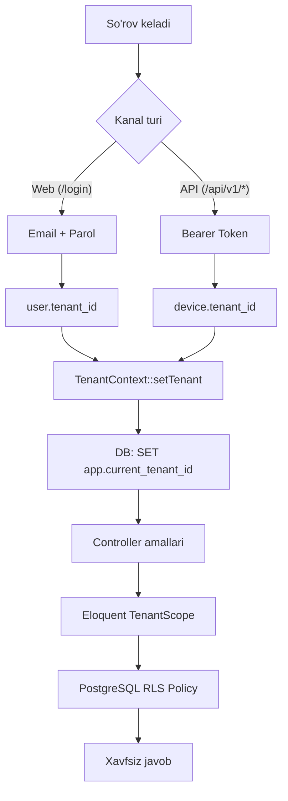
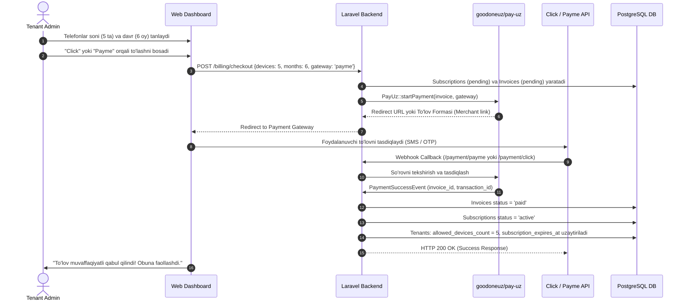

# Multi-Tenant SaaS "ZvonkiPro" — Texnik Arxitektura va Implementatsiya Rejasi
**(Single Database + Centralized Auth + PostgreSQL RLS + amoCRM/Bitrix24/MoySklad/BitoERP + Click/Payme Billing)**

---

## Arxitektura Xulosasi
| Qaror | Tanlangan Variant |
|-------|-------------------|
| **Multi-Tenancy modeli** | Single Database with Row-Level / Tenant Scoping (`tenant_id`) |
| **Tenantni aniqlash (Web)** | A-Variant: Markazlashgan Login → `user.tenant_id` → sessiya |
| **Tenantni aniqlash (Mobil)** | Sanctum Device Token → `device.tenant_id` |
| **Izolyatsiya** | 2 bosqichli: Laravel Eloquent TenantScope + PostgreSQL RLS |
| **DBMS** | PostgreSQL 16+ |
| **Billing & To'lovlar** | Click va Payme (`composer require goodoneuz/pay-uz`) |
| **Tarif Modeli** | Har bir mobil telefon (handset) uchun 3, 6, 12 oylik paketlar (Dual-SIM = 1 telefon) |
| **CRM/ERP** | amoCRM, Bitrix24, MoySklad, BitoERP (Driver Pattern) |

---

## 1. Tenant Izolyatsiyasi Mexanizmi



### 1.1. TenantContext Singleton
```php
namespace App\Services\Tenancy;

use App\Models\Tenant;
use Illuminate\Support\Facades\DB;

class TenantContext
{
    protected ?Tenant $tenant = null;

    public function setTenant(?Tenant $tenant): void
    {
        $this->tenant = $tenant;

        if ($tenant) {
            // Sessiya darajasida (SET LOCAL emas! — tranzaksiyaga bog'liq emas)
            DB::statement("SET app.current_tenant_id = '{$tenant->id}'");
        } else {
            DB::statement("RESET app.current_tenant_id");
        }
    }

    public function getTenant(): ?Tenant { return $this->tenant; }
    public function id(): ?int { return $this->tenant?->id; }
    public function check(): bool { return $this->tenant !== null; }
}
```

### 1.2. TenantScope
```php
namespace App\Models\Scopes;

use App\Services\Tenancy\TenantContext;
use Illuminate\Database\Eloquent\Builder;
use Illuminate\Database\Eloquent\Model;
use Illuminate\Database\Eloquent\Scope;

class TenantScope implements Scope
{
    public function apply(Builder $builder, Model $model): void
    {
        $ctx = app(TenantContext::class);
        if ($ctx->check()) {
            $builder->where($model->qualifyColumn('tenant_id'), $ctx->id());
        }
    }
}
```

### 1.3. BelongsToTenant Trait
```php
namespace App\Models\Concerns;

use App\Models\Scopes\TenantScope;
use App\Services\Tenancy\TenantContext;

trait BelongsToTenant
{
    protected static function bootBelongsToTenant(): void
    {
        static::addGlobalScope(new TenantScope());

        static::creating(function ($model) {
            $ctx = app(TenantContext::class);
            if (empty($model->tenant_id) && $ctx->check()) {
                $model->tenant_id = $ctx->id();
            }
        });
    }

    public function tenant()
    {
        return $this->belongsTo(\App\Models\Tenant::class);
    }
}
```

### 1.4. SetTenantContext Middleware
```php
namespace App\Http\Middleware;

use Closure;
use Illuminate\Http\Request;
use App\Services\Tenancy\TenantContext;

class SetTenantContext
{
    public function handle(Request $request, Closure $next)
    {
        $tenantContext = app(TenantContext::class);

        if (auth()->check()) {
            $tenantContext->setTenant(auth()->user()->tenant);
        } elseif ($request->bearerToken()) {
            // Sanctum device guard orqali
            $device = $request->user('device');
            if ($device) {
                $tenantContext->setTenant($device->tenant);
            }
        }

        return $next($request);
    }
}
```

### 1.5. Superadmin RLS Bypass
Platforma egasi (superadmin) barcha tenantlar ma'lumotlarini ko'rishi uchun RLS ni chetlab o'tish:
```php
namespace App\Http\Middleware;

use Closure;
use Illuminate\Http\Request;
use Illuminate\Support\Facades\DB;

class SuperadminBypassTenant
{
    public function handle(Request $request, Closure $next)
    {
        if (auth()->check() && auth()->user()->role === 'superadmin') {
            // RLS ni o'chirish — faqat superadmin uchun
            DB::statement("SET app.current_tenant_id = ''");
        }
        return $next($request);
    }
}
```

---

## 2. Jadvallar Strukturasi (PostgreSQL DDL + RLS)

### 2.1. `tenants` (Kompaniyalar)
```sql
CREATE TABLE tenants (
    id BIGSERIAL PRIMARY KEY,
    uuid UUID UNIQUE NOT NULL DEFAULT gen_random_uuid(),
    name VARCHAR(255) NOT NULL,
    slug VARCHAR(100) UNIQUE NOT NULL,
    plan VARCHAR(50) NOT NULL DEFAULT 'standard',
    plan_limits JSONB NOT NULL DEFAULT '{"max_devices": 10, "retention_days": 90, "audio_storage_gb": 20}',
    allowed_devices_count INTEGER NOT NULL DEFAULT 2, -- Sotib olingan faol telefon slotlari
    subscription_expires_at TIMESTAMPTZ NULL,        -- Obuna tugash sanasi
    trial_ends_at TIMESTAMPTZ NULL,                  -- Bepul sinov davri (masalan, 14 kun)
    is_active BOOLEAN NOT NULL DEFAULT TRUE,
    created_at TIMESTAMPTZ NULL,
    updated_at TIMESTAMPTZ NULL
);
```

### 2.2. `users` (Mavjud migratsiyaga tenant ustunlari qo'shiladi)
```sql
ALTER TABLE users
    ADD COLUMN tenant_id BIGINT REFERENCES tenants(id) ON DELETE CASCADE,
    ADD COLUMN role VARCHAR(50) NOT NULL DEFAULT 'operator',
    ADD COLUMN phone_number VARCHAR(50) NULL,
    ADD COLUMN is_active BOOLEAN NOT NULL DEFAULT TRUE;

CREATE INDEX idx_users_tenant ON users(tenant_id);

ALTER TABLE users ENABLE ROW LEVEL SECURITY;
CREATE POLICY users_tenant_isolation ON users
    FOR ALL
    USING (tenant_id = NULLIF(current_setting('app.current_tenant_id', true), '')::bigint)
    WITH CHECK (tenant_id = NULLIF(current_setting('app.current_tenant_id', true), '')::bigint);
```

### 2.3. `devices` (Android Mobil Agentlar)
> [!IMPORTANT]
> **Dual-SIM Qoidasi:** Har bir jismoniy smartfon 1 ta `device` yozuvi hisoblanadi. Unda 1 ta yoki 2 ta SIM karta bo'lishi billing va tarifga ta'sir qilmaydi! SIM ma'lumotlari `sim_slots_info` JSONB ustunida saqlanadi.
```sql
CREATE TABLE devices (
    id BIGSERIAL PRIMARY KEY,
    uuid UUID UNIQUE NOT NULL DEFAULT gen_random_uuid(),
    tenant_id BIGINT NOT NULL REFERENCES tenants(id) ON DELETE CASCADE,
    user_id BIGINT NULL REFERENCES users(id) ON DELETE SET NULL,
    device_uid VARCHAR(128) NOT NULL,
    name VARCHAR(255) NOT NULL,
    model VARCHAR(150) NULL,
    manufacturer VARCHAR(100) NULL,
    os_version VARCHAR(50) NULL,
    app_version VARCHAR(50) NULL,
    sim_slots_info JSONB NULL DEFAULT '[]', -- [ {"slot": 0, "operator": "Ucell", "phone": "+99893..."}, {"slot": 1, "operator": "Beeline", "phone": "+99890..."} ]
    battery_level SMALLINT NULL,
    is_charging BOOLEAN NOT NULL DEFAULT FALSE,
    pairing_code VARCHAR(16) NULL,
    pairing_code_expires_at TIMESTAMPTZ NULL,
    last_seen_at TIMESTAMPTZ NULL,
    is_active BOOLEAN NOT NULL DEFAULT TRUE,
    created_at TIMESTAMPTZ NULL,
    updated_at TIMESTAMPTZ NULL,
    CONSTRAINT uq_devices_tenant_uid UNIQUE (tenant_id, device_uid)
);
CREATE INDEX idx_devices_tenant_seen ON devices(tenant_id, last_seen_at);

ALTER TABLE devices ENABLE ROW LEVEL SECURITY;
CREATE POLICY devices_tenant_isolation ON devices
    FOR ALL
    USING (tenant_id = NULLIF(current_setting('app.current_tenant_id', true), '')::bigint)
    WITH CHECK (tenant_id = NULLIF(current_setting('app.current_tenant_id', true), '')::bigint);
```

### 2.4. `calls` (Qo'ng'iroqlar va Audio Yozuvlar)
```sql
CREATE TABLE calls (
    id BIGSERIAL PRIMARY KEY,
    uuid UUID UNIQUE NOT NULL DEFAULT gen_random_uuid(),
    tenant_id BIGINT NOT NULL REFERENCES tenants(id) ON DELETE CASCADE,
    device_id BIGINT NOT NULL REFERENCES devices(id) ON DELETE CASCADE,
    user_id BIGINT NULL REFERENCES users(id) ON DELETE SET NULL,
    direction VARCHAR(20) NOT NULL,
    phone_number VARCHAR(50) NOT NULL,
    contact_name VARCHAR(255) NULL,
    duration_seconds INTEGER NOT NULL DEFAULT 0,
    sim_slot SMALLINT NOT NULL DEFAULT 0, -- 0 (SIM 1) yoki 1 (SIM 2)
    sim_operator VARCHAR(100) NULL,
    recording_disk VARCHAR(50) NOT NULL DEFAULT 'private_storage',
    recording_path VARCHAR(500) NULL,
    recording_size_bytes BIGINT NULL,
    recording_status VARCHAR(30) NOT NULL DEFAULT 'none',
    call_timestamp TIMESTAMPTZ NOT NULL,
    synced_at TIMESTAMPTZ NOT NULL DEFAULT CURRENT_TIMESTAMP,
    created_at TIMESTAMPTZ NULL,
    updated_at TIMESTAMPTZ NULL
);
CREATE INDEX idx_calls_tenant_ts ON calls(tenant_id, call_timestamp DESC);
CREATE INDEX idx_calls_tenant_phone ON calls(tenant_id, phone_number);
CREATE INDEX idx_calls_tenant_device ON calls(tenant_id, device_id);

ALTER TABLE calls ENABLE ROW LEVEL SECURITY;
CREATE POLICY calls_tenant_isolation ON calls
    FOR ALL
    USING (tenant_id = NULLIF(current_setting('app.current_tenant_id', true), '')::bigint)
    WITH CHECK (tenant_id = NULLIF(current_setting('app.current_tenant_id', true), '')::bigint);
```

### 2.5. `subscriptions` (Tarif va Obunalar)
```sql
CREATE TABLE subscriptions (
    id BIGSERIAL PRIMARY KEY,
    uuid UUID UNIQUE NOT NULL DEFAULT gen_random_uuid(),
    tenant_id BIGINT NOT NULL REFERENCES tenants(id) ON DELETE CASCADE,
    period_months SMALLINT NOT NULL,              -- 3, 6, yoki 12 oy
    device_count INTEGER NOT NULL,               -- Obunadagi telefonlar soni
    unit_price_monthly NUMERIC(12, 2) NOT NULL,  -- 1 ta telefon uchun 1 oylik baza narxi (masalan, 50,000 UZS)
    discount_percent SMALLINT NOT NULL DEFAULT 0,-- Chegirma: 3 oy (0%), 6 oy (10%), 12 oy (20%)
    total_amount NUMERIC(14, 2) NOT NULL,        -- Umumiy hisoblangan to'lov summasi
    currency VARCHAR(3) NOT NULL DEFAULT 'UZS',
    starts_at TIMESTAMPTZ NOT NULL,
    expires_at TIMESTAMPTZ NOT NULL,
    status VARCHAR(30) NOT NULL DEFAULT 'pending', -- pending, active, expired, cancelled
    created_at TIMESTAMPTZ NULL,
    updated_at TIMESTAMPTZ NULL
);
CREATE INDEX idx_subscriptions_tenant ON subscriptions(tenant_id, status);

ALTER TABLE subscriptions ENABLE ROW LEVEL SECURITY;
CREATE POLICY subscriptions_tenant_isolation ON subscriptions
    FOR ALL
    USING (tenant_id = NULLIF(current_setting('app.current_tenant_id', true), '')::bigint)
    WITH CHECK (tenant_id = NULLIF(current_setting('app.current_tenant_id', true), '')::bigint);
```

### 2.6. `invoices` (Hisob-fakturalar va To'lovlar)
```sql
CREATE TABLE invoices (
    id BIGSERIAL PRIMARY KEY,
    uuid UUID UNIQUE NOT NULL DEFAULT gen_random_uuid(),
    tenant_id BIGINT NOT NULL REFERENCES tenants(id) ON DELETE CASCADE,
    subscription_id BIGINT NULL REFERENCES subscriptions(id) ON DELETE SET NULL,
    invoice_number VARCHAR(50) UNIQUE NOT NULL,    -- Masalan: INV-202609-00042
    amount NUMERIC(14, 2) NOT NULL,
    currency VARCHAR(3) NOT NULL DEFAULT 'UZS',
    payment_system VARCHAR(30) NULL,              -- 'click', 'payme'
    transaction_id VARCHAR(100) NULL,             -- Provider / pay_uz tranzaksiya ID si
    status VARCHAR(30) NOT NULL DEFAULT 'pending', -- pending, paid, cancelled, failed
    paid_at TIMESTAMPTZ NULL,
    meta JSONB NULL,                              -- To'lov tizimi qaytargan kvitansiya ma'lumotlari
    created_at TIMESTAMPTZ NULL,
    updated_at TIMESTAMPTZ NULL
);
CREATE INDEX idx_invoices_tenant ON invoices(tenant_id, status);

ALTER TABLE invoices ENABLE ROW LEVEL SECURITY;
CREATE POLICY invoices_tenant_isolation ON invoices
    FOR ALL
    USING (tenant_id = NULLIF(current_setting('app.current_tenant_id', true), '')::bigint)
    WITH CHECK (tenant_id = NULLIF(current_setting('app.current_tenant_id', true), '')::bigint);
```

### 2.7. `tenant_integrations` (amoCRM, Bitrix24, MoySklad, BitoERP)
```sql
CREATE TABLE tenant_integrations (
    id BIGSERIAL PRIMARY KEY,
    uuid UUID UNIQUE NOT NULL DEFAULT gen_random_uuid(),
    tenant_id BIGINT NOT NULL REFERENCES tenants(id) ON DELETE CASCADE,
    provider VARCHAR(50) NOT NULL,
    name VARCHAR(150) NOT NULL,
    credentials JSONB NOT NULL,
    settings JSONB NOT NULL DEFAULT '{"auto_create_lead": true, "sync_recordings": true, "sync_missed_calls": true}',
    is_active BOOLEAN NOT NULL DEFAULT TRUE,
    last_synced_at TIMESTAMPTZ NULL,
    status_message TEXT NULL,
    created_at TIMESTAMPTZ NULL,
    updated_at TIMESTAMPTZ NULL,
    CONSTRAINT uq_integrations_provider UNIQUE (tenant_id, provider)
);

ALTER TABLE tenant_integrations ENABLE ROW LEVEL SECURITY;
CREATE POLICY integrations_tenant_isolation ON tenant_integrations
    FOR ALL
    USING (tenant_id = NULLIF(current_setting('app.current_tenant_id', true), '')::bigint)
    WITH CHECK (tenant_id = NULLIF(current_setting('app.current_tenant_id', true), '')::bigint);
```

### 2.8. `integration_user_mappings` (Qurilma ↔ CRM Menejer)
```sql
CREATE TABLE integration_user_mappings (
    id BIGSERIAL PRIMARY KEY,
    tenant_id BIGINT NOT NULL REFERENCES tenants(id) ON DELETE CASCADE,
    integration_id BIGINT NOT NULL REFERENCES tenant_integrations(id) ON DELETE CASCADE,
    device_id BIGINT NOT NULL REFERENCES devices(id) ON DELETE CASCADE,
    crm_user_id VARCHAR(100) NOT NULL,
    crm_user_name VARCHAR(255) NULL,
    created_at TIMESTAMPTZ NULL,
    updated_at TIMESTAMPTZ NULL,
    CONSTRAINT uq_user_mappings UNIQUE (integration_id, device_id)
);
```

### 2.9. `integration_sync_logs` (Integratsiya audit jurnali)
```sql
CREATE TABLE integration_sync_logs (
    id BIGSERIAL PRIMARY KEY,
    tenant_id BIGINT NOT NULL REFERENCES tenants(id) ON DELETE CASCADE,
    integration_id BIGINT NOT NULL REFERENCES tenant_integrations(id) ON DELETE CASCADE,
    call_id BIGINT NOT NULL REFERENCES calls(id) ON DELETE CASCADE,
    event_type VARCHAR(50) NOT NULL,
    status VARCHAR(30) NOT NULL,
    request_payload JSONB NULL,
    response_payload JSONB NULL,
    response_code INTEGER NULL,
    error_message TEXT NULL,
    attempts SMALLINT NOT NULL DEFAULT 1,
    created_at TIMESTAMPTZ NULL
);
CREATE INDEX idx_sync_logs_tenant ON integration_sync_logs(tenant_id, created_at DESC);
```

---

## 3. Billing & To'lov Tizimi (Click / Payme / goodoneuz/pay-uz)

### 3.1. Tarif Modeli va Hisob-kitob Qoidalari
1. **Hisob-kitob Birligi (Baza):**
   - Faqat ulangan **mobil telefonlar (Handset / Qurilma)** soni bo'yicha hisoblanadi.
   - **Dual-SIM:** Bitta telefonda 2 ta SIM-karta bo'lsa ham, u **1 ta telefon** sifatida hisoblanadi. SIM soniga qo'shimcha to'lov olinmaydi.
2. **Tarif Davrlari va Chegirmalar:**
   - **3 oylik:** Boshlang'ich minimal davr (Chegirma: 0%).
   - **6 oylik:** O'rta muddatli obuna (Chegirma: 10%).
   - **12 oylik:** Yillik uzoq muddatli obuna (Chegirma: 20%).
3. **Hisoblash Formulasi:**
   $$\text{Baza Summasi} = \text{Qurilmalar Soni} \times \text{Oylik Narx (masalan, 50 000 UZS)} \times \text{Oylar Soni (3, 6, 12)}$$
   $$\text{To'lov Summasi} = \text{Baza Summasi} \times \left(1 - \frac{\text{Chegirma Foizi}}{100}\right)$$

*Misol:*
| Qurilmalar soni | Davr | Oylik baza narxi | Chegirma | Jami to'lov | Tejamkorlik |
|-----------------|------|------------------|----------|-------------|-------------|
| 5 ta telefon | 3 oy | 50 000 UZS | 0% | 750 000 UZS | — |
| 5 ta telefon | 6 oy | 50 000 UZS | 10% | 1 350 000 UZS | 150 000 UZS |
| 5 ta telefon | 12 oy | 50 000 UZS | 20% | 2 400 000 UZS | 600 000 UZS |

### 3.2. To'lov Oqimi (Click & Payme integratsiyasi)



### 3.3. `goodoneuz/pay-uz` Paketini O'rnatish va Sozlash
```bash
composer require goodoneuz/pay-uz
php artisan vendor:publish --provider="Goodoneuz\PayUz\PayUzServiceProvider"
```

`.env` konfiguratsiyasi:
```env
# Payme Sozlamalari
PAYME_MERCHANT_ID=your_payme_merchant_id
PAYME_KEY=your_payme_secret_key
PAYME_TEST_MODE=true

# Click Sozlamalari
CLICK_SERVICE_ID=your_click_service_id
CLICK_MERCHANT_ID=your_click_merchant_id
CLICK_SECRET_KEY=your_click_secret_key
CLICK_MERCHANT_USER_ID=your_click_user_id
```

### 3.4. Qurilma Kvotasi va Obunani Nazorat Qilish (Enforcement)
1. **Yangi telefon ulanayotganda (`POST /api/v1/devices/pair`):**
   ```php
   $activeDevicesCount = $tenant->devices()->where('is_active', true)->count();
   if ($activeDevicesCount >= $tenant->allowed_devices_count) {
       return response()->json([
           'error' => 'device_quota_exceeded',
           'message' => 'Tarifingizdagi faol qurilmalar limiti to\'ldi. Yangi telefon ulash uchun billing bo\'limida qo\'shimcha slot xarid qiling.',
           'allowed_count' => $tenant->allowed_devices_count,
           'active_count' => $activeDevicesCount,
       ], 403);
   }
   ```
2. **Obuna muddati tugaganda (`CheckTenantSubscription` Middleware):**
   ```php
   if ($tenant->subscription_expires_at && $tenant->subscription_expires_at->isPast()) {
       // Bepul trial yoki to'langan obuna muddati tugagan
       return response()->json([
           'error' => 'subscription_expired',
           'message' => 'Obuna muddati tugagan. Xizmatdan foydalanishni davom ettirish uchun to\'lovni amalga oshiring.',
       ], 402); // 402 Payment Required
   }
   ```

---

## 4. Auth Konfiguratsiyasi — config/auth.php

Sanctum orqali mobil qurilmalarni avtorizatsiya qilish uchun alohida `device` guard va provider:
```php
'guards' => [
    'web' => ['driver' => 'session', 'provider' => 'users'],
    'device' => ['driver' => 'sanctum', 'provider' => 'devices'],
],
'providers' => [
    'users' => ['driver' => 'eloquent', 'model' => App\Models\User::class],
    'devices' => ['driver' => 'eloquent', 'model' => App\Models\Device::class],
],
```

---

## 5. Monorepo Fayl Daraxti
```
zvonkipro/
├── .github/workflows/
│   ├── backend-ci.yml
│   └── android-ci.yml
├── android/                         # Native Kotlin
│   ├── app/src/main/java/com/zvonkipro/agent/
│   │   ├── data/{local, remote, repository}/
│   │   ├── service/{CallDetectionService, AudioRecorderService, KeepAliveService}.kt
│   │   ├── workers/{CallSyncWorker, HeartbeatWorker}.kt
│   │   └── ui/{pairing, status}/
│   └── build.gradle.kts
├── app/                             # Laravel 12
│   ├── Http/Controllers/Api/
│   │   ├── DevicePairingController.php
│   │   ├── TelemetryIngestController.php
│   │   └── PaymentWebhookController.php # Click va Payme callbacklari
│   ├── Http/Controllers/Web/
│   │   ├── DashboardController.php
│   │   ├── CallsController.php
│   │   ├── DevicesController.php
│   │   ├── BillingController.php        # Obuna xaridi va to'lov sahifasi
│   │   └── IntegrationsController.php
│   ├── Http/Middleware/
│   │   ├── SetTenantContext.php
│   │   ├── SuperadminBypassTenant.php
│   │   └── CheckTenantSubscription.php  # Obuna holati tekshiruvi
│   ├── Models/
│   │   ├── Tenant.php
│   │   ├── User.php
│   │   ├── Device.php
│   │   ├── Call.php
│   │   ├── Subscription.php             # 3, 6, 12 oylik paketlar
│   │   ├── Invoice.php                  # Hisob-fakturalar
│   │   └── TenantIntegration.php
│   ├── Models/Concerns/BelongsToTenant.php
│   ├── Models/Scopes/TenantScope.php
│   ├── Services/Tenancy/TenantContext.php
│   ├── Services/Billing/
│   │   ├── BillingCalculator.php        # 3/6/12 oy chegirmalari va narx hisoblash
│   │   └── SubscriptionService.php      # To'lovdan so'ng slot va muddatni yangilash
│   ├── Services/Integrations/{CrmManager, AmoCrmDriver, Bitrix24Driver, MoySkladDriver, BitoErpDriver}.php
│   └── Jobs/{SyncCallToIntegrationsJob, DispatchWebhookJob}.php
├── resources/js/pages/
│   ├── {Dashboard, Calls/Index, Devices/Index}.tsx
│   ├── Billing/
│   │   ├── Index.tsx                    # Tarif tanlash, qurilmalar kalkulyatori, Click/Payme tugmalari
│   │   └── Invoices.tsx                 # To'lovlar tarixi va cheklar
│   └── Integrations/{Index, AmoCrmConfig, UserMapping}.tsx
├── docs/ARCHITECTURE_AND_ROADMAP.md
└── .gitignore
```

---

## 6. Mobil Agent (Kotlin Native) — QR-Kod Orqali Ulanish

1. **Dashboardda QR-kod chiqarish:** Admin "Yangi telefon ulash" tugmasini bosadi. Server bir martalik `pairing_token` generatsiya qiladi:
   ```json
   {
     "endpoint": "https://app.zvonkipro.com/api/v1",
     "pairing_token": "PAIR_7xK9pQ2m",
     "tenant_name": "Artel Call Center",
     "expires_at": "2026-09-10T12:00:00Z"
   }
   ```
2. **Kvota Tekshiruvi:** Agar tenantning mavjud faol qurilmalari `allowed_devices_count` ga teng bo'lsa, tizim yangi QR-kod bermaydi va to'lov bo'limiga yo'naltiradi.
3. **QR-kod skanerlash:** Xodim ilovada kamerani ochib QR-kodni skanerlaydi (CameraX + ML Kit).
4. **Bog'lanish:** `POST /api/v1/devices/pair` (qurilma modeli, Android ID xeshi, SIM-kartalar ro'yxati).
5. **Token olish:** Server doimiy `Sanctum Device Token` qaytaradi.
6. **Xavfsiz saqlash:** `EncryptedSharedPreferences` (MasterKey AES-256 GCM).
7. **Avtomatik ishlash:** Bundan keyin foydalanuvchiga qayta login talab etilmaydi.

---

## 7. Qadam-baqadam Ishga Tushirish Yo'l Xaritasi (Phase 1 — Phase 6)

### **Phase 1: Multi-Tenant Backend Core & Ingest API**
- [ ] **1.0.** PostgreSQL o'rnatish va `.env` da `DB_CONNECTION=pgsql` ga o'tish.
- [ ] **1.1.** Kerakli paketlarni o'rnatish:
  - `composer require laravel/sanctum`
  - `composer require goodoneuz/pay-uz` (Click va Payme to'lovlari uchun)
- [ ] **1.2.** `tenants` jadval migratsiyasi (`allowed_devices_count`, `subscription_expires_at`, `trial_ends_at` bilan).
- [ ] **1.3.** Mavjud `users` migratsiyasiga `tenant_id`, `role`, `phone_number`, `is_active` ustunlarini qo'shish.
- [ ] **1.4.** Baza migratsiyalari: `devices`, `calls`, `subscriptions`, `invoices`, `tenant_integrations`, `integration_user_mappings`, `integration_sync_logs` va `pay-uz` jadvallari.
- [ ] **1.5.** Barcha tenant-jadvallarga PostgreSQL RLS siyosatlarini qo'llash (`users`, `devices`, `calls`, `subscriptions`, `invoices`, `tenant_integrations`).
- [ ] **1.6.** `TenantContext` singleton va `SetTenantContext` middleware yaratish (`SET app.current_tenant_id` — `SET LOCAL` emas!).
- [ ] **1.7.** `BelongsToTenant` Trait va `TenantScope` ni modellar uchun tatbiq etish.
- [ ] **1.8.** `config/auth.php` da `device` guard va provider sozlash.
- [ ] **1.9.** `SuperadminBypassTenant` middleware yaratish (platforma egasi uchun RLS bypass).
- [ ] **1.10.** `POST /api/v1/devices/pair` APIsi (Tarifdagi `allowed_devices_count` kvotasi tekshiruvi bilan).
- [ ] **1.11.** Telemetriya qabul qilish APIsi: `POST /api/v1/telemetry/calls` (Multipart/JSON).
- [ ] **1.12.** Heartbeat APIsi: `POST /api/v1/telemetry/heartbeat`.
- [ ] **1.13.** Pest testlar: RLS izolyatsiyasi, tenant scoping, device quota enforcement, superadmin bypass tekshiruvlari.

---

### **Phase 2: Android Native Core & Device Pairing**
- [ ] **2.1.** `android/` papkasida Jetpack Compose, Material3 va Hilt asosida loyiha skeletini yaratish.
- [ ] **2.2.** Ruxsatnomalar oqimini yaratish: `READ_PHONE_STATE`, `RECORD_AUDIO`, `POST_NOTIFICATIONS`, `READ_PHONE_NUMBERS`, `CAMERA`.
- [ ] **2.3.** CameraX + ML Kit asosida QR-kod skanerlash ekrani.
- [ ] **2.4.** `EncryptedSharedPreferences` va Retrofit interceptor (Bearer Token).
- [ ] **2.5.** `TelephonyCallback` bilan qo'ng'iroq holatlarini tutuvchi fon servisi.

---

### **Phase 3: Audio Yozish va Offline Sync (Room + WorkManager)**
- [ ] **3.1.** `ForegroundService` (`foregroundServiceType="microphone"`) — `MediaRecorder` AAC/M4A.
- [ ] **3.2.** `SubscriptionManager` — Dual-SIM aniqlash (har ikki SIM ma'lumotlarini o'qish, lekin 1 ta qurilma sifatida uzatish).
- [ ] **3.3.** Room Database (`LocalCallRecord`, DAO, Repository).
- [ ] **3.4.** `CallSyncWorker` (WorkManager, `NetworkType.CONNECTED`, Exponential Backoff).
- [ ] **3.5.** `HeartbeatWorker` (15 daqiqalik davriy ping).
- [ ] **3.6.** Batareya optimallashtirish chetlab o'tish onboardingi (MIUI, OneUI, HarmonyOS).

---

### **Phase 4: Tenant Dashboard & Audio Player (Inertia.js + React)**
- [ ] **4.1.** `TenantLayout` va navigatsiya.
- [ ] **4.2.** Qo'ng'iroqlar jurnali: Filtrlar, jadval, KPI kartalari.
- [ ] **4.3.** `WaveformPlayer.tsx` — Audio to'lqin vizualizatsiyasi (wavesurfer.js), tezlik nazorati (1x-2x).
- [ ] **4.4.** Qurilmalar monitoringi: Onlayn/oflayn, batareya, Dual-SIM holati, QR-kod generatsiya modali (kvota tekshiruvi bilan).
- [ ] **4.5.** Xavfsiz audio streaming marshruti (`/api/v1/calls/{uuid}/audio-stream`, HTTP Range qo'llab-quvvatlash).

---

### **Phase 5: Billing & To'lov Tizimi (Click, Payme, goodoneuz/pay-uz)**
- [ ] **5.1.** `config/pay-uz.php` sozlash (Click va Payme merchant kalitlari, callback URLlar).
- [ ] **5.2.** `BillingCalculator` servisi:
  - 1 ta telefon uchun bazaviy narxni hisoblash.
  - 3 oylik (0%), 6 oylik (10%), 12 oylik (20%) chegirmalarni avtomatik hisoblash.
  - Qurilmalar soni o'zgarganda pro-rata kalkulyatsiyasi.
- [ ] **5.3.** `SubscriptionService`:
  - Yangi obuna yaratish, hisob-faktura (`Invoice`) chiqarish.
  - To'lov tasdiqlanganda `tenant.subscription_expires_at` va `tenant.allowed_devices_count` ni oshirish.
- [ ] **5.4.** To'lov Gateway Webhook integratsiyasi:
  - `POST /payment/payme` (Payme JSON-RPC 2.0 protokoli).
  - `POST /payment/click` (Click Prepare va Complete so'rovlari).
  - Webhook tranzaksiyalari imzolarini tekshirish (MD5 / SHA-1) va xavfsizlik.
- [ ] **5.5.** `CheckTenantSubscription` middleware — muddati tugagan tenantlar uchun operatsiyalarni cheklash.
- [ ] **5.6.** Billing UI Dashboard:
  - `Billing/Index.tsx` — Interaktiv kalkulyator (telefonlar soni slayder/input, 3 / 6 / 12 oy tanlash, Click va Payme tugmalari).
  - `Billing/Invoices.tsx` — To'lovlar tarixi, statuslari va PDF kvitansiyalar.
- [ ] **5.7.** Avtomatik eslatmalar (Obuna tugashiga 7 kun, 3 kun, 1 kun qolganda Email va Telegram xabarnomasi).

---

### **Phase 6: CRM & ERP Integratsiyalari va Production Tayyorgarlik**
- [ ] **6.1.** `CrmDriverInterface` va `CrmManager` (Driver Pattern).
- [ ] **6.2.** **amoCRM Drayveri:** OAuth2 refresh oqimi, `/api/v4/contacts` qidirish/yaratish, `/api/v4/calls` voqea yozish, Redis Rate Limiter (7 req/sec).
- [ ] **6.3.** **Bitrix24 Drayveri:** `telephony.externalcall.register` va `telephony.externalcall.finish`, audio biriktirish.
- [ ] **6.4.** **MoySklad Drayveri:** JSON API 1.2 kontragent qidiruv va voqea kiritish.
- [ ] **6.5.** **BitoERP & Universal Webhook Drayveri:** REST Webhook (HMAC SHA-256).
- [ ] **6.6.** `SyncCallToIntegrationsJob` asinxron navbat va Retry Policy (3 urinish, Exponential Backoff).
- [ ] **6.7.** Integratsiyalar Dashboard UI: Ulanish modallari, User Mapping, audit loglari.
- [ ] **6.8.** Monorepo `.gitignore` yangilash (Android artefaktlar uchun).
- [ ] **6.9.** GitHub Actions CI/CD: `backend-ci.yml` va `android-ci.yml`.
- [ ] **6.10.** Yuqori yuklamada sinov (PostgreSQL indekslar, Redis navbatlar, PgBouncer).
