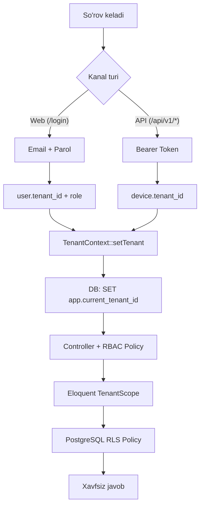

# Multi-Tenant SaaS "agent.1call.uz" — Texnik Arxitektura va Implementatsiya Rejasi
**(Single Database + Centralized Auth + PostgreSQL RLS + Click/Payme Billing + Telegram Bot + CRM/ERP)**

---

## Arxitektura Xulosasi
| Qaror | Tanlangan Variant |
|-------|-------------------|
| **Multi-Tenancy modeli** | Single Database with Row-Level / Tenant Scoping (`tenant_id`) |
| **Tenantni aniqlash (Web)** | A-Variant: Markazlashgan Login → `user.tenant_id` → sessiya |
| **Tenantni aniqlash (Mobil)** | Sanctum Device Token → `device.tenant_id` |
| **Izolyatsiya** | 2 bosqichli: Laravel Eloquent TenantScope + PostgreSQL RLS |
| **Foydalanuvchi Rollari (RBAC)** | 3 darajali: `admin`, `supervisor`, `operator` (+ global `superadmin`) |
| **DBMS** | PostgreSQL 16+ |
| **Billing & To'lovlar** | Click va Payme (`composer require goodoneuz/pay-uz`) |
| **Tarif Modeli** | Har bir mobil telefon (handset) uchun 3, 6, 12 oylik paketlar (Dual-SIM = 1 telefon) |
| **Billing Dinamikasi** | Yangi telefonlar uchun **Pro-rata (Co-terming)** + **3 kunlik Grace Period** |
| **Android Audio Capture** | **AccessibilityService** + MediaRecorder AudioSource fallback (Android 10+ qo'llab-quvvatlash) |
| **Maxfiylik (Privacy)** | **Ish vaqti rejimi (Work Schedule)** va shaxsiy raqamlar filtri (Blacklist) |
| **Tezkor Bildirishnomalar** | **Telegram Bot:** Qoldirilgan qo'ng'iroqlar, kunlik hisobotlar va to'lov eslatmalari |
| **CRM/ERP Integratsiyalari** | amoCRM, Bitrix24, MoySklad, BitoERP (Driver Pattern) |
| **Server va Joylashtirish** | Linux VPS (Ubuntu 24.04, Nginx, PHP 8.3, PostgreSQL 16, Redis) |
| **Audio Saqlash** | VPS Private Storage (`storage/app/private/recordings/`) + HTTP Range streaming |
| **Superadmin Paneli** | Ichki yengil Inertia.js/React boshqaruvi (`/admin/users`, `/admin/tenants`) |

---

## 1. Tenant Izolyatsiyasi va RBAC Ruxsatlar Tizimi



### 1.1. TenantContext Singleton
```php
namespace App\Services\Tenancy;

use App\Models\Tenant;
use Illuminate\Support\Facades\DB;

class TenantContext
{
    protected ?Tenant $tenant = null;

    public function setTenant(?Tenant $tenant): void
    {
        $this->tenant = $tenant;

        if ($tenant) {
            // Sessiya darajasida (SET LOCAL emas! — tranzaksiyaga bog'liq emas)
            DB::statement("SET app.current_tenant_id = '{$tenant->id}'");
        } else {
            DB::statement("RESET app.current_tenant_id");
        }
    }

    public function getTenant(): ?Tenant { return $this->tenant; }
    public function id(): ?int { return $this->tenant?->id; }
    public function check(): bool { return $this->tenant !== null; }
}
```

### 1.2. 3 Darajali RBAC Ruxsatlar Matritsasi
| Imkoniyat / Bo'lim | Superadmin (Platforma egasi) | Admin (Kompaniya rahbari) | Supervisor (Bo'lim boshlig'i) | Operator (Xodim) |
|---|---|---|---|---|
| **Barcha tenantlar va foydalanuvchilar (`/admin/users`)** | ✅ To'liq nazorat | ❌ Kirish taqiqlangan | ❌ Kirish taqiqlangan | ❌ Kirish taqiqlangan |
| **Kompaniyalar obunasini qo'lda uzaytirish/boshqarish** | ✅ Ha | ❌ Faqat o'zinikini to'laydi | ❌ Yo'q | ❌ Yo'q |
| **Barcha qo'ng'iroqlarni ko'rish va eshitish** | ✅ Barcha xodimlar | ✅ Faqat o'z bo'limi operatorlari | ❌ Faqat o'zining qo'ng'iroqlari |
| **Audio yozuvlarni yuklab olish (Download)** | ✅ Ruxsat berilgan | ❌ Faqat eshitish (Stream) | ❌ Yuklab ololmaydi |
| **Qurilmalar va QR-kod ulash** | ✅ Ha | ⚠️ Faqat o'z xodimlariga | ❌ Yo'q |
| **Billing va To'lovlar (Click/Payme)** | ✅ To'liq kirish | ❌ Kirish taqiqlangan | ❌ Kirish taqiqlangan |
| **CRM/ERP sozlamalari** | ✅ Sozlay oladi | ❌ Faqat holatni ko'radi | ❌ Kirish taqiqlangan |
| **Ish grafigi va maxfiylik sozlamalari** | ✅ Ha | ❌ Yo'q | ❌ Yo'q |

### 1.3. Superadmin Ichki Boshqaruv Sahifasi (`/admin/users` va `/admin/tenants`)
Alohida og'ir paketlar (masalan Filament) o'rnatilmaydi. Mavjud Inertia.js + React stekida faqat `role === 'superadmin'` foydalanuvchilari uchun yengil boshqaruv sahifalari yaratiladi:
1. **`/admin/users`:**
   - Platformadagi barcha tenantlar xodimlarining yagona jadvali.
   - Filtrlash (Tenant bo'yicha, rol bo'yicha, status bo'yicha).
   - Foydalanuvchini bloklash, faollashtirish yoki parolini yangilash.
2. **`/admin/tenants`:**
   - Barcha kompaniyalar (tenantlar) ro'yxati, ularning joriy tarifi, faol telefonlari soni va obuna tugash sanasi.
   - Obunani qo'lda uzaytirish (masalan, to'lov bank orqali kelib tushganda yoki do'stona trial berilganda).
   - RLS bu sahifalarda `SuperadminBypassTenant` middleware orqali avtomatik chetlab o'tiladi.

---

## 2. Jadvallar Strukturasi (PostgreSQL DDL + RLS)

### 2.1. `tenants` (Kompaniyalar)
```sql
CREATE TABLE tenants (
    id BIGSERIAL PRIMARY KEY,
    uuid UUID UNIQUE NOT NULL DEFAULT gen_random_uuid(),
    name VARCHAR(255) NOT NULL,
    slug VARCHAR(100) UNIQUE NOT NULL,
    plan VARCHAR(50) NOT NULL DEFAULT 'standard',
    plan_limits JSONB NOT NULL DEFAULT '{"max_devices": 10, "retention_days": 90, "audio_storage_gb": 20}',
    allowed_devices_count INTEGER NOT NULL DEFAULT 2, -- Sotib olingan faol telefon slotlari
    subscription_expires_at TIMESTAMPTZ NULL,        -- Obuna rasmiy tugash sanasi
    grace_period_ends_at TIMESTAMPTZ NULL,           -- 3 kunlik imtiyozli davr tugash sanasi
    trial_ends_at TIMESTAMPTZ NULL,                  -- Bepul sinov davri (masalan, 14 kun)
    work_schedule JSONB NOT NULL DEFAULT '{
        "enabled": false,
        "work_days": [1, 2, 3, 4, 5],
        "start_time": "09:00",
        "end_time": "18:00",
        "timezone": "Asia/Tashkent"
    }',                                              -- Kompaniya umumiy ish grafigi
    privacy_blacklist JSONB NOT NULL DEFAULT '[]',   -- Yozilmaydigan maxfiy/shaxsiy raqamlar maskalari
    telegram_chat_id VARCHAR(100) NULL,             -- Bildirishnomalar uchun Telegram guruh/kanal ID si
    is_active BOOLEAN NOT NULL DEFAULT TRUE,
    created_at TIMESTAMPTZ NULL,
    updated_at TIMESTAMPTZ NULL
);
```

### 2.2. `users` (3 darajali RBAC bilan)
```sql
ALTER TABLE users
    ADD COLUMN tenant_id BIGINT REFERENCES tenants(id) ON DELETE CASCADE,
    ADD COLUMN role VARCHAR(50) NOT NULL DEFAULT 'operator', -- admin, supervisor, operator, superadmin
    ADD COLUMN supervisor_id BIGINT NULL REFERENCES users(id) ON DELETE SET NULL, -- Operator kimga bo'ysunadi
    ADD COLUMN phone_number VARCHAR(50) NULL,
    ADD COLUMN is_active BOOLEAN NOT NULL DEFAULT TRUE;

CREATE INDEX idx_users_tenant ON users(tenant_id);
CREATE INDEX idx_users_supervisor ON users(supervisor_id);

ALTER TABLE users ENABLE ROW LEVEL SECURITY;
CREATE POLICY users_tenant_isolation ON users
    FOR ALL
    USING (tenant_id = NULLIF(current_setting('app.current_tenant_id', true), '')::bigint)
    WITH CHECK (tenant_id = NULLIF(current_setting('app.current_tenant_id', true), '')::bigint);
```

### 2.3. `devices` (Android Mobil Agentlar)
> [!IMPORTANT]
> **Dual-SIM Qoidasi:** Bitta jismoniy smartfonda 2 ta SIM karta bo'lishi billing va litsenziyaga ta'sir qilmaydi! SIM ma'lumotlari `sim_slots_info` ustunida saqlanadi va 1 ta litsenziya deb hisoblanadi.
```sql
CREATE TABLE devices (
    id BIGSERIAL PRIMARY KEY,
    uuid UUID UNIQUE NOT NULL DEFAULT gen_random_uuid(),
    tenant_id BIGINT NOT NULL REFERENCES tenants(id) ON DELETE CASCADE,
    user_id BIGINT NULL REFERENCES users(id) ON DELETE SET NULL,
    device_uid VARCHAR(128) NOT NULL,
    name VARCHAR(255) NOT NULL,
    model VARCHAR(150) NULL,
    manufacturer VARCHAR(100) NULL,
    os_version VARCHAR(50) NULL,
    app_version VARCHAR(50) NULL,
    sim_slots_info JSONB NULL DEFAULT '[]',
    accessibility_service_enabled BOOLEAN NOT NULL DEFAULT FALSE, -- Ovoz yozish xizmati holati
    battery_level SMALLINT NULL,
    is_charging BOOLEAN NOT NULL DEFAULT FALSE,
    work_schedule_override JSONB NULL,           -- Xodim uchun maxsus individual grafik (agar kerak bo'lsa)
    pairing_code VARCHAR(16) NULL,
    pairing_code_expires_at TIMESTAMPTZ NULL,
    last_seen_at TIMESTAMPTZ NULL,
    is_active BOOLEAN NOT NULL DEFAULT TRUE,
    created_at TIMESTAMPTZ NULL,
    updated_at TIMESTAMPTZ NULL,
    CONSTRAINT uq_devices_tenant_uid UNIQUE (tenant_id, device_uid)
);
CREATE INDEX idx_devices_tenant_seen ON devices(tenant_id, last_seen_at);

ALTER TABLE devices ENABLE ROW LEVEL SECURITY;
CREATE POLICY devices_tenant_isolation ON devices
    FOR ALL
    USING (tenant_id = NULLIF(current_setting('app.current_tenant_id', true), '')::bigint)
    WITH CHECK (tenant_id = NULLIF(current_setting('app.current_tenant_id', true), '')::bigint);
```

### 2.4. `calls` (Qo'ng'iroqlar va Audio Yozuvlar)
```sql
CREATE TABLE calls (
    id BIGSERIAL PRIMARY KEY,
    uuid UUID UNIQUE NOT NULL DEFAULT gen_random_uuid(),
    tenant_id BIGINT NOT NULL REFERENCES tenants(id) ON DELETE CASCADE,
    device_id BIGINT NOT NULL REFERENCES devices(id) ON DELETE CASCADE,
    user_id BIGINT NULL REFERENCES users(id) ON DELETE SET NULL,
    direction VARCHAR(20) NOT NULL,              -- inbound, outbound, missed
    phone_number VARCHAR(50) NOT NULL,
    contact_name VARCHAR(255) NULL,
    duration_seconds INTEGER NOT NULL DEFAULT 0,
    sim_slot SMALLINT NOT NULL DEFAULT 0,        -- 0 (SIM 1) yoki 1 (SIM 2)
    sim_operator VARCHAR(100) NULL,
    recording_disk VARCHAR(50) NOT NULL DEFAULT 'private_storage',
    recording_path VARCHAR(500) NULL,
    recording_size_bytes BIGINT NULL,
    recording_status VARCHAR(30) NOT NULL DEFAULT 'none', -- none, uploaded, processing, failed
    audio_source_type VARCHAR(50) NULL,          -- accessibility_service, mic, voice_communication
    is_work_hours BOOLEAN NOT NULL DEFAULT TRUE, -- Ish vaqtida bo'lganmi
    call_timestamp TIMESTAMPTZ NOT NULL,
    synced_at TIMESTAMPTZ NOT NULL DEFAULT CURRENT_TIMESTAMP,
    created_at TIMESTAMPTZ NULL,
    updated_at TIMESTAMPTZ NULL
);
CREATE INDEX idx_calls_tenant_ts ON calls(tenant_id, call_timestamp DESC);
CREATE INDEX idx_calls_tenant_phone ON calls(tenant_id, phone_number);
CREATE INDEX idx_calls_tenant_device ON calls(tenant_id, device_id);

ALTER TABLE calls ENABLE ROW LEVEL SECURITY;
CREATE POLICY calls_tenant_isolation ON calls
    FOR ALL
    USING (tenant_id = NULLIF(current_setting('app.current_tenant_id', true), '')::bigint)
    WITH CHECK (tenant_id = NULLIF(current_setting('app.current_tenant_id', true), '')::bigint);
```

### 2.5. `subscriptions` (Tarif va Obunalar)
```sql
CREATE TABLE subscriptions (
    id BIGSERIAL PRIMARY KEY,
    uuid UUID UNIQUE NOT NULL DEFAULT gen_random_uuid(),
    tenant_id BIGINT NOT NULL REFERENCES tenants(id) ON DELETE CASCADE,
    period_months SMALLINT NOT NULL,              -- 3, 6, 12 oy (yoki 0 agar pro-rata bo'lsa)
    device_count INTEGER NOT NULL,               -- Obunadagi telefonlar soni
    unit_price_monthly NUMERIC(12, 2) NOT NULL,  -- 1 ta telefon uchun 1 oylik baza narxi
    discount_percent SMALLINT NOT NULL DEFAULT 0,-- 3 oy (0%), 6 oy (10%), 12 oy (20%)
    total_amount NUMERIC(14, 2) NOT NULL,        -- Umumiy to'lov summasi
    is_prorated BOOLEAN NOT NULL DEFAULT FALSE,  -- Pro-rata orqali qo'shilgan slotmi
    currency VARCHAR(3) NOT NULL DEFAULT 'UZS',
    starts_at TIMESTAMPTZ NOT NULL,
    expires_at TIMESTAMPTZ NOT NULL,
    status VARCHAR(30) NOT NULL DEFAULT 'pending', -- pending, active, expired, cancelled
    created_at TIMESTAMPTZ NULL,
    updated_at TIMESTAMPTZ NULL
);
CREATE INDEX idx_subscriptions_tenant ON subscriptions(tenant_id, status);

ALTER TABLE subscriptions ENABLE ROW LEVEL SECURITY;
CREATE POLICY subscriptions_tenant_isolation ON subscriptions
    FOR ALL
    USING (tenant_id = NULLIF(current_setting('app.current_tenant_id', true), '')::bigint)
    WITH CHECK (tenant_id = NULLIF(current_setting('app.current_tenant_id', true), '')::bigint);
```

### 2.6. `invoices` (Hisob-fakturalar va To'lovlar)
```sql
CREATE TABLE invoices (
    id BIGSERIAL PRIMARY KEY,
    uuid UUID UNIQUE NOT NULL DEFAULT gen_random_uuid(),
    tenant_id BIGINT NOT NULL REFERENCES tenants(id) ON DELETE CASCADE,
    subscription_id BIGINT NULL REFERENCES subscriptions(id) ON DELETE SET NULL,
    invoice_number VARCHAR(50) UNIQUE NOT NULL,    -- Masalan: INV-202609-00042
    amount NUMERIC(14, 2) NOT NULL,
    currency VARCHAR(3) NOT NULL DEFAULT 'UZS',
    payment_system VARCHAR(30) NULL,              -- 'click', 'payme'
    transaction_id VARCHAR(100) NULL,             -- Provider / pay_uz tranzaksiya ID si
    status VARCHAR(30) NOT NULL DEFAULT 'pending', -- pending, paid, cancelled, failed
    paid_at TIMESTAMPTZ NULL,
    meta JSONB NULL,
    created_at TIMESTAMPTZ NULL,
    updated_at TIMESTAMPTZ NULL
);
CREATE INDEX idx_invoices_tenant ON invoices(tenant_id, status);

ALTER TABLE invoices ENABLE ROW LEVEL SECURITY;
CREATE POLICY invoices_tenant_isolation ON invoices
    FOR ALL
    USING (tenant_id = NULLIF(current_setting('app.current_tenant_id', true), '')::bigint)
    WITH CHECK (tenant_id = NULLIF(current_setting('app.current_tenant_id', true), '')::bigint);
```

---

## 3. Billing, Pro-rata va Grace Period Mexanizmi

### 3.1. Tariflash Qoidalari va Chegirmalar
1. **Hisob-kitob Birligi:** Faqat ulangan **mobil telefonlar (Handset / Qurilma)** soni bo'yicha. Dual-SIM 1 ta telefon narxida.
2. **Paketlar:**
   - **3 oylik:** 0% chegirma (Baza narx * 3).
   - **6 oylik:** 10% chegirma (Baza narx * 6 * 0.90).
   - **12 oylik:** 20% chegirma (Baza narx * 12 * 0.80).

### 3.2. Pro-rata (Co-terming) Yangi Telefon Qo'shish Kalkulyatori
Mijozda joriy obuna davom etayotgan bo'lsa va qo'shimcha yangi telefonlar ulamoqchi bo'lsa, ularning muddati alohida hisoblanmaydi, balki **mavjud obunaning tugash sanasiga moslanadi**:

$$\text{Qolgan Kunlar} = \text{tenant.subscription\_expires\_at} - \text{NOW()}$$
$$\text{Kunlik Narx} = \frac{\text{1 ta telefonning oylik narxi}}{30}$$
$$\text{Pro-rata To'lov} = \text{Yangi Telefonlar Soni} \times \text{Kunlik Narx} \times \text{Qolgan Kunlar}$$

*Natija:* Barcha telefonlarning tugash sanasi yagona bo'ladi, hisob-kitobda chalkashlik bo'lmaydi.

### 3.3. 3 Kunlik "Grace Period" (Imtiyozli Davr) Siyosati
- Obuna muddati tugagach (`subscription_expires_at < now()`), xizmat darhol o'chirilmaydi.
- Avtomatik `grace_period_ends_at = subscription_expires_at + INTERVAL '3 days'` faollashadi:
  - **Ilova va qo'ng'iroqlar:** 3 kun davomida odatdagidek yoziladi va serverga qabul qilinadi.
  - **Dashboard:** Qizil ogohlantirish bannari chiqadi: *"Obuna muddati tugadi! Xizmat to'xtatilishiga X kun qoldi. Hozir to'lang."*
  - **Telegram Bot:** Rahbarga har kuni ertalab to'lov havolasi yuboriladi.
- 3 kunlik Grace Period ham tugagach (`now() > grace_period_ends_at`):
  - Telemetriya qabul qilish to'xtatiladi (`402 Payment Required`).
  - Web panelda faqat Billing sahifasi ochiq qoladi.

---

## 4. Android Audio Capture (AccessibilityService) & Maxfiylik Rejimi

### 4.1. Android 10+ (API 29+) Ovoz Yozish Strategiyasi
Google Android 10 dan boshlab standart `VOICE_CALL` manbasini cheklaganligi sababli, ilovada ko'p bosqichli mexanizm ishlatiladi:
1. **AccessibilityService (Asosiy Yechim):**
   - Ilova o'rnatilganda foydalanuvchidan "Maxsus imkoniyatlar" (Accessibility Service) ruxsatnomasi so'raladi.
   - Bu servis qo'ng'iroqning aniq audio oqimini har qanday Android versiyasida (Android 10, 11, 12, 13, 14, 15) to'liq va ikki tomonlama sifatli yozib olish imkonini beradi.
2. **Fallback Audio Manbalari:**
   - Agar biror qurilmada Accessibility ruxsati berilmasa: `MediaRecorder.AudioSource.VOICE_COMMUNICATION` -> `MediaRecorder.AudioSource.MIC` kombinatsiyasi ishlatiladi.

### 4.2. "Ish Vaqti" va Maxfiylik Rejimi (Work Schedule & Privacy)
Xodimlarning shaxsiy hayotini himoya qilish va korporativ axloq qoidalariga rioya qilish uchun:
1. **Ish Grafigi Tekshiruvi:**
   - Har bir qo'ng'iroq boshlanganda Android agent qurilma vaqti va tenantning `work_schedule` (masalan: Dush-Juma, 09:00 - 18:00) jadvalini solishtiradi.
   - Ish vaqtidan tashqaridagi qo'ng'iroqlar ilova tomonidan **umuman yozilmaydi va audio fayl saqlanmaydi**.
2. **Qora Ro'yxat (Blacklist):**
   - Shaxsiy yoki yaqin qarindoshlar raqamlari qora ro'yxatga kiritilsa, bu raqamlar bilan bo'lgan suhbatlar avtomatik filtrlanadi va serverga jo'natilmaydi.

---

## 5. agent.1call.uz Telegram Boti (Real-time Xabarnomalar)

### 5.1. Bot Funksional Imkoniyatlari
- **Qoldirilgan Qo'ng'iroqlar (Missed Call Alert):** Operator mijoz qo'ng'irog'iga javob bermasa, 60 soniya ichida rahbar yoki bo'lim guruhiga xabar keladi:
  > ⚠️ **Qoldirilgan qo'ng'iroq!**  
  > 📞 Raqam: `+998 90 123 45 67`  
  > 👤 Biriktirilgan xodim: Sardor Karimov (SIM 1 - Ucell)  
  > 🕒 Vaqt: 14:32:10  
  > 🔗 *[Mijozga qayta qo'ng'iroq qilish](tel:+998901234567)*
- **Kunlik Xulosa (Daily Digest):** Har kuni soat 19:00 da:
  > 📊 **Bugungi qo'ng'iroqlar hisoboti (10.09.2026):**  
  > • Jami qo'ng'iroqlar: **284 ta**  
  > • Kiruvchi: **192 ta** (Javob berildi: 95%)  
  > • Chiquvchi: **92 ta**  
  > • Qoldirilgan: **10 ta**  
  > 🏆 Eng faol operator: **Shahnoza Rahimova** (64 ta qo'ng'iroq)
- **Billing Eslatmalari:** Obuna tugashiga 7 kun, 3 kun qolganda va Grace Period davrida to'g'ridan-to'g'ri Click va Payme to'lov havolalari yuboriladi.

---

## 6. Monorepo Fayl Daraxti
```
agent.1call.uz/
├── .github/workflows/
│   ├── backend-ci.yml
│   └── android-ci.yml
├── android/                         # Native Kotlin
│   ├── app/src/main/java/uz/onecall/agent/
│   │   ├── data/{local, remote, repository}/
│   │   ├── service/
│   │   │   ├── CallAccessibilityService.kt   # Android 10+ audio capture servisi
│   │   │   ├── CallDetectionService.kt
│   │   │   ├── AudioRecorderService.kt
│   │   │   └── KeepAliveService.kt
│   │   ├── filter/
│   │   │   └── WorkHoursFilter.kt            # Ish vaqti va blacklist filtri
│   │   ├── workers/{CallSyncWorker, HeartbeatWorker}.kt
│   │   └── ui/{pairing, permissions, status}/
│   └── build.gradle.kts
├── app/                             # Laravel 12
│   ├── Http/Controllers/Api/
│   │   ├── DevicePairingController.php
│   │   ├── TelemetryIngestController.php
│   │   └── PaymentWebhookController.php      # Click va Payme callbacklari
│   ├── Http/Controllers/Web/
│   │   ├── Admin/
│   │   │   ├── SuperadminUsersController.php    # Superadmin barcha foydalanuvchilar sahifasi
│   │   │   └── SuperadminTenantsController.php  # Superadmin barcha tenantlar sahifasi
│   │   ├── DashboardController.php
│   │   ├── CallsController.php
│   │   ├── DevicesController.php
│   │   ├── BillingController.php             # Pro-rata, Click/Payme to'lov
│   │   ├── SettingsController.php            # Ish grafigi va maxfiylik
│   │   └── IntegrationsController.php
│   ├── Http/Middleware/
│   │   ├── SetTenantContext.php
│   │   ├── SuperadminBypassTenant.php
│   │   ├── CheckTenantSubscription.php       # Grace period & Expiry tekshiruvi
│   │   └── RoleMiddleware.php                # Admin / Supervisor / Operator RBAC
│   ├── Models/
│   │   ├── Tenant.php
│   │   ├── User.php
│   │   ├── Device.php
│   │   ├── Call.php
│   │   ├── Subscription.php
│   │   ├── Invoice.php
│   │   └── TenantIntegration.php
│   ├── Services/Billing/
│   │   ├── BillingCalculator.php             # 3/6/12 oy, chegirmalar, Pro-rata
│   │   └── SubscriptionService.php
│   ├── Services/Telegram/
│   │   └── TelegramNotificationService.php   # Qoldirilgan qo'ng'iroq va hisobotlar
│   ├── Services/Integrations/{CrmManager, AmoCrmDriver, Bitrix24Driver, MoySkladDriver, BitoErpDriver}.php
│   └── Jobs/{SyncCallToIntegrationsJob, SendTelegramAlertJob}.php
├── resources/js/pages/
│   ├── {Dashboard, Calls/Index, Devices/Index}.tsx
│   ├── Admin/
│   │   ├── Users/Index.tsx                      # Superadmin Users sahifasi
│   │   └── Tenants/Index.tsx                    # Superadmin Tenants sahifasi
│   ├── Billing/{Index, Invoices}.tsx
│   ├── Settings/{WorkSchedule, Privacy}.tsx
│   └── Integrations/{Index, AmoCrmConfig, UserMapping}.tsx
├── docs/ARCHITECTURE_AND_ROADMAP.md
└── .gitignore
```

---

## 7. Qadam-baqadam Ishga Tushirish Yo'l Xaritasi (Phase 1 — Phase 6)

### **Phase 1: Multi-Tenant Backend Core & RBAC Ingest API**
- [ ] **1.0.** PostgreSQL o'rnatish va `.env` da `DB_CONNECTION=pgsql` ga o'tish.
- [ ] **1.1.** Paketlarni o'rnatish: `laravel/sanctum`, `goodoneuz/pay-uz`.
- [ ] **1.2.** `tenants` jadvali migratsiyasi (`allowed_devices_count`, `subscription_expires_at`, `grace_period_ends_at`, `work_schedule`, `privacy_blacklist`).
- [ ] **1.3.** `users` jadvaliga `tenant_id`, 3 darajali `role` (`admin`, `supervisor`, `operator`), `supervisor_id` ustunlarini qo'shish.
- [ ] **1.4.** Baza migratsiyalari: `devices`, `calls`, `subscriptions`, `invoices`, `tenant_integrations`, `integration_user_mappings`, `integration_sync_logs` va `pay-uz`.
- [ ] **1.5.** Barcha tenant-jadvallarga PostgreSQL RLS siyosatlarini qo'llash.
- [ ] **1.6.** `TenantContext` singleton va `SetTenantContext` middleware.
- [ ] **1.7.** `RoleMiddleware` (Admin, Supervisor, Operator ruxsatlarini ajratish).
- [ ] **1.8.** `SuperadminBypassTenant` middleware.
- [ ] **1.9.** `POST /api/v1/devices/pair` APIsi (`allowed_devices_count` kvotasi tekshiruvi bilan).
- [ ] **1.10.** Telemetriya qabul qilish APIsi: `POST /api/v1/telemetry/calls`.
- [ ] **1.11.** Heartbeat APIsi: `POST /api/v1/telemetry/heartbeat`.
- [ ] **1.12.** Pest testlar: RLS izolyatsiyasi, RBAC tekshiruvlari, device kvotasi.

---

### **Phase 2: Android Native Core & Accessibility Setup**
- [ ] **2.1.** Jetpack Compose, Material3 va Hilt asosida Android loyiha skeletini yaratish.
- [ ] **2.2.** Ruxsatnomalar onboardingi: `READ_PHONE_STATE`, `RECORD_AUDIO`, `POST_NOTIFICATIONS`, `CAMERA`.
- [ ] **2.3.** `AccessibilityService` ruxsatnoma oqimi va xizmatni sozlash ekrani.
- [ ] **2.4.** CameraX + ML Kit asosida QR-kod skanerlash va token olish.
- [ ] **2.5.** `EncryptedSharedPreferences` xavfsiz token saqlash.

---

### **Phase 3: Android Audio Yozish, Maxfiylik va Offline Sync**
- [ ] **3.1.** `CallAccessibilityService` — Android 10+ da qo'ng'iroq ovozini ishonchli yozib olish servisi.
- [ ] **3.2.** `WorkHoursFilter` — Ish grafigi va qora ro'yxat tekshiruvi (shaxsiy qo'ng'iroqlarni yozmaslik).
- [ ] **3.3.** Dual-SIM aniqlash (`SubscriptionManager` orqali ikkala SIMni aniqlab, 1 ta qurilma telemetriyasi sifatida uzatish).
- [ ] **3.4.** Room Database (`LocalCallRecord`, DAO, Repository).
- [ ] **3.5.** `CallSyncWorker` (WorkManager, avtomatik sinxronizatsiya va qayta urinish).
- [ ] **3.6.** Batareya optimallashtirish chetlab o'tish onboardingi (MIUI, OneUI, HarmonyOS).

---

### **Phase 4: Tenant Dashboard, RBAC & Audio Player (Inertia.js + React)**
- [ ] **4.1.** `TenantLayout` va rollar bo'yicha navigatsiya (Supervisor faqat o'z jamoasini ko'radi).
- [ ] **4.2.** Grace Period ogohlantirish banneri.
- [ ] **4.3.** Qo'ng'iroqlar jurnali: Filtrlar, KPI kartalari, qoldirilgan qo'ng'iroqlar belgisi.
- [ ] **4.4.** `WaveformPlayer.tsx` — Audio to'lqin vizualizatsiyasi (wavesurfer.js), xavfsiz streaming (Signed URL, yuklab olishni taqiqlash).
- [ ] **4.5.** Qurilmalar monitoringi va QR-kod generatsiya modali.
- [ ] **4.6.** Ish grafigi va Maxfiylik sozlamalari sahifasi (`Settings/WorkSchedule.tsx`).
- [ ] **4.7.** **Superadmin Sahifalari:** `/admin/users` (barcha xodimlar boshqaruvi) va `/admin/tenants` (kompaniyalar va obuna boshqaruvi).

---

### **Phase 5: Billing, Pro-rata va To'lov Tizimi (Click, Payme, goodoneuz/pay-uz)**
- [ ] **5.1.** `config/pay-uz.php` sozlash (Click va Payme merchant kalitlari).
- [ ] **5.2.** `BillingCalculator` servisi:
  - 3 oy (0%), 6 oy (10%), 12 oy (20%) chegirmalar kalkulyatori.
  - Yangi telefonlar uchun **Pro-rata (Co-terming)** kalkulyatori.
- [ ] **5.3.** `SubscriptionService` (yangi obuna, hisob-faktura, slotlar soni va muddatni yangilash).
- [ ] **5.4.** Gateway Webhook integratsiyasi: `POST /payment/payme` va `POST /payment/click`.
- [ ] **5.5.** **3 kunlik Grace Period** mexanizmi va `CheckTenantSubscription` middleware.
- [ ] **5.6.** Billing UI: `Billing/Index.tsx` (tarif kalkulyatori, Pro-rata qo'shimcha slotlar, Click/Payme tugmalari), `Billing/Invoices.tsx`.

---

### **Phase 6: Telegram Bot, CRM Integratsiyalari va Production**
- [ ] **6.1.** **Telegram Bot integratsiyasi:**
  - Real-vaqtda qoldirilgan qo'ng'iroqlar haqida ogohlantirish (`SendTelegramAlertJob`).
  - Kunlik soat 19:00 statistik hisobot.
  - Obuna tugashiga 7, 3, 1 kun qolganda to'lov eslatmalari.
- [ ] **6.2.** `CrmDriverInterface` va `CrmManager` (Driver Pattern).
- [ ] **6.3.** **amoCRM Drayveri:** OAuth2, kontaktlar va qo'ng'iroqlarni sinxronlash, Redis Rate Limiter (7 req/sec).
- [ ] **6.4.** **Bitrix24 Drayveri:** `telephony.externalcall` integratsiyasi.
- [ ] **6.5.** **MoySklad Drayveri:** JSON API 1.2 kontragent va voqealar.
- [ ] **6.6.** **BitoERP & Universal Webhook Drayveri:** REST Webhook (HMAC SHA-256).
- [ ] **6.7.** `SyncCallToIntegrationsJob` asinxron navbat va Retry Policy.
- [ ] **6.8.** Integratsiyalar Dashboard UI.
- [ ] **6.9.** GitHub Actions CI/CD (`backend-ci.yml`, `android-ci.yml`) va yuklama sinovlari.
- [ ] **6.10.** **VPS Production Deploy:** Ubuntu 24.04 sozlash, Nginx, PHP 8.3-FPM, PostgreSQL 16, Redis, Supervisor (queues), Certbot SSL va deploy skripti.
