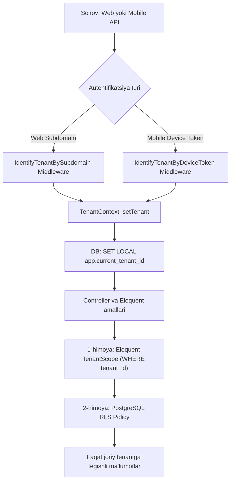

# Multi-Tenant SaaS "ZvonkiPro" (Single Database with Row-Level / Tenant Scoping)

Mazkur hujjat foydalanuvchi tanlovi asosida **Single Database with Row-Level / Tenant Scoping** modeliga 100% moslashtirilgan, Laravel 12 Backend & Inertia/React Dashboard va Android Native Kotlin Agent uchun to'liq texnik arxitektura va amaliy yo'l xaritasini (Implementation Roadmap) belgilaydi.

---

## Foydalanuvchi Tanlovi: Single Database with Row-Level / Tenant Scoping
Ushbu arxitekturada barcha mijozlar (tenantlar) bitta PostgreSQL ma'lumotlar bazasidan foydalanadi. Ma'lumotlarning mutlaq xavfsizligi va o'zaro aralashib ketmasligi **ikki bosqichli chuqur himoya (Defense-in-Depth)** orqali ta'minlanadi:
1. **Ilova qatlami (Application Layer - Laravel Eloquent):** `TenantScope` va `BelongsToTenant` traiti har bir ORM so'roviga avtomatik `WHERE tenant_id = ?` shartini qo'shadi va yangi yozuvlarga `tenant_id` ni biriktiradi.
2. **Baza qatlami (Database Layer - PostgreSQL Row-Level Security / RLS):** Hatto dasturchi xato qilib xom SQL (`DB::select`) yoki qat'iy tekshirilmagan so'rov yozgan taqdirda ham, PostgreSQL o'z darajasida jadvallarni bloklaydi (`ENABLE ROW LEVEL SECURITY`).

---

## 1. Multi-Tenant Backend & Database Arxitekturasi (Laravel 12 + PostgreSQL RLS)

### 1.1. Tenant Izolyatsiyasi Mexanizmi



### 1.2. PostgreSQL Row-Level Security (RLS) Konfiguratsiyasi
Barcha tenantga xos jadvallarda (`calls`, `devices`, `users`, `crm_webhooks`) RLS yoqiladi:

```sql
-- Har bir ulanishda o'rnatiladigan o'zgaruvchi: app.current_tenant_id
-- 1. Calls jadvalida RLS ni yoqish
ALTER TABLE calls ENABLE ROW LEVEL SECURITY;
ALTER TABLE devices ENABLE ROW LEVEL SECURITY;
ALTER TABLE crm_webhooks ENABLE ROW LEVEL SECURITY;

-- 2. Qat'iy izolyatsiya qoidasi (Policy)
CREATE POLICY calls_tenant_isolation_policy ON calls
    FOR ALL
    USING (tenant_id = NULLIF(current_setting('app.current_tenant_id', true), '')::bigint)
    WITH CHECK (tenant_id = NULLIF(current_setting('app.current_tenant_id', true), '')::bigint);

CREATE POLICY devices_tenant_isolation_policy ON devices
    FOR ALL
    USING (tenant_id = NULLIF(current_setting('app.current_tenant_id', true), '')::bigint)
    WITH CHECK (tenant_id = NULLIF(current_setting('app.current_tenant_id', true), '')::bigint);

CREATE POLICY webhooks_tenant_isolation_policy ON crm_webhooks
    FOR ALL
    USING (tenant_id = NULLIF(current_setting('app.current_tenant_id', true), '')::bigint)
    WITH CHECK (tenant_id = NULLIF(current_setting('app.current_tenant_id', true), '')::bigint);
```

### 1.3. Laravel Middleware va TenantContext

#### `TenantContext.php` (Singleton Service):
```php
namespace App\Services\Tenancy;

use App\Models\Tenant;
use Illuminate\Support\Facades\DB;

class TenantContext
{
    protected ?Tenant $tenant = null;

    public function setTenant(?Tenant $tenant): void
    {
        $this->tenant = $tenant;

        if ($tenant) {
            // PostgreSQL sessiya o'zgaruvchisini o'rnatish (RLS uchun)
            DB::statement("SET LOCAL app.current_tenant_id = '{$tenant->id}'");
        } else {
            DB::statement("RESET app.current_tenant_id");
        }
    }

    public function getTenant(): ?Tenant
    {
        return $this->tenant;
    }

    public function id(): ?int
    {
        return $this->tenant?->id;
    }

    public function check(): bool
    {
        return $this->tenant !== null;
    }
}
```

#### `BelongsToTenant.php` (Model Trait):
```php
namespace App\Models\Concerns;

use App\Models\Scopes\TenantScope;
use App\Services\Tenancy\TenantContext;

trait BelongsToTenant
{
    protected static function bootBelongsToTenant(): void
    {
        static::addGlobalScope(new TenantScope());

        static::creating(function ($model) {
            $context = app(TenantContext::class);
            if (empty($model->tenant_id) && $context->check()) {
                $model->tenant_id = $context->id();
            }
        });
    }

    public function tenant()
    {
        return $this->belongsTo(\App\Models\Tenant::class);
    }
}
```

---

### 1.4. To'liq Jadvallar Strukturasi va Indekslar (Single DB Sxemasi)

#### 1. `tenants` (Ijarachilar / Kompaniyalar)
```sql
CREATE TABLE tenants (
    id BIGSERIAL PRIMARY KEY,
    uuid UUID UNIQUE NOT NULL DEFAULT gen_random_uuid(),
    name VARCHAR(255) NOT NULL,
    subdomain VARCHAR(100) UNIQUE NOT NULL,
    custom_domain VARCHAR(255) UNIQUE NULL,
    plan VARCHAR(50) NOT NULL DEFAULT 'standard', -- 'starter', 'business', 'enterprise'
    plan_limits JSONB NOT NULL DEFAULT '{"max_devices": 10, "retention_days": 90, "audio_storage_gb": 20}',
    is_active BOOLEAN NOT NULL DEFAULT TRUE,
    created_at TIMESTAMP WITH TIME ZONE NULL,
    updated_at TIMESTAMP WITH TIME ZONE NULL
);
CREATE INDEX idx_tenants_subdomain ON tenants(subdomain);
```

#### 2. `users` (Dashboard Foydalanuvchilari)
```sql
CREATE TABLE users (
    id BIGSERIAL PRIMARY KEY,
    tenant_id BIGINT NOT NULL REFERENCES tenants(id) ON DELETE CASCADE,
    name VARCHAR(255) NOT NULL,
    email VARCHAR(255) NOT NULL,
    password VARCHAR(255) NOT NULL,
    role VARCHAR(50) NOT NULL DEFAULT 'operator', -- 'superadmin', 'tenant_admin', 'manager', 'operator'
    phone_number VARCHAR(50) NULL,
    is_active BOOLEAN NOT NULL DEFAULT TRUE,
    remember_token VARCHAR(100) NULL,
    created_at TIMESTAMP WITH TIME ZONE NULL,
    updated_at TIMESTAMP WITH TIME ZONE NULL,
    CONSTRAINT uq_users_tenant_email UNIQUE (tenant_id, email)
);
CREATE INDEX idx_users_tenant ON users(tenant_id);
```

#### 3. `devices` (Android Mobil Agentlar)
```sql
CREATE TABLE devices (
    id BIGSERIAL PRIMARY KEY,
    uuid UUID UNIQUE NOT NULL DEFAULT gen_random_uuid(),
    tenant_id BIGINT NOT NULL REFERENCES tenants(id) ON DELETE CASCADE,
    user_id BIGINT NULL REFERENCES users(id) ON DELETE SET NULL,
    device_uid VARCHAR(128) NOT NULL,
    name VARCHAR(255) NOT NULL, -- "Alisher - Xiaomi 13"
    model VARCHAR(150) NULL,
    manufacturer VARCHAR(100) NULL,
    os_version VARCHAR(50) NULL,
    app_version VARCHAR(50) NULL,
    sim_slots_info JSONB NULL DEFAULT '[]', -- [{"slot":0,"carrier":"Ucell","phone":"+99890..."},{"slot":1,"carrier":"Beeline","phone":"+99891..."}]
    battery_level SMALLINT NULL,
    is_charging BOOLEAN NOT NULL DEFAULT FALSE,
    pairing_code VARCHAR(16) NULL,
    pairing_code_expires_at TIMESTAMP WITH TIME ZONE NULL,
    last_seen_at TIMESTAMP WITH TIME ZONE NULL,
    is_active BOOLEAN NOT NULL DEFAULT TRUE,
    created_at TIMESTAMP WITH TIME ZONE NULL,
    updated_at TIMESTAMP WITH TIME ZONE NULL,
    CONSTRAINT uq_devices_tenant_device_uid UNIQUE (tenant_id, device_uid)
);
CREATE INDEX idx_devices_tenant_seen ON devices(tenant_id, last_seen_at);
```

#### 4. `calls` (Qo'ng'iroqlar Jurnali va Audio Yozuvlar)
```sql
CREATE TABLE calls (
    id BIGSERIAL PRIMARY KEY,
    uuid UUID UNIQUE NOT NULL DEFAULT gen_random_uuid(),
    tenant_id BIGINT NOT NULL REFERENCES tenants(id) ON DELETE CASCADE,
    device_id BIGINT NOT NULL REFERENCES devices(id) ON DELETE CASCADE,
    user_id BIGINT NULL REFERENCES users(id) ON DELETE SET NULL,
    direction VARCHAR(20) NOT NULL, -- 'inbound', 'outbound', 'missed'
    phone_number VARCHAR(50) NOT NULL,
    contact_name VARCHAR(255) NULL,
    duration_seconds INTEGER NOT NULL DEFAULT 0,
    sim_slot SMALLINT NOT NULL DEFAULT 0, -- 0 = SIM1, 1 = SIM2
    sim_operator VARCHAR(100) NULL,
    recording_disk VARCHAR(50) NOT NULL DEFAULT 'private_storage',
    recording_path VARCHAR(500) NULL, -- 'recordings/{tenant_id}/{year}/{month}/{call_uuid}.m4a'
    recording_size_bytes BIGINT NULL,
    recording_status VARCHAR(30) NOT NULL DEFAULT 'none', -- 'none', 'uploading', 'ready', 'failed'
    call_timestamp TIMESTAMP WITH TIME ZONE NOT NULL,
    synced_at TIMESTAMP WITH TIME ZONE NOT NULL DEFAULT CURRENT_TIMESTAMP,
    created_at TIMESTAMP WITH TIME ZONE NULL,
    updated_at TIMESTAMP WITH TIME ZONE NULL
);
-- High-performance kompozit indekslar
CREATE INDEX idx_calls_tenant_timestamp ON calls(tenant_id, call_timestamp DESC);
CREATE INDEX idx_calls_tenant_phone ON calls(tenant_id, phone_number);
CREATE INDEX idx_calls_tenant_device ON calls(tenant_id, device_id);
CREATE INDEX idx_calls_tenant_direction ON calls(tenant_id, direction);
```

#### 5. `crm_webhooks` va `webhook_deliveries`
```sql
CREATE TABLE crm_webhooks (
    id BIGSERIAL PRIMARY KEY,
    tenant_id BIGINT NOT NULL REFERENCES tenants(id) ON DELETE CASCADE,
    name VARCHAR(150) NOT NULL,
    url VARCHAR(500) NOT NULL,
    secret VARCHAR(255) NOT NULL,
    events JSONB NOT NULL DEFAULT '["call.created", "call.recording_ready"]',
    is_active BOOLEAN NOT NULL DEFAULT TRUE,
    failure_count INTEGER NOT NULL DEFAULT 0,
    last_triggered_at TIMESTAMP WITH TIME ZONE NULL,
    created_at TIMESTAMP WITH TIME ZONE NULL,
    updated_at TIMESTAMP WITH TIME ZONE NULL
);
CREATE INDEX idx_crm_webhooks_tenant ON crm_webhooks(tenant_id);

CREATE TABLE webhook_deliveries (
    id BIGSERIAL PRIMARY KEY,
    tenant_id BIGINT NOT NULL REFERENCES tenants(id) ON DELETE CASCADE,
    webhook_id BIGINT NOT NULL REFERENCES crm_webhooks(id) ON DELETE CASCADE,
    event_type VARCHAR(100) NOT NULL,
    payload JSONB NOT NULL,
    response_status INTEGER NULL,
    response_body TEXT NULL,
    duration_ms INTEGER NULL,
    attempts SMALLINT NOT NULL DEFAULT 1,
    status VARCHAR(30) NOT NULL,
    created_at TIMESTAMP WITH TIME ZONE NULL
);
CREATE INDEX idx_webhook_deliveries_tenant ON webhook_deliveries(tenant_id, created_at DESC);
```

---

### 1.5. Xavfsiz Audio Saqlash va Oqim (Audio Streaming)
- Audio fayllar saqlash joyi: `storage/app/private/recordings/{tenant_id}/{year}/{month}/{call_uuid}.m4a`.
- Pleyerga to'g'ridan-to'g'ri ochiq havola (public URL) berilmaydi.
- Maxsus audio streaming marshruti: `GET /api/v1/calls/{call:uuid}/audio-stream`
- Kontroller ichidagi himoya:
  1. `abort_if($call->tenant_id !== tenant()->id, 403, 'Ruxsat berilmagan!');`
  2. Stream qilinganda HTTP Range sarlavhalari (206 Partial Content) qo'llab-quvvatlanadi, natijada katta audio fayllarni o'tkazib (seek qilib) eshitish mumkin bo'ladi.

---

## 2. Monorepo Tuzilmasi va Git Konfiguratsiyasi

### 2.1. Kataloglar Sxemasi
```
zvonkipro/
├── .github/workflows/
│   ├── backend-ci.yml           # PHPUnit, Pint, Larastan, Vite build
│   └── android-ci.yml           # Gradle test, Assemble APK
├── android/                         # NATIVE KOTLIN ANDROID LOYIHASI
│   ├── app/
│   │   ├── src/main/
│   │   │   ├── java/com/zvonkipro/agent/
│   │   │   │   ├── data/
│   │   │   │   │   ├── local/          # Room DB (LocalCallRecord, Dao)
│   │   │   │   │   ├── remote/         # Retrofit API Services, DTOs
│   │   │   │   │   └── repository/
│   │   │   │   ├── service/
│   │   │   │   │   ├── CallDetectionService.kt # TelephonyCallback
│   │   │   │   │   ├── AudioRecorderService.kt # MediaRecorder / AAC
│   │   │   │   │   └── KeepAliveService.kt     # Sticky Foreground
│   │   │   │   ├── workers/
│   │   │   │   │   ├── CallSyncWorker.kt       # WorkManager offline sync
│   │   │   │   │   └── HeartbeatWorker.kt      # Batareya ping
│   │   │   │   └── ui/
│   │   │   │       ├── pairing/        # QR Scanner (CameraX + ML Kit)
│   │   │   │       └── status/         # Diagnostics ekrani
│   │   │   └── AndroidManifest.xml
│   │   └── build.gradle.kts
│   ├── build.gradle.kts
│   └── settings.gradle.kts
├── app/                             # LARAVEL 12 BACKEND
│   ├── Http/
│   │   ├── Controllers/Api/        # DevicePairing, Telemetry, AudioUpload
│   │   ├── Controllers/Web/        # Dashboard, Calls, Devices, Webhooks
│   │   └── Middleware/             # IdentifyTenant, SetTenantRlsContext
│   ├── Models/                     # Tenant, User, Device, Call, CrmWebhook
│   ├── Models/Concerns/            # BelongsToTenant trait
│   └── Services/Tenancy/           # TenantContext
├── resources/js/                    # INERTIA + REACT
│   ├── components/
│   │   ├── AudioPlayer/WaveformPlayer.tsx
│   │   ├── DeviceBadge.tsx
│   │   └── QrPairingModal.tsx
│   └── pages/
│       ├── Dashboard.tsx
│       ├── Calls/Index.tsx
│       ├── Devices/Index.tsx
│       └── Settings/Webhooks.tsx
├── routes/
│   ├── api.php                      # Mobil agent uchun Sanctum bilan himoyalangan API
│   └── web.php                      # Inertia Dashboard marshrutlari
├── docs/
│   └── ARCHITECTURE_AND_ROADMAP.md  # Ushbu arxitektura hujjati
├── .gitignore
├── composer.json
└── package.json
```

### 2.2. Monorepo `.gitignore`
PHP/Node va Android artefaktlarini to'liq filtrlovchi birlashgan konfiguratsiya:
- PHP / Composer: `/vendor/`, `.env`, `/storage/*.key`, `/storage/app/private/*`
- Node / Frontend: `/node_modules/`, `/public/build/`, `/public/hot`
- Android: `android/.gradle/`, `android/build/`, `android/*/build/`, `android/local.properties`, `*.jks`, `*.keystore`

---

## 3. Mobil Agent (Kotlin Native) Arxitekturasi

### 3.1. Tenantga Bog'lanish (Pairing)
1. **Web Dashboard:** Admin "Yangi qurilma ulash" tugmasini bosadi -> bir martalik `pairing_code` (yoki QR kod) yaratiladi. QR kod tarkibi:
   `{"endpoint": "https://company.zvonkipro.com/api/v1", "token": "PAIR_XYZ987", "expires_at": "2026-09-10T12:00:00Z"}`
2. **Android Ilova:** CameraX + ML Kit yordamida QR-kodni skanerlaydi.
3. **API so'rovi:** `POST /api/v1/devices/pair` ga qurilma UID, modeli, OS versiyasi va SIM karta ma'lumotlarini uzatadi.
4. **Javob:** Server doimiy Sanctum Bearer Token qaytaradi.
5. **Saqlash:** Token Android `EncryptedSharedPreferences` (MasterKey AES-256 GCM) da xavfsiz saqlanadi.

### 3.2. Qo'ng'iroqlar va Audio Yozish Dvigateli
- **Holatlarni aniqlash:** Android 12+ uchun `TelephonyCallback.CallStateListener` (`RINGING`, `OFFHOOK`, `IDLE`).
  - `RINGING` -> vaqt va kiruvchi raqamni saqlash.
  - `OFFHOOK` -> Suhbat boshlandi. `AudioRecorderService` ni ishga tushirish.
  - `IDLE` -> Suhbat tugadi. Audioni yakunlash, davomiylikni o'lchash, Room DB ga saqlash.
- **Audio yozish:** `ForegroundService` (`foregroundServiceType="microphone"`). Format: **AAC / M4A**, 16 kHz mono (hajmi ~200-300 KB / daqiqa). Korporativ qurilmalar uchun `AccessibilityService` hook'i.
- **Dual-SIM:** `SubscriptionManager` orqali qo'ng'iroq qilingan/kelgan SIM kartaning uyasi (Slot 0 yoki 1) va operator nomi (Ucell, Beeline, va h.k.) aniqlanadi.

### 3.3. Offline Bardoshlik (Room DB + WorkManager)
- Internet bo'lmaganda barcha qo'ng'iroqlar Room bazasidagi `LocalCallRecord` jadvaliga `sync_status = PENDING` holatida saqlanadi.
- `CallSyncWorker` faqat internet mavjud bo'lganda (`Constraints.Builder().setRequiredNetworkType(NetworkType.CONNECTED)`) ishga tushadi.
- So'rovlar `POST /api/v1/telemetry/calls` ga multipart formatda uzatiladi. Muvaffaqiyatsiz bo'lsa, WorkManager Exponential Backoff bilan avtomatik qayta urinadi.
- `HeartbeatWorker` har 15 daqiqada batareya foizi va qurilma onlayn holatini xabar qiladi.

---

## 4. Tenant Dashboard (Inertia.js + React)

1. **Jonli Qo'ng'iroqlar Jurnali (`/calls`):**
   - KPI bloklari: Kunlik qo'ng'iroqlar, Javob berilganlar %, Umumiy suhbat vaqti, Faol xodimlar.
   - Filtrlar: Sanalar, Xodimlar, Yo'nalish (Kiruvchi/Chiquvchi/O'tkazib yuborilgan), SIM slot, Raqam qidiruvi.
   - Inline audio ijro qatori.
2. **Waveform Audio Pleyer (`WaveformPlayer.tsx`):**
   - To'lqin shakli (waveform canvas), Play/Pause, 10 soniya oldinga/orqaga sakrash, 1x/1.5x/2x tezlik, yuklab olish.
3. **Qurilmalar Monitoringi (`/devices`):**
   - Kartochkalar ko'rinishi: Xodim ismi, telefon modeli, onlayn/oflayn holati (🟢 < 5 min, 🟡 5-30 min, 🔴 > 30 min), batareya foizi va quvvat olayotganlik belgisi (⚡).
   - QR kod generatsiyasi modali.
4. **CRM Webhook Integratsiyalari (`/settings/webhooks`):**
   - Webhook yaratish: URL, HMAC secret, voqealar (`call.completed`, `call.missed`, `device.offline`).
   - Yetkazib berishlar auditi (Delivery logs): Status kodi, xato xabari, qayta jo'natish (Retry) tugmasi.

---

## 5. Qadam-baqadam Ishga Tushirish Yo'l Xaritasi (Roadmap: Phase 1 — Phase 5)

### **Phase 1: Multi-Tenant Backend Core & Ingest API (Laravel + PostgreSQL RLS)**
- [ ] **1.1.** PostgreSQL drayveri va migratsiyalarni yozish (`tenants`, `users`, `devices`, `calls`, `crm_webhooks`, `webhook_deliveries`).
- [ ] **1.2.** Jadvallarga PostgreSQL RLS siyosatlarini (`ENABLE ROW LEVEL SECURITY` va `POLICY`) qo'llash.
- [ ] **1.3.** `TenantContext` xizmati va `IdentifyTenant` middleware'ini yaratish (`SET LOCAL app.current_tenant_id`).
- [ ] **1.4.** `BelongsToTenant` Trait va `TenantScope` ni Eloquent modellari uchun tatbiq etish.
- [ ] **1.5.** Qurilmani ulash APIsi: `POST /api/v1/devices/pair` (Sanctum token berish).
- [ ] **1.6.** Telemetriya va audio qabul qilish APIsi: `POST /api/v1/telemetry/calls` (Multipart/JSON).
- [ ] **1.7.** Heartbeat APIsi: `POST /api/v1/telemetry/heartbeat` (Batareya va onlayn status).
- [ ] **1.8.** Pest orqali RLS va Tenant Scoping testlarini yozish (Tenantlararo ma'lumot sizib chiqmasligini tekshirish).

---

### **Phase 2: Android Native Core & Device Pairing**
- [ ] **2.1.** `android/` papkasida Jetpack Compose va Hilt asosida loyiha skeletini yaratish.
- [ ] **2.2.** Barcha zarur ruxsatnomalar (Permissions) oqimini tayyorlash (`READ_PHONE_STATE`, `RECORD_AUDIO`, `POST_NOTIFICATIONS` va h.k.).
- [ ] **2.3.** CameraX + ML Kit asosida QR-kod skanerlash va Tenantga ulanish (Pairing) ekranini yaratish.
- [ ] **2.4.** `EncryptedSharedPreferences` orqali Sanctum tokenni saqlash va Retrofit interseptorini sozlash.
- [ ] **2.5.** `TelephonyCallback` orqali qo'ng'iroq holatlarini (`RINGING`, `OFFHOOK`, `IDLE`) tutuvchi fon xizmatini yozish.

---

### **Phase 3: Audio Yozish va Offline Sync Mexanizmi (Room + WorkManager)**
- [ ] **3.1.** `ForegroundService` (`microphone` type) asosida audio yozish modulini qurish (`MediaRecorder` - AAC/M4A).
- [ ] **3.2.** `SubscriptionManager` orqali Dual-SIM (SIM 1 / SIM 2) ma'lumotlarini aniqlash.
- [ ] **3.3.** Room Database tuzish (`LocalCallRecord`, DAO, Repository).
- [ ] **3.4.** `WorkManager` asosida `CallSyncWorker` yaratish (Offline navbat va Exponential Backoff).
- [ ] **3.5.** Batareya optimallashtirish cheklovlarini chetlab o'tish bo'yicha vizual Onboarding yo'riqnomasini yaratish.

---

### **Phase 4: Tenant Dashboard & Audio Player (Inertia.js + React)**
- [ ] **4.1.** Inertia.js va React asosida `TenantLayout` va asosiy navigatsiyani qurish.
- [ ] **4.2.** Qo'ng'iroqlar jurnali sahifasi: Kengaytirilgan filtrlar, xodimlar, sanalar va qidiruv.
- [ ] **4.3.** `WaveformPlayer.tsx` komponenti: Audio to'lqinini chizish, ijro nazorati, tezlikni oshirish.
- [ ] **4.4.** Qurilmalar monitoringi sahifasi: Real-vaqtda onlayn/oflayn belgilari, zaryad indikatori va QR-kod generatsiya modali.
- [ ] **4.5.** Xavfsiz audio oqim marshruti (`/api/v1/calls/{uuid}/audio-stream`) va ruxsatlarni tekshirish.

---

### **Phase 5: CRM Webhook Tizimi, Optimallashtirish va CI/CD**
- [ ] **5.1.** Webhook sozlash sahifasi (CRUD, voqealar tanlovi, maxfiy kalit).
- [ ] **5.2.** `DispatchWebhookJob` asinxron navbati (Laravel Queue) orqali tashqi CRMlarga (amoCRM, Bitrix24) HMAC imzolangan JSON yuborish.
- [ ] **5.3.** Webhook muvaffaqiyatsiz bo'lganda 3 martagacha eksponensial kechikish bilan qayta urinish (Retry policy).
- [ ] **5.4.** Monorepo uchun GitHub Actions quvurlarini (`backend-ci.yml`, `android-ci.yml`) to'liq sozlash.
- [ ] **5.5.** Yuqori yuklamada (High Load) sinov: PostgreSQL indekslari va Redis navbatlari samaradorligini tekshirish.
