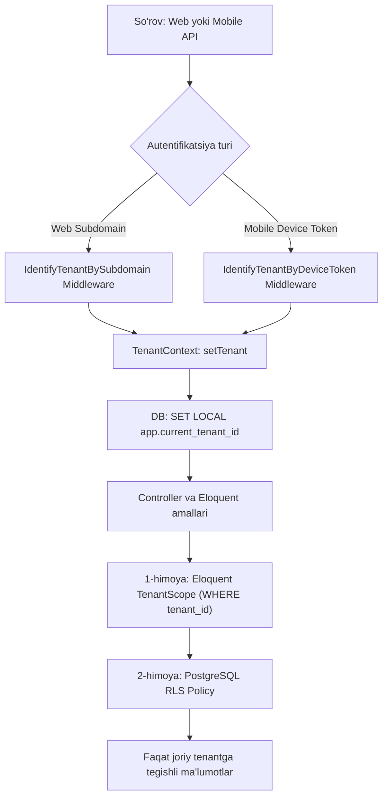

# Multi-Tenant SaaS "ZvonkiPro" (Single Database with Row-Level / Tenant Scoping)

Mazkur hujjat **Single Database with Row-Level / Tenant Scoping** modeliga to'liq moslashtirilgan bo'lib, Laravel 12 Backend, Inertia/React Dashboard, Android Native Kotlin Agent hamda **amoCRM, Bitrix24, MoySklad va BitoERP** kabi tashqi CRM/ERP tizimlari bilan chuqur integratsiyalashgan arxitektura va amaliy yo'l xaritasini (Roadmap) belgilaydi.

---

## Foydalanuvchi Tanlovi: Single Database with Row-Level / Tenant Scoping
Ushbu arxitekturada barcha mijozlar (tenantlar) bitta PostgreSQL ma'lumotlar bazasidan foydalanadi. Ma'lumotlarning mutlaq xavfsizligi va o'zaro aralashib ketmasligi **ikki bosqichli chuqur himoya (Defense-in-Depth)** orqali ta'minlanadi:
1. **Ilova qatlami (Application Layer - Laravel Eloquent):** `TenantScope` va `BelongsToTenant` traiti har bir ORM so'roviga avtomatik `WHERE tenant_id = ?` shartini qo'shadi va yangi yozuvlarga `tenant_id` ni biriktiradi.
2. **Baza qatlami (Database Layer - PostgreSQL Row-Level Security / RLS):** Hatto dasturchi xato qilib xom SQL (`DB::select`) yoki qat'iy tekshirilmagan so'rov yozgan taqdirda ham, PostgreSQL o'z darajasida jadvallarni bloklaydi (`ENABLE ROW LEVEL SECURITY`).

---

## 1. Multi-Tenant Backend & Database Arxitekturasi (Laravel 12 + PostgreSQL RLS)

### 1.1. Tenant Izolyatsiyasi Mexanizmi



### 1.2. PostgreSQL Row-Level Security (RLS) Konfiguratsiyasi
Barcha tenantga xos jadvallarda (`calls`, `devices`, `users`, `tenant_integrations`, `crm_webhooks`) RLS yoqiladi:

```sql
-- Calls, Devices, Integratsiyalar jadvallarida RLS yoqish
ALTER TABLE calls ENABLE ROW LEVEL SECURITY;
ALTER TABLE devices ENABLE ROW LEVEL SECURITY;
ALTER TABLE tenant_integrations ENABLE ROW LEVEL SECURITY;
ALTER TABLE crm_webhooks ENABLE ROW LEVEL SECURITY;

-- Qat'iy izolyatsiya qoidalari (Policies)
CREATE POLICY calls_tenant_isolation_policy ON calls
    FOR ALL
    USING (tenant_id = NULLIF(current_setting('app.current_tenant_id', true), '')::bigint)
    WITH CHECK (tenant_id = NULLIF(current_setting('app.current_tenant_id', true), '')::bigint);

CREATE POLICY devices_tenant_isolation_policy ON devices
    FOR ALL
    USING (tenant_id = NULLIF(current_setting('app.current_tenant_id', true), '')::bigint)
    WITH CHECK (tenant_id = NULLIF(current_setting('app.current_tenant_id', true), '')::bigint);

CREATE POLICY integrations_tenant_isolation_policy ON tenant_integrations
    FOR ALL
    USING (tenant_id = NULLIF(current_setting('app.current_tenant_id', true), '')::bigint)
    WITH CHECK (tenant_id = NULLIF(current_setting('app.current_tenant_id', true), '')::bigint);
```

---

### 1.3. Jadvallar Strukturasi (CRM/ERP Modullari Bilan)

#### 1. `tenants` (Ijarachilar)
```sql
CREATE TABLE tenants (
    id BIGSERIAL PRIMARY KEY,
    uuid UUID UNIQUE NOT NULL DEFAULT gen_random_uuid(),
    name VARCHAR(255) NOT NULL,
    subdomain VARCHAR(100) UNIQUE NOT NULL,
    custom_domain VARCHAR(255) UNIQUE NULL,
    plan VARCHAR(50) NOT NULL DEFAULT 'standard',
    plan_limits JSONB NOT NULL DEFAULT '{"max_devices": 10, "retention_days": 90, "audio_storage_gb": 20}',
    is_active BOOLEAN NOT NULL DEFAULT TRUE,
    created_at TIMESTAMP WITH TIME ZONE NULL,
    updated_at TIMESTAMP WITH TIME ZONE NULL
);
CREATE INDEX idx_tenants_subdomain ON tenants(subdomain);
```

#### 2. `devices` (Android Mobil Agentlar)
```sql
CREATE TABLE devices (
    id BIGSERIAL PRIMARY KEY,
    uuid UUID UNIQUE NOT NULL DEFAULT gen_random_uuid(),
    tenant_id BIGINT NOT NULL REFERENCES tenants(id) ON DELETE CASCADE,
    user_id BIGINT NULL REFERENCES users(id) ON DELETE SET NULL,
    device_uid VARCHAR(128) NOT NULL,
    name VARCHAR(255) NOT NULL,
    model VARCHAR(150) NULL,
    sim_slots_info JSONB NULL DEFAULT '[]',
    battery_level SMALLINT NULL,
    is_charging BOOLEAN NOT NULL DEFAULT FALSE,
    pairing_code VARCHAR(16) NULL,
    pairing_code_expires_at TIMESTAMP WITH TIME ZONE NULL,
    last_seen_at TIMESTAMP WITH TIME ZONE NULL,
    is_active BOOLEAN NOT NULL DEFAULT TRUE,
    created_at TIMESTAMP WITH TIME ZONE NULL,
    updated_at TIMESTAMP WITH TIME ZONE NULL,
    CONSTRAINT uq_devices_tenant_device_uid UNIQUE (tenant_id, device_uid)
);
CREATE INDEX idx_devices_tenant_seen ON devices(tenant_id, last_seen_at);
```

#### 3. `calls` (Qo'ng'iroqlar va Audio Yozuvlar)
```sql
CREATE TABLE calls (
    id BIGSERIAL PRIMARY KEY,
    uuid UUID UNIQUE NOT NULL DEFAULT gen_random_uuid(),
    tenant_id BIGINT NOT NULL REFERENCES tenants(id) ON DELETE CASCADE,
    device_id BIGINT NOT NULL REFERENCES devices(id) ON DELETE CASCADE,
    user_id BIGINT NULL REFERENCES users(id) ON DELETE SET NULL,
    direction VARCHAR(20) NOT NULL, -- 'inbound', 'outbound', 'missed'
    phone_number VARCHAR(50) NOT NULL,
    contact_name VARCHAR(255) NULL,
    duration_seconds INTEGER NOT NULL DEFAULT 0,
    sim_slot SMALLINT NOT NULL DEFAULT 0,
    sim_operator VARCHAR(100) NULL,
    recording_disk VARCHAR(50) NOT NULL DEFAULT 'private_storage',
    recording_path VARCHAR(500) NULL,
    recording_size_bytes BIGINT NULL,
    recording_status VARCHAR(30) NOT NULL DEFAULT 'none',
    call_timestamp TIMESTAMP WITH TIME ZONE NOT NULL,
    synced_at TIMESTAMP WITH TIME ZONE NOT NULL DEFAULT CURRENT_TIMESTAMP,
    created_at TIMESTAMP WITH TIME ZONE NULL,
    updated_at TIMESTAMP WITH TIME ZONE NULL
);
CREATE INDEX idx_calls_tenant_timestamp ON calls(tenant_id, call_timestamp DESC);
CREATE INDEX idx_calls_tenant_phone ON calls(tenant_id, phone_number);
CREATE INDEX idx_calls_tenant_device ON calls(tenant_id, device_id);
```

#### 4. `tenant_integrations` (CRM & ERP Ulanishlari: amoCRM, Bitrix24, MoySklad, BitoERP)
```sql
CREATE TABLE tenant_integrations (
    id BIGSERIAL PRIMARY KEY,
    uuid UUID UNIQUE NOT NULL DEFAULT gen_random_uuid(),
    tenant_id BIGINT NOT NULL REFERENCES tenants(id) ON DELETE CASCADE,
    provider VARCHAR(50) NOT NULL, -- 'amocrm', 'bitrix24', 'moysklad', 'bitoerp', 'custom_webhook'
    name VARCHAR(150) NOT NULL, -- "Asosiy amoCRM", "Ombor MoySklad"
    credentials JSONB NOT NULL, -- Shifrlangan tokenlar, API kalitlar, subdomain, webhook sirlari
    settings JSONB NOT NULL DEFAULT '{"auto_create_lead": true, "sync_recordings": true, "sync_missed_calls": true}',
    is_active BOOLEAN NOT NULL DEFAULT TRUE,
    last_synced_at TIMESTAMP WITH TIME ZONE NULL,
    status_message TEXT NULL,
    created_at TIMESTAMP WITH TIME ZONE NULL,
    updated_at TIMESTAMP WITH TIME ZONE NULL,
    CONSTRAINT uq_tenant_integrations_provider UNIQUE (tenant_id, provider)
);
CREATE INDEX idx_tenant_integrations_tenant ON tenant_integrations(tenant_id);
```

#### 5. `integration_user_mappings` (Telefon apparati xodimini CRM foydalanuvchisi bilan bog'lash)
Har bir mobil apparat egasi CRMdagi mas'ul menejer (responsible user) bilan moslashtiriladi:
```sql
CREATE TABLE integration_user_mappings (
    id BIGSERIAL PRIMARY KEY,
    tenant_id BIGINT NOT NULL REFERENCES tenants(id) ON DELETE CASCADE,
    integration_id BIGINT NOT NULL REFERENCES tenant_integrations(id) ON DELETE CASCADE,
    device_id BIGINT NOT NULL REFERENCES devices(id) ON DELETE CASCADE,
    crm_user_id VARCHAR(100) NOT NULL, -- amoCRM user_id, Bitrix24 ID, MoySklad employee ID
    crm_user_name VARCHAR(255) NULL,
    created_at TIMESTAMP WITH TIME ZONE NULL,
    updated_at TIMESTAMP WITH TIME ZONE NULL,
    CONSTRAINT uq_user_mappings UNIQUE (integration_id, device_id)
);
```

#### 6. `integration_sync_logs` (Integratsiya yetkazib berish va audit jurnali)
```sql
CREATE TABLE integration_sync_logs (
    id BIGSERIAL PRIMARY KEY,
    tenant_id BIGINT NOT NULL REFERENCES tenants(id) ON DELETE CASCADE,
    integration_id BIGINT NOT NULL REFERENCES tenant_integrations(id) ON DELETE CASCADE,
    call_id BIGINT NOT NULL REFERENCES calls(id) ON DELETE CASCADE,
    event_type VARCHAR(50) NOT NULL, -- 'call.created', 'call.recorded'
    status VARCHAR(30) NOT NULL, -- 'success', 'failed', 'retrying'
    request_payload JSONB NULL,
    response_payload JSONB NULL,
    response_code INTEGER NULL,
    error_message TEXT NULL,
    attempts SMALLINT NOT NULL DEFAULT 1,
    created_at TIMESTAMP WITH TIME ZONE NULL
);
CREATE INDEX idx_integration_logs_call ON integration_sync_logs(call_id);
CREATE INDEX idx_integration_logs_tenant ON integration_sync_logs(tenant_id, created_at DESC);
```

---

### 1.4. Tashqi CRM/ERP Integratsiyalari Arxitekturasi (Driver & Adapter Pattern)

Tizim kengaytiriluvchan **Manager/Driver** naqshiga asoslanadi:

```php
namespace App\Services\Integrations\Contracts;

use App\Models\Call;
use App\Models\TenantIntegration;

interface CrmDriverInterface
{
    /** Ulanish va hisob ma'lumotlarini (OAuth2 / API Key) tekshirish */
    public function testConnection(TenantIntegration $integration): bool;

    /** Qo'ng'iroq ma'lumotlarini CRMga sinxronlash (kontakt yaratish, lidiya ochish, qo'ng'iroq kartochkasi) */
    public function syncCall(TenantIntegration $integration, Call $call): array;

    /** Audio yozuv tayyor bo'lganda uni CRM kartochkasiga biriktirish */
    public function attachAudio(TenantIntegration $integration, Call $call): bool;

    /** CRMdagi foydalanuvchilar (menejerlar) ro'yxatini yuklash */
    public function fetchCrmUsers(TenantIntegration $integration): array;
}
```

#### Integratsiya Modullari Tavsifi:

1. **amoCRM Integratsiyasi (`AmoCrmDriver`):**
   - **Avtorizatsiya:** OAuth2 (avtomatik refresh token yangilash oqimi).
   - **Mantiq:**
     - Qo'ng'iroq kelganda/ketganda raqam bo'yicha kontakt izlash (`/api/v4/contacts?query=...`).
     - Agar topilmasa: avtomatik yangi kontakt va ochilmagan bitim (Неразобранное / Lead) yaratish.
     - Qo'ng'iroq tugagach, davomiyligi, yo'nalishi va xodim biriktirilgan holda qo'ng'iroq hodisasini (`/api/v4/calls`) yozish.
     - Audio yuklanganda audio fayl havolasini karta eslatmasiga biriktirish.
   - **Rate Limiting:** amoCRM talabi bo'yicha sekundiga 7 ta so'rov chegarasi (Laravel Redis Rate Limiter orqali boshqariladi).

2. **Bitrix24 Integratsiyasi (`Bitrix24Driver`):**
   - **Protokol:** Bitrix24 Telephony REST API (`telephony.externalcall.register`, `telephony.externalcall.finish`).
   - **Imkoniyatlar:**
     - Qo'ng'iroq boshlanganda Bitrix24 ichida mas'ul xodim monitorida mijoz kartochkasini (Screen Pop-up) ko'rsatish.
     - Qo'ng'iroq tugaganda davomiylik, natija kodi (200 - muvaffaqiyatli, 304 - o'tkazib yuborilgan) va CRM bilan bog'lash.
     - Bitrix24 diskiga audio faylni (`RECORD_URL`) yuklash.

3. **MoySklad Integratsiyasi (`MoySkladDriver`):**
   - **Protokol:** MoySklad JSON API 1.2 (Bearer Token yoki Basic Auth).
   - **Mantiq:**
     - Qo'ng'iroq qiluvchi raqam bo'yicha kontragentni (`/entity/counterparty?search=...`) aniqlash.
     - Agar mavjud bo'lmasa, "Yangi mijoz (ZvonkiPro)" nomi bilan kontragent yaratish.
     - Kontragent tarixiga voqea (Событие / Qo'ng'iroq qaydi) qo'shish va menejerni biriktirish.

4. **BitoERP Integratsiyasi (`BitoErpDriver`):**
   - **Protokol:** BitoERP REST API + Webhooks (API Token bilan himoyalangan).
   - **Mantiq:**
     - Qo'ng'iroq telemetriyasini BitoERP savdo/mijozlar bo'limiga real vaqtda uzatish.
     - Mijozlar kartochkasi va buyurtmalar holati bo'yicha xodimga ma'lumot qaytarish.

---

## 2. Monorepo Tuzilmasi va Git Konfiguratsiyasi

```
zvonkipro/
├── .github/workflows/
│   ├── backend-ci.yml           # PHPUnit, Pint, Larastan, Vite build
│   └── android-ci.yml           # Gradle test, Assemble APK
├── android/                         # NATIVE KOTLIN ANDROID LOYIHASI
│   ├── app/
│   │   ├── src/main/java/com/zvonkipro/agent/
│   │   │   ├── data/local/      # Room DB (LocalCallRecord, Dao)
│   │   │   ├── data/remote/     # Retrofit API Services
│   │   │   ├── service/         # CallDetectionService, AudioRecorderService
│   │   │   ├── workers/         # CallSyncWorker, HeartbeatWorker
│   │   │   └── ui/              # QR Scanner, Diagnostics
│   │   └── build.gradle.kts
│   └── build.gradle.kts
├── app/                             # LARAVEL 12 BACKEND
│   ├── Http/Controllers/Api/        # DevicePairing, Telemetry, AudioUpload
│   ├── Http/Controllers/Web/        # Dashboard, Calls, Devices, Integrations
│   ├── Models/                      # Tenant, Device, Call, TenantIntegration
│   ├── Services/
│   │   ├── Tenancy/                 # TenantContext, TenantScope
│   │   └── Integrations/            # Drivers: AmoCrm, Bitrix24, MoySklad, BitoErp
│   └── Jobs/
│       ├── SyncCallToIntegrationsJob.php # Asinxron CRMga yuborish
│       └── DispatchWebhookJob.php
├── resources/js/                    # INERTIA + REACT
│   ├── components/
│   │   ├── AudioPlayer/WaveformPlayer.tsx
│   │   └── QrPairingModal.tsx
│   └── pages/
│       ├── Dashboard.tsx
│       ├── Calls/Index.tsx
│       ├── Devices/Index.tsx
│       └── Integrations/            # CRM sozlash (amoCRM, Bitrix, MoySklad, BitoERP)
│           ├── Index.tsx
│           ├── AmoCrmConfigModal.tsx
│           ├── BitrixConfigModal.tsx
│           └── UserMappingModal.tsx
├── docs/
│   └── ARCHITECTURE_AND_ROADMAP.md
├── .gitignore
├── composer.json
└── package.json
```

---

## 3. Mobil Agent (Kotlin Native) Arxitekturasi

- **Pairing (QR-kod orqali bog'lanish):** Bir martalik token orqali Sanctum Device Bearer Token olish va `EncryptedSharedPreferences` da saqlash.
- **Qo'ng'iroq holatlarini tutish:** Android 12+ uchun `TelephonyCallback` (`RINGING` -> `OFFHOOK` -> `IDLE`).
- **Audio yozish:** `ForegroundService` (`android:foregroundServiceType="microphone"`) + AAC/M4A format (16kHz mono). Korporativ qurilmalarda sifatli yozish uchun `AccessibilityService` hook'i.
- **Dual-SIM:** `SubscriptionManager` yordamida qaysi SIM-karta orqali qo'ng'iroq bo'lganini (0 yoki 1 slot) va aloqa operatorini aniqlash.
- **Offline chidamlilik:** Tarmoq bo'lmaganda Room DB ga saqlash, internet paydo bo'lganda `WorkManager` (Exponential Backoff bilan) orqali backendga xavfsiz yuklash.

---

## 4. Tenant Dashboard (Inertia.js + React)

1. **Jonli Qo'ng'iroqlar Jurnali (`/calls`):**
   - KPI kartalari, kengaytirilgan filtrlar (sanalar, xodimlar, yo'nalish, SIM karta).
   - Waveform Canvas Audio Pleyeri (to'lqin shakli, 1x-2x tezlik, yuklab olish).
2. **Qurilmalar Telemetriyasi (`/devices`):**
   - Onlayn/oflayn monitoringi (🟢 onlayn, 🟡 kutilmoqda, 🔴 oflayn), batareya darajasi va zaryad holati.
   - Yangi qurilma ulash uchun QR-kod generatori.
3. **Integratsiyalar Markazi (`/integrations`):**
   - amoCRM, Bitrix24, MoySklad, BitoERP kartochkalari.
   - Bir tugma bilan OAuth2 ulanish yoki API kalitlarni sozlash.
   - **Xodimlarni moslashtirish (User Mapping):** Telefon qurilmasini CRM mas'ul menejeri bilan o'zaro bog'lash interfeysi.
   - Sinxronizatsiya loglari va xatoliklarni qayta yuborish (Retry) tugmasi.

---

## 5. Qadam-baqadam Ishga Tushirish Yo'l Xaritasi (Roadmap: Phase 1 — Phase 5)

### **Phase 1: Multi-Tenant Backend Core & Ingest API (Laravel + PostgreSQL RLS)**
- [ ] **1.1.** PostgreSQL bazasi va jadvallar migratsiyasini yaratish (`tenants`, `users`, `devices`, `calls`, `tenant_integrations`, `integration_user_mappings`, `integration_sync_logs`).
- [ ] **1.2.** Jadvallarga PostgreSQL RLS siyosatlarini (`ENABLE ROW LEVEL SECURITY`) qo'llash.
- [ ] **1.3.** `TenantContext` xizmati va `IdentifyTenant` middleware'ini yaratish (`SET LOCAL app.current_tenant_id`).
- [ ] **1.4.** `BelongsToTenant` Trait va `TenantScope` ni modellar uchun tatbiq etish.
- [ ] **1.5.** Qurilmani ulash APIsi: `POST /api/v1/devices/pair` (Sanctum token).
- [ ] **1.6.** Telemetriya va audio qabul qilish APIsi: `POST /api/v1/telemetry/calls` (Multipart/JSON).
- [ ] **1.7.** Heartbeat APIsi: `POST /api/v1/telemetry/heartbeat` (Batareya va onlayn status).
- [ ] **1.8.** Pest orqali RLS va Tenant Scoping testlarini o'tkazish.

---

### **Phase 2: Android Native Core & Device Pairing**
- [ ] **2.1.** `android/` papkasida Jetpack Compose, Material3 va Hilt asosida loyiha skeletini yaratish.
- [ ] **2.2.** Android ruxsatnomalar oqimini tayyorlash (`READ_PHONE_STATE`, `RECORD_AUDIO`, `POST_NOTIFICATIONS`).
- [ ] **2.3.** CameraX + ML Kit asosida QR-kod skanerlash va Tenantga ulanish (Pairing) ekranini yaratish.
- [ ] **2.4.** `EncryptedSharedPreferences` orqali Sanctum tokenni saqlash va Retrofit interseptorini sozlash.
- [ ] **2.5.** `TelephonyCallback` orqali qo'ng'iroq holatlarini (`RINGING`, `OFFHOOK`, `IDLE`) tutuvchi fon servisini yozish.

---

### **Phase 3: Audio Yozish va Offline Sync Mexanizmi (Room + WorkManager)**
- [ ] **3.1.** `ForegroundService` (`microphone` turi) asosida audio yozish modulini qurish (`MediaRecorder` - AAC/M4A).
- [ ] **3.2.** `SubscriptionManager` orqali Dual-SIM (SIM 1 / SIM 2) ma'lumotlarini aniqlash.
- [ ] **3.3.** Room Database tuzish (`LocalCallRecord`, DAO, Repository).
- [ ] **3.4.** `WorkManager` asosida `CallSyncWorker` yaratish (Offline navbat va Exponential Backoff).
- [ ] **3.5.** Batareya optimallashtirish cheklovlarini chetlab o'tish bo'yicha vizual Onboarding yo'riqnomasini yaratish.

---

### **Phase 4: Tenant Dashboard & Audio Player (Inertia.js + React)**
- [ ] **4.1.** Inertia.js va React asosida `TenantLayout` va asosiy navigatsiyani qurish.
- [ ] **4.2.** Qo'ng'iroqlar jurnali sahifasi: Kengaytirilgan filtrlar, xodimlar, sanalar va qidiruv.
- [ ] **4.3.** `WaveformPlayer.tsx` komponenti: Audio to'lqinini chizish, ijro nazorati, tezlikni oshirish.
- [ ] **4.4.** Qurilmalar monitoringi sahifasi: Real-vaqtda onlayn/oflayn belgilari, zaryad indikatori va QR-kod generatsiya modali.
- [ ] **4.5.** Xavfsiz audio oqim marshruti (`/api/v1/calls/{uuid}/audio-stream`) va ruxsatlarni tekshirish.

---

### **Phase 5: CRM & ERP Integratsiya Tizimi (amoCRM, Bitrix24, MoySklad, BitoERP) va Webhooklar**
- [ ] **5.1.** Integratsiyalar arxitekturasi: `CrmDriverInterface` va `CrmManager` (Driver Pattern).
- [ ] **5.2.** **amoCRM Drayveri:** OAuth2 oqimi, kontakt qidirish/yaratish, qo'ng'iroq voqeasi va audio yozuvni biriktirish (`/api/v4/calls`).
- [ ] **5.3.** **Bitrix24 Drayveri:** Bitrix24 Telephony API (`telephony.externalcall.register` va `telephony.externalcall.finish`), audio fayl biriktirish.
- [ ] **5.4.** **MoySklad Drayveri:** JSON API 1.2 orqali kontragentni qidirish/yaratish va voqea kiritish.
- [ ] **5.5.** **BitoERP va Universal Webhook Drayveri:** REST Webhook orqali HMAC SHA-256 imzolangan voqealarni uzatish.
- [ ] **5.6.** `SyncCallToIntegrationsJob` orqali asinxron navbat, Redis Rate Limiter (amoCRM 7 req/sec limit) va qayta urinish (Retry Policy).
- [ ] **5.7.** Integratsiyalar Dashboard UI: Ulanish modallari, xodimlarni CRM menejerlari bilan moslashtirish (User Mapping) va audit loglari.
- [ ] **5.8.** CI/CD (GitHub Actions) va yakuniy yuklama ostida sinovlar.
